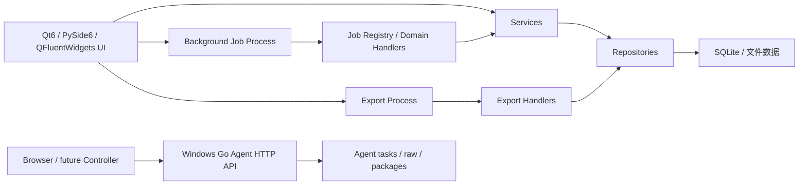

# NetConsole

NetConsole 是面向网络工程现场维护与诊断的 Windows 桌面工具，当前重点覆盖 H3C/Comware 设备管理、AC/FIT AP、轨道交通车地无线、SNMP/MIB、网络测试、配置采集、文件管理和日志诊断。

当前版本：`v1.3.8`。版本唯一来源为 `netconsole/core/version.py`；本文不单独维护版本号。

## 仓库地址

| 仓库 | Git 推送地址 | 浏览器地址 |
| --- | --- | --- |
| GitHub | `git@github.com:wxj183589/NetConsole.git` | `https://github.com/wxj183589/NetConsole.git` |
| NAS | `ssh://git@nas.love-ok.com:3022/mengyou/NetConsole.git` | `https://nas.love-ok.com:3021/mengyou/NetConsole.git` |

关于页只使用浏览器地址，Git 操作只使用 SSH 推送地址，二者不得混用。

当前开发技术栈为 Python 3.13、Qt 6、PySide6、QFluentWidgets（PySide6-Fluent-Widgets）、SQLite、Netmiko、openpyxl，以及基于 QProcess/QThread 的后台执行。依赖下限与固定版本以 `requirements.txt` 为准。

## 当前能力

| 一级模块 | Feature key | 主要能力 |
| --- | --- | --- |
| 设备管理 | `module.devices` | 设备、分组、连接测试、批量采集、SecureCRT/OmniPeek 导出 |
| AC 管理 | `module.ac` | FIT AP 资源、扩展、光衰、历史和命令 |
| 轨道交通 | `module.rail_transit` | 车载 MR、Online MR、MR/Mesh 离线分析、轨旁 AP、车载网络点表 |
| 无线测试 | `module.wifi_survey` | 扫描、勘测、热力图和结果导出 |
| 配置采集 | `module.config_collection` | 配置快照、比较、批量采集 |
| 文件管理 | `module.file_management` | 局点文件、下载、复制和整理 |
| SNMP Center | `module.snmp_center` | MIB 资源、OID 浏览、查询、批量采集、监控、Trap 记录和拓扑 |
| 网络工具 | `module.network_tools` | Ping/fping、iPerf3、工具箱和用户配置的可选外部 IPOP v4.1 |
| 命令参考 | `module.command_reference` | 命令、参数、解析器与消费者索引 |
| 日志 | `module.logs` | 应用日志查看与导出 |
| 系统设置 | `module.system_settings` | 局点、主题、工具路径、磁盘清理和版本信息 |

模块、页面、Tab、动作和按钮的真实启用状态以 `netconsole/core/feature_registry.py` 为准。新增用户可见能力必须先登记 Feature key，再由页面通过 `FeatureGate` 控制。

## 架构摘要



- UI 只负责交互和轻量展示；预计超过 300 ms 的 IO、CPU 或网络工作进入后台任务。
- 普通后台任务走 `BackgroundProcessManager -> background_worker -> JobRegistry -> handler`。
- 所有正式导出走独立 Export Process，使用临时文件完成后原子替换目标文件。
- 可再次导入的 XLSX/CSV/JSON/ZIP 正式导出写入 NetConsole 文件契约；导入入口在业务层统一校验扩展名、模块、类型、schema、必要结构和非空数据，不能只依赖文件选择框过滤。
- `JobRegistry` 当前注册 83 个任务类型，已按 10 个领域 handler 模块分区；多数领域 handler 仍通过 `legacy_tasks.py` 薄适配，迁移尚未完成。
- 设备批量连接测试和批量详情采集仍使用专用 `QThread`/线程池，不应误写成 Job Center 已接管。
- AP Identity 当前仅为只读 shadow/diagnostics，不参与生产匹配、页面展示或业务结论接管。
- Windows Go Agent 是独立进程和数据根，不进入 Qt UI、Job Center、Export Process 或主程序 Feature Registry；当前由浏览器直接操作，主程序多 Agent 管理尚未接入。

完整说明见 [架构文档](docs/ARCHITECTURE.md)、[Job Center](docs/JOB_CENTER.md)、[导出进程规范](docs/export_process_policy.md) 和 [重构地图](docs/REFACTOR_MAP.md)。

## 开发与运行

开发前先阅读：

1. [项目文档索引](docs/README.md)
2. [开发规则](docs/DEVELOPMENT_RULES.md)
3. [架构约束](docs/ARCHITECTURE.md)
4. [数据与路径](docs/DATA_LAYOUT.md)
5. 与改动领域对应的专题文档

优先使用仓库虚拟环境：

```powershell
.\.venv\Scripts\python.exe main.py
.\.venv\Scripts\python.exe -m pytest
```

Windows/PowerShell 涉及中文、日志、设备回显或路径时，先切换 UTF-8；源码和 Markdown 统一使用 UTF-8。读取 H3C 回显、MIB 和历史日志时，按 `utf-8-sig -> utf-8 -> gb18030 -> gbk` 顺序探测，不得因终端显示乱码直接改写业务数据。

## 数据与发布边界

- 运行数据默认位于应用根目录下的 `data/`，临时协议、缓存和应用日志位于顶层 `runtime/`。
- 主应用数据库（尤其设备管理和 FIT AP 资源）默认保持兼容；会话解析库与可重建分析表可在明确任务范围内重构。
- H3C 私有 MIB 不随仓库分发，需由用户导入合法取得的官方归档或参考资料。
- 主程序和 Agent 的 Windows x64 工具目录统一命名为 `tools/windows-x64/{fping,iperf3,ipop}`；IPOP 仅为用户自备外部工具，任何正式包都不得携带 `IPOP.EXE`。
- 发布包必须保留 `_internal`、`data`、`runtime` 目录，以及 PySide6、网络工具和 VC++ 运行库等运行依赖。
- 构建入口、版本来源、外部工具和 Windows 验证要求见 [构建与发布](docs/BUILD_AND_RELEASE.md)。

## 重点专题

- [Online MR 实时采集](docs/ONLINE_MR_COLLECTION.md)
- [Windows 独立 Go Agent](docs/AGENT.md)
- [MR/Mesh 日志分析规则](docs/mr_mesh_log_analysis_rules.md)
- [SNMP Center](docs/SNMP_CENTER.md)
- [AP Identity](docs/AP_IDENTITY.md)
- [表格与 UI 规范](docs/ui_table_guidelines.md)
- [功能模块与 Feature key](docs/FEATURE_MODULES.md)

## 当前规划

近期工作的正确顺序是：继续拆分 `legacy_tasks.py` 领域逻辑、统一剩余专用后台工作入口、在真实局点观测通过前保持 AP Identity 只读、持续用代码与测试反向校正文档。任何“重构完成”结论都必须同时满足生产调用链切换、测试覆盖和旧入口收口，不能只依据目录或注册表存在。
