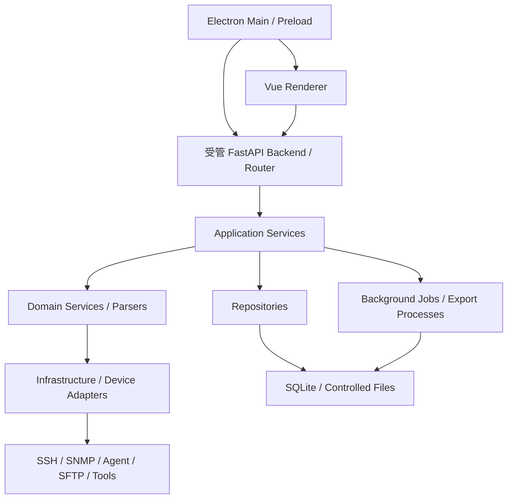

# NetConsole

简体中文 | [English](README_EN.md)

[](https://github.com/wxj183589/NetConsole/actions/workflows/quality-gate.yml) [](https://www.python.org/) [](https://github.com/wxj183589/NetConsole)

**轨道交通 WLAN 工程诊断与数据分析工具**

NetConsole 是一个以轨道交通 WLAN 无线通信质量为核心的开源工程工具。项目主要面向地铁和市域铁路的 PIS WLAN、CBTC WLAN 相关通信子系统，围绕线路实施、开局调试、现场采集、实时诊断、历史分析和持续优化建设完整数据链路；当前重点覆盖采集、实时/离线诊断和无人值守。

**在问题消失之前，先把关键数据留下来。**

轨道交通无线故障经常是瞬态的。等工程人员介入时，AP、AC、交换机、车载设备和链路在故障时间点的状态可能已经改变，日志也可能被覆盖。NetConsole 关注的不是单纯增加设备操作入口，而是尽可能持续地采集、保存、关联和分析故障前后的有效证据。

> NetConsole 可以分析 PIS/CBTC WLAN 的通信质量，但不参与 CBTC 安全控制逻辑。

当前状态：持续开发；正式桌面产品面向 Windows。

## 核心模型

无线是问题中心，设备管理和轨道交通基础资料是数据底座，实时与无人值守采集负责留下证据，关联建模和分析负责把证据变成结论。

```text
Infrastructure data      Engineering context       Operational data
设备、AC、AP、交换机、接口   线路、车站、区间、点位、列车   MESH/MR、RSSI、漫游、时延、日志
IP、VLAN、拓扑与配置         AP 规划、车载资料、业务关系      实时采集、测试与无人值守归档
                \                 |                 /
                 \                |                /
                  Correlation and modeling
                               |
              Wireless diagnostics and quality analysis
                               |
                         Network optimization
```

设备发现告诉 NetConsole 一个对象在技术上是什么；工程基础资料补充它在线路业务中代表什么。只有把两者与运行数据放在同一上下文中，才能回答“这是哪个 AP、位于哪个区间、连接哪台交换机、切换是否合理、历史上是否重复发生”等现场问题。

## 主要能力

### 1. 轨道交通工程基础资料

- 线路、车站、区间、方向和轨旁 AP 规划
- 车载设备、列车与通信点表
- AP 点位、设备角色、IP/VLAN 和工程关系
- 可校验、可预览、可回滚的基础资料导入与编辑

### 2. 网络与 WLAN 基础设施

- 网络设备、分组、地址和连接信息管理
- H3C/Comware SSH 采集与 AC/FIT-AP 资源管理
- 交换机、接口、VLAN、链路和配置快照上下文
- SNMP v1/v2c 只读基础识别；不提供 SNMPv3、通用 MIB/OID 平台或 SNMP Center
- 轨旁 AP、LLDP、端口和光衰信息（以设备型号和数据来源支持范围为准）

### 3. 无线运行数据采集

- Online MR 与车载无线数据采集
- MESH/MR 原始日志导入、解析、时间轴和报告
- RSSI、Peer、Radio、关联/漫游与 AP Identity 关联
- 地面无人值守采集、fping、Syslog/WMESH 原始数据和归档
- 原始文件、会话、任务和导出 Artifact 的生命周期管理

### 4. 诊断与工程测试

- 无线事件与线路、AP、列车、设备、时间的关联分析
- 车内通信检测与跨 TC 检查
- Ping、吞吐测试、Traffic、无线扫描和现场网络工具
- 配置采集、文本/快照对比、受控 SFTP 文件下载
- 后台 Job、取消、进度、日志和 XLSX/CSV/PDF 等导出流程

通用的 SSH、SNMP、设备管理、配置采集、Ping、吞吐测试、文件管理和 Windows Go Agent 能力，都是无线诊断的数据采集与工程基础设施，也可以作为更广泛现场网络工程的工具集使用。

## 架构摘要



- Electron 是正式 Windows 桌面外壳，Vue 是唯一主界面。
- FastAPI/Python runtime 中的 Router 只做 DTO、鉴权和 Service 调用；Application Services 编排用例。
- Domain Services / Parsers 负责设备与业务规则，Repositories 负责 SQLite、受控文件和事务。
- 网络、磁盘、解析和导出等长任务进入后台 Job 或独立 Export Process；Infrastructure 通过受控适配器访问设备和工具。
- Windows Go Agent 是独立的可选采集进程；Linux/CentOS 离线部署、主动注册和多 Controller 不属于当前交付范围。

详细说明见 [当前架构](docs/ARCHITECTURE.md)、[Electron Desktop](docs/ELECTRON_DESKTOP.md)、[Agent](docs/AGENT.md) 和 [仓库目录规范](docs/development/repository-layout.md)。

## 项目状态

NetConsole 处于持续开发阶段。当前正式桌面目标是 Windows，代码主线为 Python Core + FastAPI + Vue + Electron；模块自动化、真实设备/局点验证和最终安装包验收可能处于不同阶段，不能仅依据源码入口推断为生产就绪。

当前产品版本以 [`src/netconsole/core/version.py`](src/netconsole/core/version.py) 为唯一事实源。

- 已有：轨道交通基础资料、设备与 AC/FIT-AP 管理、Online MR、MESH/MR 离线分析、地面无人值守、AP Identity、网络测试、任务中心和数据导出等代码与自动化测试。
- 仍在演进：跨厂商采集覆盖、全线路历史数据标准化、质量评估模型、异常识别和面向线路的可视化。
- 尚无：可供公众直接下载的稳定 Release 安装包。构建和打包入口见 [构建与发布](docs/BUILD_AND_RELEASE.md)。

## Roadmap

主路线围绕无线通信质量的数据闭环推进，而不是简单增加菜单数量：

```text
当前       采集 → 实时诊断 → MESH/MR 分析 → 无人值守
下一阶段   数据标准化 → 线路/设备/AP/列车建模 → 全量历史分析
长期       自动质量评估 → 异常识别 → 动态线路可视化
           → 优化前后对比 → 数据驱动优化
```

Infrastructure & Network Tooling 路线会持续补充更多厂商适配、交换机和链路诊断、配置分析、Agent、文件管理与数据导入导出，但这些扩展仍服务于更完整的无线诊断上下文。

## 使用方式

仓库当前没有公开稳定安装包，普通用户不应把历史 Git tag、CI Artifact 或源码目录视为正式发行版。需要评估项目时，请按下方开发流程从源码运行；需要生成 Windows 安装包时，请严格使用[构建与发布](docs/BUILD_AND_RELEASE.md)中的锁定依赖和打包门禁。

## 开发运行

当前开发与构建目标为 Windows 11、CPython 3.13、Node.js 24 和 pnpm 11。下面的快速启动使用隔离测试根，不读取或修改正式业务数据。普通 `pnpm dev` 才使用持久化数据根，其规则见 [数据根](docs/storage/DATA_ROOT.md)。不要把运行数据、凭据或真实现场日志放入仓库。

```powershell
# 1. 创建项目虚拟环境，并安装锁定的开发依赖
py -3.13 -m venv .venv
.\.venv\Scripts\python.exe -m pip install -c constraints.txt -r requirements-dev.txt
.\.venv\Scripts\python.exe -m pip install -e . --no-deps

# 2. 安装两个前端工作区的锁定依赖
cd apps\desktop_renderer
pnpm install --frozen-lockfile
cd ..\desktop_electron
pnpm install --frozen-lockfile

# 3. 使用隔离测试数据启动 Electron 开发链
pnpm dev:codex
```

`pnpm dev:codex` 和 `pnpm smoke:dev` 使用 `D:\NetConsoleTestData\<run-id>` 下的临时测试根，不读取正式业务根。需要持久保存开发数据且机器已配置数据根时，才使用 `pnpm dev`。Python 定向测试：

```powershell
.\.venv\Scripts\python.exe -m pytest tests\test_web_architecture.py tests\test_mesh_analysis_web_api.py -q
```

完整开发、测试和打包要求分别见 [开发指南](docs/DEVELOPMENT_GUIDE.md)、[测试基线](docs/TEST_BASELINE.md) 和 [构建与发布](docs/BUILD_AND_RELEASE.md)。

## 文档导航

- [项目文档索引](docs/README.md)
- [轨道交通无线业务模型](docs/RAIL_TRANSIT_WIRELESS.md)
- [轨道交通基础资料](docs/RAIL_TRANSIT_BASE_DATA.md)
- [Online MR 实时采集](docs/ONLINE_MR_COLLECTION.md)
- [MESH/MR 日志分析 Web](docs/MESH_ANALYSIS_WEB.md)
- [地面无人值守](docs/GROUND_UNATTENDED.md)
- [AC/FIT-AP 管理](docs/AC_MANAGEMENT.md)
- [配置采集与快照对比](docs/CONFIG_COLLECTION.md)
- [局点与数据存储](docs/storage/README.md)
- [Windows Go Agent](docs/AGENT.md)

## 贡献与安全

欢迎通过 [GitHub Issues](https://github.com/wxj183589/NetConsole/issues) 和 Pull Request 提交问题报告、文档改进、设备兼容性、命令解析器、WLAN 分析、自动化测试和跨环境验证方面的贡献。提交时请使用脱敏后的设备型号、固件版本、命令回显或日志，并说明预期与实际行为。

请勿在公开 Issue、Pull Request 或附件中提交密码、私钥、SNMP community、访问令牌、真实拓扑、生产 IP/MAC 或未脱敏现场数据。仓库当前没有公开专用安全邮箱；安全问题请先通过维护者可用的私下渠道联系。

## 许可证

许可证说明见 [LICENSE](LICENSE)。当前仓库许可证文件将 NetConsole 标注为 non-commercial GPLv3 project；使用、修改或再分发前请阅读完整条款。

## 相关项目

NetConsole 使用 Python、FastAPI、Vue、Electron、SQLite、Netmiko、ECharts、openpyxl 等开源组件。第三方组件与许可证清单见 [docs/open_source_notices.json](docs/open_source_notices.json)。
