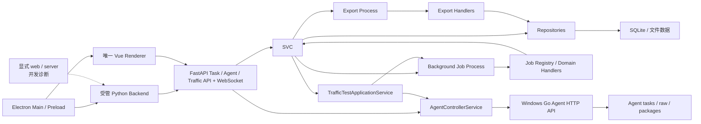

# NetConsole

NetConsole 是面向网络工程现场维护与诊断的 Windows 桌面工具，当前重点覆盖 H3C/Comware 设备管理、AC/FIT AP、轨道交通无线与车内通信检测、网络测试、配置采集、文件管理和日志诊断。设备管理保留 SNMP v1/v2c 只读基础识别；不提供 SNMPv3、通用 MIB/OID 平台或 SNMP Center。

当前版本：`v1.4.3`。版本唯一来源为 `src/netconsole/core/version.py`；本文只同步展示该事实源。

局点、新建/切换、全局数据根迁移、备份恢复和数据包导入导出由 Python Core 统一管理。设置页支持完整迁移包、现场采集包和采集回传包；回传包按稳定局点 UUID、文件 SHA-256 和可识别记录 UUID 预检合并，绝不以局点名称或本地自增 ID 覆盖数据。Electron 只通过版本化 API 和白名单 Native Bridge 操作。完整约束见 [局点与数据存储](docs/storage/README.md)。

## 仓库地址

| 仓库 | Git 推送地址 | 浏览器地址 |
| --- | --- | --- |
| GitHub | `git@github.com:wxj183589/NetConsole.git` | `https://github.com/wxj183589/NetConsole.git` |
| NAS | `ssh://git@nas.love-ok.com:3022/mengyou/NetConsole.git` | `https://nas.love-ok.com:3021/mengyou/NetConsole.git` |

关于页只使用浏览器地址，Git 操作只使用 SSH 推送地址，二者不得混用。

当前开发技术栈为 Python 3.13、SQLite、Netmiko、openpyxl、FastAPI、Pydantic、Vue 3、TypeScript、Vite、Electron、Element Plus、Pinia、Vue Router 和 ECharts。`apps/desktop_electron` 是唯一正式桌面产品，复用 FastAPI 与唯一 Vue Renderer；源码态 Browser 仅用于开发、联调和诊断。Qt/PySide6/QFluentWidgets 源码、运行时和回退入口已经退出活动仓库，历史 Qt 终版只作为仓库外归档成果和旧功能事实记录。Python 依赖按 runtime/test/build/dev 分层并由 `constraints.txt` 锁定；Vue 与 Electron 分别以各自 `apps/*/package.json` 和 `pnpm-lock.yaml` 为准。

长期产品架构已确定为 **Python Core + FastAPI 永久业务层、Vue 永久主界面、Electron 唯一桌面外壳**。Electron 已完成安全宿主以及设备、AC/FIT-AP、轨交、配置、文件、网络工具、命令参考、系统设置、日志维护等代码闭环，但真实设备和桌面人工验收仍按模块标记为 `REAL_DEVICE_PENDING` 或 `IMPLEMENTED_UNVERIFIED`。浏览器式工作区、多窗口和 Windows 通知区域驻留已接入；签名、升级和最终 Windows 安装包人工验收仍属于后续门槛。

## 工作区与通知区域

- 主窗口和附加工作区窗口都使用同一 Vue Renderer 与受管 Python Backend；标签支持切换、关闭、固定，以及路由策略明确允许的复制和“在新窗口打开”，不会为标签或窗口再启动 Backend。标签清单与组件缓存相互独立，普通页面默认在离开时卸载，只有显式 `workspace.cache=true` 的页面进入 KeepAlive。
- 默认关闭主窗口时仅隐藏到 Windows 右下角通知区域。后台任务和 Backend 继续运行；可双击托盘图标或在菜单中选择“打开 NetConsole”，也可从菜单新建工作区窗口或打开唯一任务中心窗口。
- 托盘菜单中的“退出 NetConsole”是完整退出入口，会先保存工作区与界面偏好、关闭受管窗口和停止 Backend。关闭“关闭主窗口后驻留通知区域”设置后，最后一个普通业务窗口关闭时恢复受控退出。
- 浏览器开发模式仍可使用多标签工作区，但没有 Electron 原生多窗口与托盘能力。托盘图标复用 `resources/branding/netconsole.ico`，打包时复制到 Electron `extraResources/branding`。

## 当前能力

| 一级模块 | Feature key | 主要能力 |
| --- | --- | --- |
| 设备管理 | `module.devices` | 设备、分组、连接测试、批量采集、SecureCRT/OmniPeek 导出 |
| AC 管理 | `module.ac` | FIT-AP 资源、扩展、光衰、受控固化/远程登录动作和 OmniPeek 名称表 |
| 轨道交通 | `module.rail_transit` | 基础资料、车载 MR、Online MR、MR/Mesh 离线分析、轨旁 AP、全列车车内通信检测与点表 |
| 配置采集 | `module.config_collection` | 配置快照、勾选/左右对比、批量采集和差异导出 |
| 文件管理 | `module.file_management` | 受控 SFTP 浏览、持久下载队列、MESH 日志归档和本地文件管理 |
| 网络工具 | `module.network_tools` | Ping/fping、iPerf3、工具箱和用户配置的可选外部 IPOP v4.1 |
| 命令参考 | `module.command_reference` | 命令、参数、解析器与消费者索引 |
| 日志 | `module.logs` | 应用日志查看与导出 |
| 系统设置 | `module.system_settings` | 局点、主题、工具路径、磁盘清理和版本信息 |

模块、页面、Tab、动作和按钮的真实启用状态以 `src/netconsole/core/feature_registry.py` 为准。新增用户可见能力必须先登记 Feature key，再由页面通过 `FeatureGate` 控制。

源码开发态继续提供全局运行时功能配置、变更预览和恢复能力；`client_package/internal_only` 只读展示，保存仅写应用数据根中的 `visible/enabled` 覆盖，不修改发布 profile。正式 Electron 包采用不可编辑的固定生产功能集，不显示或调用功能配置入口。打包基线缺失或损坏时回退到 Feature Registry 的稳定生产默认，而不是关闭全部功能。系统设置、局点与数据管理、任务中心和运行日志属于正式包核心能力，不依赖 customer profile 或本地 override；`client_package` 只表达构建选择/发布元数据，不作为正式运行时的通用权限开关。

## 仓库结构

```text
apps/       独立应用：Agent、Electron Desktop 和 Web 前端
src/        可安装的 Python 包（src/netconsole）
config/     开发和构建配置模板（含 feature profiles）
docs/       项目文档和长期工程规则
resources/  版本化静态资源、命令参考和随包运行工具
scripts/    build、dev、maintenance 脚本
tests/      自动化测试和脱敏 fixtures
tools/      独立开发、诊断、维护和协议分析工具，不作为运行时工具来源
```

根目录只保留项目级配置、说明、许可证、`main.py` 兼容入口和上述白名单目录。完整规则见 [仓库目录规范](docs/development/repository-layout.md)。

Agent 子项目只保留 Go/Python/Web 源码、构建脚本和 `apps/agent/resources/config/` 下的示例配置；开发与交付运行数据统一位于数据根的 `agents/local/`，构建输出在 `dist/agent/`。fping/iPerf 的版本化源码唯一位于 `resources/tools/`，Agent 交付包内才复制到 `tools/windows-x64/`。

## 架构摘要



- UI 只负责交互和轻量展示；预计超过 300 ms 的 IO、CPU 或网络工作进入后台任务。
- 正式桌面后台任务走 `Vue/FastAPI Application Service -> LocalProcessAdapter -> TaskApplicationService/TaskRuntime -> background_worker -> JobRegistry -> handler`。
- 任务快照和事件写入每局点 `tasks.db`；Vue 任务中心支持列表、详情、日志和协作取消。`COMPLETED` 只表示调度生命周期结束，不保证所有业务目标成功；批量任务还需读取结构化业务结果。当前轨旁 AP 光衰任务已在详情中区分部分成功，但列表级通用警告聚合仍是已知缺口。
- Agent 配置与运行状态分别写入每局点 `agents.db`；Token 仅保存在当前 Python 进程内，REST/WebSocket 不返回凭据。
- 所有正式导出走独立 Export Process，使用临时文件完成后原子替换目标文件。
- 可再次导入的 XLSX/CSV/JSON/ZIP 正式导出写入 NetConsole 文件契约；导入入口在业务层统一校验扩展名、模块、类型、schema、必要结构和非空数据，不能只依赖文件选择框过滤。
- `JobRegistry` 按领域 handler 模块分区；能力集合由测试校验，不再在文档和测试中绑定易漂移的任务总数。多数既有领域 handler 仍通过 `legacy_tasks.py` 薄适配，迁移尚未完成。
- 设备批量连接测试和批量详情采集使用永久后台 Worker/进程链；是否已由统一 Job Center 接管以生产 handler 和测试为准。
- AP Identity 当前仅为只读 shadow/diagnostics，不参与生产匹配、页面展示或业务结论接管。
- Windows Go Agent 仍是独立进程和数据根；`AgentTrafficSupervisor` 已把远端 iPerf/fping 状态、事件和结果映射到 Task Center，Online MR 也提供默认关闭的单 Agent start/status/normal stop、自动包下载和安全导入。Token 始终留在 Controller 进程内，不提供远端强停、包删除或任意命令。

完整说明见 [当前架构](docs/ARCHITECTURE.md)、[永久架构与后续演进](docs/ARCHITECTURE_NEXT.md)、[Electron Desktop](docs/ELECTRON_DESKTOP.md)、[最终迁移矩阵](docs/architecture/MIGRATION_MATRIX.md)、[架构一致性报告](docs/archive/migrations/electron-only/ARCHITECTURE_COMPLIANCE_REPORT.md)、[Job Center](docs/JOB_CENTER.md)、[导出进程规范](docs/export_process_policy.md) 和 [重构地图](docs/REFACTOR_MAP.md)。

## 开发与运行

开发前先阅读：

1. [项目文档索引](docs/README.md)
2. [下一阶段开发指南](docs/DEVELOPMENT_GUIDE.md)
3. [开发规则](docs/DEVELOPMENT_RULES.md)
4. [下一代架构](docs/ARCHITECTURE_NEXT.md)
5. [当前架构](docs/ARCHITECTURE.md)
6. [数据与路径](docs/DATA_LAYOUT.md)
7. 与改动领域对应的专题文档

优先使用仓库虚拟环境：

```powershell
.\.venv\Scripts\python.exe -m pip install -e . --no-deps
.\.venv\Scripts\python.exe main.py
.\.venv\Scripts\python.exe main.py --mode web
.\.venv\Scripts\python.exe main.py --mode server --host 127.0.0.1 --port 8000
.\.venv\Scripts\python.exe -m netconsole.backend.api.main
.\.venv\Scripts\python.exe -m pytest

cd apps\desktop_electron
pnpm dev
```

无参数 `main.py` 是源码态 PyCharm/命令行的 Electron Desktop 入口：它使用项目本地 Electron 运行时执行同一 `scripts/dev.mjs` 编排链，不恢复 Qt，也不单独启动第二套 FastAPI。依赖已安装时不要求全局 `pnpm` 在 `PATH` 中；缺少 `apps/desktop_electron` 或 `apps/web` 的 `node_modules` 时会明确提示先安装锁定依赖。`--mode web|server` 继续只用于本机开发诊断。

前端首次运行或依赖变化后执行：

```powershell
cd apps/web
pnpm install
pnpm test
pnpm build
```

Windows/PowerShell 涉及中文、日志、设备回显或路径时，先切换 UTF-8；源码和 Markdown 统一使用 UTF-8。读取 H3C 回显、MIB 和历史日志时，按 `utf-8-sig -> utf-8 -> gb18030 -> gbk` 顺序探测，不得因终端显示乱码直接改写业务数据。

## 数据与发布边界

- Windows NSIS 安装向导分别选择程序安装目录与业务数据目录；业务数据根由 `HKLM\Software\NetConsole\DataRoot` 持久化，当前机器配置为 `D:\NetConsoleData`。程序升级、修复和普通卸载只处理程序文件，不会删除该数据根。源码开发、Electron 开发、Python Backend、打包验证与正式安装包都读取同一机器配置；只有 `RuntimeMode.TEST` 可使用显式的 `D:\NetConsoleTestData\<run-id>`。不会依赖当前工作目录、LocalAppData、用户目录或源码目录；仓库 `.local/` 和根 `data/` 仅作为历史迁移源。
- 主应用数据库（尤其设备管理和 FIT AP 资源）默认保持兼容；会话解析库与可重建分析表可在明确任务范围内重构。
- SNMP Center、通用 MIB/OID 字典与无线勘测已从活动产品、源码资源和发布依赖中删除；历史用户数据库与文件不做破坏性清理。设备管理只保留 SNMP v1/v2c 只读基础识别，网络工具无线扫描仍是独立能力。
- `resources/tools/` 是主程序和 Agent 随包运行工具的唯一源码来源；构建后交付包内统一使用 `tools/windows-x64/{fping,iperf3}`。根 `tools/` 不再保存 fping/iPerf 运行依赖，IPOP 仅为用户自备外部工具，任何正式包都不得携带 `IPOP.EXE`。
- 历史 Qt 发布包只作为仓库外归档成果，不进入当前构建。Electron-only 安装包使用无 Qt Backend bundle，并通过锁定依赖、真实 PyInstaller 制品清单、许可证、SBOM 和本地工具资源 Guard。
- 构建入口、版本来源、外部工具和 Windows 验证要求见 [构建与发布](docs/BUILD_AND_RELEASE.md)。

## 重点专题

- [Online MR 实时采集](docs/ONLINE_MR_COLLECTION.md)
- [Windows 独立 Go Agent](docs/AGENT.md)
- [Agent Controller](docs/AGENT_CONTROLLER.md)
- [Agent 流量测试协议](docs/AGENT_TRAFFIC_API.md)
- [统一流量测试架构](docs/TRAFFIC_TEST_ARCHITECTURE.md)
- [MR/Mesh 日志分析规则](docs/mr_mesh_log_analysis_rules.md)
- [AC/FIT-AP 管理](docs/AC_MANAGEMENT.md)
- [车内通信检测](docs/TRAIN_COMMUNICATION_MONITORING.md)
- [设备文件下载与 SFTP](docs/device-files/README.md)
- [配置采集与快照对比](docs/CONFIG_COLLECTION.md)
- [CBTC 旧 Wireshark DLL 逆向状态](docs/reverse-engineering/CBTC_WIRESHARK_DLL.md)
- [AP Identity](docs/AP_IDENTITY.md)
- [表格与 UI 规范](docs/ui_table_guidelines.md)
- [功能模块与 Feature key](docs/FEATURE_MODULES.md)

## 当前规划

Web 演进阶段 4C 已接入 Traffic REST API、独立 Traffic WebSocket 和 `/network-tools/traffic` Vue 页面；阶段 4D 的 Qt Web Shell 仅为历史验收记录，其源码与活动启动入口均已删除。Online MR 已建立纯 Python LOCAL/AGENT Application Service、同局点 Task/Session 映射、Traffic 收口，以及严格 Desktop/`127.0.0.1`/短期会话保护的独立 Web LOCAL/AGENT 页签；AGENT 默认关闭，只提供固定 start/status/normal stop 与自动 package 导入，不提供强停、删除或任意命令。SNMP Center、通用 MIB/OID 平台和无线勘测已删除；AP Identity 继续只读。

Electron-only E1 已删除 Python 启动壳中的 `auto/qt`、Qt probe、旧 Qt WebShell、Qt 页面、Qt-only 测试与无调用 Qt Native Adapter；打包 Electron 通过内部 `--electron-backend` 协议启动受管 Backend，开发态继续直接运行 `netconsole.backend.electron_runtime`。无参数 `main.py` 是 PyCharm/源码态 Electron 入口，`main.py --mode web|server` 只用于本机开发诊断。源码、依赖和安装包门禁均禁止重新引入 Qt。
