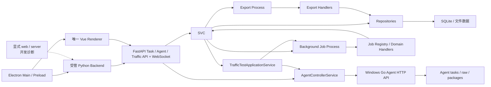

# NetConsole

NetConsole 是面向网络工程现场维护与诊断的 Windows 桌面工具，当前重点覆盖 H3C/Comware 设备管理、AC/FIT AP、轨道交通车地无线、SNMP/MIB、网络测试、配置采集、文件管理和日志诊断。

当前版本：`v1.3.9`。版本唯一来源为 `src/netconsole/core/version.py`；本文不单独维护版本号。

## 仓库地址

| 仓库 | Git 推送地址 | 浏览器地址 |
| --- | --- | --- |
| GitHub | `git@github.com:wxj183589/NetConsole.git` | `https://github.com/wxj183589/NetConsole.git` |
| NAS | `ssh://git@nas.love-ok.com:3022/mengyou/NetConsole.git` | `https://nas.love-ok.com:3021/mengyou/NetConsole.git` |

关于页只使用浏览器地址，Git 操作只使用 SSH 推送地址，二者不得混用。

当前开发技术栈为 Python 3.13、Qt 6、PySide6、QFluentWidgets、SQLite、Netmiko、openpyxl、FastAPI、Pydantic、Vue 3、TypeScript、Vite、Electron、Element Plus、Pinia、Vue Router 和 ECharts。`apps/desktop_electron` 是唯一正式桌面产品方向，复用 FastAPI 与唯一 Vue Renderer；源码态 Browser 仅用于开发、联调和诊断。Qt 源码暂时保留为功能事实源和迁移参考，不再承担新版本发布门或新功能开发，待 Electron 完成全部有效功能的 1:1 可用迁移后单独删除。Python 依赖以 `requirements.txt` 为准，Vue 与 Electron 分别以各自 `apps/*/package.json` 和 `pnpm-lock.yaml` 为准。

长期产品路线已确定为 **Python Core + FastAPI 永久业务层、Vue 永久主界面、Electron 最终桌面外壳**。当前处于 Electron 功能对等迁移阶段：Qt 只保留为事实源和临时参考；Electron 已完成安全宿主以及设备、AC/FIT-AP、轨交、配置、文件、网络工具、命令参考、系统设置、日志维护等代码闭环，但真实设备和桌面人工验收仍按模块标记为 `REAL_DEVICE_PENDING` 或 `IMPLEMENTED_UNVERIFIED`。Electron 安装包、签名、升级和托盘仍属于后续独立阶段。

## 当前能力

| 一级模块 | Feature key | 主要能力 |
| --- | --- | --- |
| 设备管理 | `module.devices` | 设备、分组、连接测试、批量采集、SecureCRT/OmniPeek 导出 |
| AC 管理 | `module.ac` | FIT AP 资源、扩展、光衰、历史和命令 |
| 轨道交通 | `module.rail_transit` | 车载 MR、Online MR、MR/Mesh 离线分析、轨旁 AP、车载网络点表 |
| 无线勘测 | `module.wifi_survey` | `DISABLED`；代码和数据保留，等待独立重构 |
| 配置采集 | `module.config_collection` | 配置快照、比较、批量采集 |
| 文件管理 | `module.file_management` | 局点文件、下载、复制和整理 |
| SNMP Center | `module.snmp_center` | `DISABLED`；代码、数据库和 MIB 保留，等待独立重构 |
| 网络工具 | `module.network_tools` | Ping/fping、iPerf3、工具箱和用户配置的可选外部 IPOP v4.1 |
| 命令参考 | `module.command_reference` | 命令、参数、解析器与消费者索引 |
| 日志 | `module.logs` | 应用日志查看与导出 |
| 系统设置 | `module.system_settings` | 局点、主题、工具路径、磁盘清理和版本信息 |

模块、页面、Tab、动作和按钮的真实启用状态以 `src/netconsole/core/feature_registry.py` 为准。新增用户可见能力必须先登记 Feature key，再由页面通过 `FeatureGate` 控制。

## 仓库结构

```text
apps/       独立应用：Agent、Electron Desktop、Web 前端和待回收 Qt 事实源
src/        可安装的 Python 包（src/netconsole）
config/     开发和构建配置模板（含 feature profiles）
docs/       项目文档和长期工程规则
resources/  版本化静态资源、命令参考、MIB 归档和随包运行工具
scripts/    build、dev、maintenance 脚本
tests/      自动化测试和脱敏 fixtures
tools/      独立开发、诊断、维护和协议分析工具，不作为运行时工具来源
```

根目录只保留项目级配置、说明、许可证、`main.py` 兼容入口和上述白名单目录。完整规则见 [仓库目录规范](docs/development/repository-layout.md)。

Agent 子项目只保留 Go/Python/Web 源码、构建脚本和 `apps/agent/resources/config/` 下的示例配置；开发运行数据在 `.local/agent/`，构建输出在 `dist/agent/`。fping/iPerf 的版本化源码唯一位于 `resources/tools/`，Agent 交付包内才复制到 `tools/windows-x64/`。

## 架构摘要



- UI 只负责交互和轻量展示；预计超过 300 ms 的 IO、CPU 或网络工作进入后台任务。
- 正式桌面后台任务走 `Vue/FastAPI Application Service -> LocalProcessAdapter -> TaskApplicationService/TaskRuntime -> background_worker -> JobRegistry -> handler`；Qt `QProcess` Adapter 仅服务待回收页面。
- 任务快照和事件写入每局点 `tasks.db`；Vue 任务中心支持列表、详情、日志和协作取消。
- Agent 配置与运行状态分别写入每局点 `agents.db`；Token 仅保存在当前 Python 进程内，REST/WebSocket 不返回凭据。
- 所有正式导出走独立 Export Process，使用临时文件完成后原子替换目标文件。
- 可再次导入的 XLSX/CSV/JSON/ZIP 正式导出写入 NetConsole 文件契约；导入入口在业务层统一校验扩展名、模块、类型、schema、必要结构和非空数据，不能只依赖文件选择框过滤。
- `JobRegistry` 按领域 handler 模块分区；能力集合由测试校验，不再在文档和测试中绑定易漂移的任务总数。多数既有领域 handler 仍通过 `legacy_tasks.py` 薄适配，迁移尚未完成。
- 设备批量连接测试和批量详情采集仍使用专用 `QThread`/线程池，不应误写成 Job Center 已接管。
- AP Identity 当前仅为只读 shadow/diagnostics，不参与生产匹配、页面展示或业务结论接管。
- Windows Go Agent 仍是独立进程和数据根；`AgentTrafficSupervisor` 已把远端 iPerf/fping 状态、事件和结果映射到 Task Center，Token 始终留在 Controller 进程内。浏览器端通过“网络工具 / 流量测试”调用统一 Traffic API。

完整说明见 [下一代架构](docs/ARCHITECTURE_NEXT.md)、[Electron Desktop](docs/ELECTRON_DESKTOP.md)、[当前架构](docs/ARCHITECTURE.md)、[Web 迁移计划](docs/WEB_MIGRATION_PLAN.md)、[Web 迁移矩阵](docs/WEB_MIGRATION_MATRIX.md)、[Qt/Web 详细对等矩阵](docs/WEB_QT_PARITY_MATRIX.md)、[Job Center](docs/JOB_CENTER.md)、[导出进程规范](docs/export_process_policy.md) 和 [重构地图](docs/REFACTOR_MAP.md)。

## 开发与运行

开发前先阅读：

1. [项目文档索引](docs/README.md)
2. [下一阶段开发指南](docs/DEVELOPMENT_GUIDE.md)
3. [开发规则](docs/DEVELOPMENT_RULES.md)
4. [下一代架构](docs/ARCHITECTURE_NEXT.md)
5. [当前架构](docs/ARCHITECTURE.md)
6. [数据与路径](docs/DATA_LAYOUT.md)
7. 与改动领域对应的专题文档

优先使用仓库虚拟环境：

```powershell
.\.venv\Scripts\python.exe -m pip install -e . --no-deps
.\.venv\Scripts\python.exe main.py --mode web
.\.venv\Scripts\python.exe main.py --mode server --host 127.0.0.1 --port 8000
.\.venv\Scripts\python.exe -m netconsole.backend.api.main
.\.venv\Scripts\python.exe -m pytest

cd apps\desktop_electron
pnpm dev
```

前端首次运行或依赖变化后执行：

```powershell
cd apps/web
pnpm install
pnpm test
pnpm build
```

Windows/PowerShell 涉及中文、日志、设备回显或路径时，先切换 UTF-8；源码和 Markdown 统一使用 UTF-8。读取 H3C 回显、MIB 和历史日志时，按 `utf-8-sig -> utf-8 -> gb18030 -> gbk` 顺序探测，不得因终端显示乱码直接改写业务数据。

## 数据与发布边界

- 开发运行数据默认位于 `.local/data/` 和 `.local/runtime/`；打包程序优先使用 `%LOCALAPPDATA%\NetConsole\`，不会依赖当前工作目录。
- 主应用数据库（尤其设备管理和 FIT AP 资源）默认保持兼容；会话解析库与可重建分析表可在明确任务范围内重构。
- H3C 私有 MIB 不随仓库分发，需由用户导入合法取得的官方归档或参考资料。
- `resources/tools/` 是主程序和 Agent 随包运行工具的唯一源码来源；构建后交付包内统一使用 `tools/windows-x64/{fping,iperf3}`。根 `tools/` 不再保存 fping/iPerf 运行依赖，IPOP 仅为用户自备外部工具，任何正式包都不得携带 `IPOP.EXE`。
- 历史 Qt 发布包的 `_internal`、`data`、`runtime` 和 PySide6 约束只用于既有成果复现。未来 Electron-only 安装包必须使用无 Qt Backend bundle，并通过依赖、许可证、SBOM 和资源 Guard；该发布链尚未完成。
- 构建入口、版本来源、外部工具和 Windows 验证要求见 [构建与发布](docs/BUILD_AND_RELEASE.md)。

## 重点专题

- [Online MR 实时采集](docs/ONLINE_MR_COLLECTION.md)
- [Windows 独立 Go Agent](docs/AGENT.md)
- [Agent Controller](docs/AGENT_CONTROLLER.md)
- [Agent 流量测试协议](docs/AGENT_TRAFFIC_API.md)
- [统一流量测试架构](docs/TRAFFIC_TEST_ARCHITECTURE.md)
- [MR/Mesh 日志分析规则](docs/mr_mesh_log_analysis_rules.md)
- [SNMP Center](docs/SNMP_CENTER.md)
- [AP Identity](docs/AP_IDENTITY.md)
- [表格与 UI 规范](docs/ui_table_guidelines.md)
- [功能模块与 Feature key](docs/FEATURE_MODULES.md)

## 当前规划

Web 演进阶段 4C 已接入 Traffic REST API、独立 Traffic WebSocket 和 `/network-tools/traffic` Vue 页面；阶段 4D 的 Qt Web Shell 是历史验收成果，其活动启动入口现已删除。Online MR 已建立纯 Python LOCAL/AGENT Application Service、同局点 Task/Session 映射、Traffic 收口、Legacy Qt 事实源以及严格 Desktop/`127.0.0.1`/短期会话保护的独立 Web LOCAL/AGENT 页签；AGENT 默认关闭，只提供固定 start/status/normal stop 与自动 package 导入，不提供强停、删除或任意命令。SNMP Center 和无线勘测保持 `DISABLED`；AP Identity 继续只读。

Electron-only E1 已删除 Python 启动壳中的 `auto/qt`、Qt probe、旧 Qt WebShell 与无调用 Qt Native Adapter；打包 Electron 通过内部 `--electron-backend` 协议启动受管 Backend，开发态继续直接运行 `netconsole.backend.electron_runtime`。源码态 `main.py --mode web|server` 只用于本机开发诊断。Qt 页面和 Qt-only 测试仍在本分支持续回收，尚不能把当前阶段描述为全仓或安装包零 Qt；SNMP Center 和无线勘测保持排除并将在独立数据安全门后正式删除。
