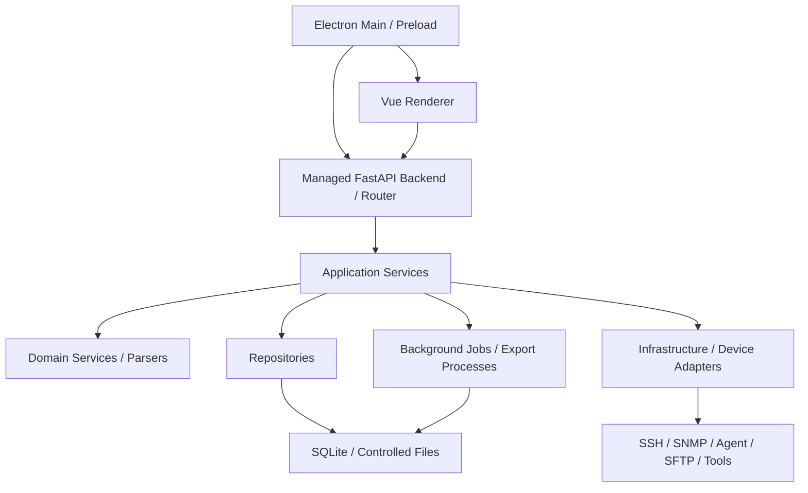

# NetConsole

[简体中文](./README.md) | English

[](https://github.com/wxj183589/NetConsole/actions/workflows/quality-gate.yml) [](https://www.python.org/) [](https://github.com/wxj183589/NetConsole)

**Rail Transit WLAN Engineering Diagnostics & Data Analysis Toolkit**

NetConsole is an open-source engineering toolkit focused on WLAN communication quality in rail-transit networks. It is primarily designed for metro and suburban-rail PIS WLAN and CBTC-related WLAN subsystems. The project is building a data workflow from commissioning and field collection through real-time diagnostics, historical analysis, and continuous optimization; its current focus is collection, real-time/offline diagnostics, and unattended operation.

**Capture the data before the problem disappears.**

Rail-transit wireless incidents are often transient. By the time engineers start troubleshooting, the state of an AP, AC, switch, onboard device, or link may have changed and the useful logs may already be gone. NetConsole therefore focuses on continuously collecting, preserving, correlating, and analyzing evidence from before and after an incident.

> NetConsole analyzes communication quality in PIS/CBTC WLAN environments. It is not part of CBTC safety-control logic.

Current status: under active development; the formal desktop product targets Windows.

## Core Model

Wireless communication is the problem center. Device management and railway engineering data are the foundation. Real-time and unattended collection preserve evidence. Correlation, modeling, and analysis turn that evidence into engineering conclusions.

```text
Infrastructure data      Engineering context       Operational data
Devices, AC, APs,        Lines, stations,          MESH/MR, RSSI, roaming,
switches, interfaces,    sections, AP locations,  latency, logs, tests,
IP/VLAN, topology        trains, onboard data      unattended archives
                \                 |                 /
                 \                |                /
                  Correlation and modeling
                               |
              Wireless diagnostics and quality analysis
                               |
                         Network optimization
```

Discovery tells NetConsole what an object is technically; engineering metadata tells it what that object means in the railway system. Combining both with operational data makes it possible to ask which AP was involved, where it was located, which switch path served it, whether a handover was expected, and whether the same symptom has occurred before.

## Capabilities

### 1. Railway engineering context

- Lines, stations, sections, directions, and trackside AP plans
- Trains, onboard equipment, and communication point tables
- AP locations, device roles, IP/VLAN plans, and engineering relationships
- Validated, previewable, and rollback-aware base-data import and editing

### 2. Network and WLAN infrastructure

- Network-device inventory, groups, addresses, and connection information
- H3C/Comware SSH collection and AC/FIT-AP resource management
- Switch, interface, VLAN, link, and configuration-snapshot context
- Read-only SNMP v1/v2c identification; no SNMPv3, generic MIB/OID platform, or SNMP Center
- Trackside AP, LLDP, port, and optical information where the device model and source data support it

### 3. Wireless operational data

- Online MR and onboard wireless collection
- MESH/MR raw-log import, parsing, timelines, and reports
- RSSI, Peer, Radio, association/roaming, and AP Identity correlation
- Ground unattended collection, fping, Syslog/WMESH raw data, and archives
- Lifecycle management for raw files, sessions, jobs, and exported artifacts

### 4. Diagnostics and engineering tools

- Correlation of wireless events with lines, APs, trains, devices, and time
- Train communication checks and cross-TC diagnostics
- Ping, throughput tests, Traffic, wireless scanning, and field network tools
- Configuration collection, snapshot/text comparison, and controlled SFTP downloads
- Background jobs, cancellation, progress, logs, and XLSX/CSV/PDF export workflows

General SSH, SNMP, device management, configuration collection, Ping, throughput testing, file management, and the Windows Go Agent support the wireless-diagnostics workflow and can also serve broader field network-engineering work.

## Architecture



- Electron is the formal Windows desktop shell and Vue is the single main renderer.
- The FastAPI/Python runtime Router handles DTOs, authentication, and Service calls; Application Services orchestrate use cases.
- Domain Services / Parsers own device and business rules, while Repositories own SQLite, controlled files, and transactions.
- Network, disk, parsing, and export work runs in background jobs or dedicated export processes; Infrastructure accesses devices and tools through controlled adapters.
- The Windows Go Agent is an optional independent collection process. CentOS offline deployment, active registration, and multi-controller operation are outside the current delivery scope.

See [Current architecture](./docs/ARCHITECTURE.md), [Electron Desktop](./docs/architecture/DESKTOP.md), [Agent](./docs/agent/README.md), and the [repository layout](./docs/development/repository-layout.md).

## Project Status

NetConsole is under active development. The formal desktop target is Windows, with Python Core + FastAPI + Vue + Electron as the product architecture. Automated implementation, real-device/site validation, and final installer acceptance may be at different stages; source entry points alone do not imply production readiness.

The single source of truth for the product version is [`src/netconsole/core/version.py`](./src/netconsole/core/version.py).

- Present in the repository: railway base data, device and AC/FIT-AP management, Online MR, offline MESH/MR analysis, ground unattended collection, AP Identity, network tools, Task Center, and data export, with automated tests across these areas.
- Evolving: cross-vendor collection coverage, standardized line-wide historical data, quality-evaluation models, anomaly recognition, and line-oriented visualization.
- No public stable installer release is currently advertised. Build and packaging details are in [Build and release](./docs/release/BUILD_AND_RELEASE.md).

## Roadmap

The roadmap follows the wireless-quality data loop rather than a growing list of menu items:

```text
Now        collection → real-time diagnostics → MESH/MR analysis → unattended collection
Next       data standardization → line/device/AP/train modeling → full historical analysis
Long term  automated quality evaluation → anomaly recognition → dynamic line visualization
           → before/after optimization comparison → data-driven optimization
```

The Infrastructure & Network Tooling track will continue to add vendor coverage, switch and link diagnostics, configuration analysis, Agent capabilities, file management, and data import/export. These extensions remain in service of a richer wireless-diagnostics context.

## Using NetConsole

The repository does not currently publish a stable installer. Historical Git tags, CI artifacts, and the source tree should not be treated as formal releases. Use the source workflow below for evaluation. To build a Windows installer, follow the locked dependencies and packaging gates in [Build and release](./docs/release/BUILD_AND_RELEASE.md).

## Development

The current development and build target is Windows 11 with CPython 3.13.9 x64, Node.js 24, and pnpm 11. The quick-start path below uses an isolated test root and does not read or modify persistent application data. A normal `pnpm dev` run uses the configured persistent data root described in [Data root](./docs/storage/DATA_ROOT.md). Do not place credentials, runtime data, or real field logs in the repository.

```powershell
# 1. Create a virtual environment and install locked Python dependencies
py -3.13.9 -m venv .venv
.\.venv\Scripts\python.exe -m pip install -c constraints.txt -r requirements-dev.txt
.\.venv\Scripts\python.exe -m pip install -e . --no-deps

# 2. Install both locked frontend workspaces
cd apps\desktop_renderer
pnpm install --frozen-lockfile
cd ..\desktop_electron
pnpm install --frozen-lockfile

# 3. Start Electron with isolated test data
pnpm dev:codex
```

`pnpm dev:codex` and `pnpm smoke:dev` use a temporary `D:\study\test-data\NetConsole\<run-id>` root and do not read the persistent application root. Use `pnpm dev` only when the machine has a configured persistent data root and you intend to retain development data. Example targeted tests:

```powershell
.\.venv\Scripts\python.exe -m pytest tests\test_web_architecture.py tests\test_mesh_analysis_web_api.py -q
```

See the [development rules](./docs/DEVELOPMENT_RULES.md), [test baseline](./docs/testing/BASELINE.md), and [build and release guide](./docs/release/BUILD_AND_RELEASE.md) for the complete workflow.

## Documentation

- [Documentation index](./docs/README.md)
- [Rail-transit wireless model](./docs/rail-transit/WIRELESS.md)
- [Railway base data](./docs/rail-transit/base-data/README.md)
- [Online MR collection](./docs/rail-transit/online-mr/README.md)
- [MESH/MR analysis](./docs/rail-transit/mesh/README.md)
- [Ground unattended collection](./docs/rail-transit/ground-unattended/README.md)
- [AC/FIT-AP management](./docs/rail-transit/AC_MANAGEMENT.md)
- [Configuration collection and snapshots](./docs/device-management/CONFIG_COLLECTION.md)
- [Site and data storage](./docs/storage/README.md)
- [Windows Go Agent](./docs/agent/README.md)

## Contributing and Security

Contributions are welcome through [GitHub Issues](https://github.com/wxj183589/NetConsole/issues) and Pull Requests, including bug reports, documentation, device compatibility, command parsers, WLAN analysis, automated tests, and cross-environment validation. Include a sanitized device model, firmware version, command output or log excerpt, and the expected and actual behavior.

Never attach passwords, private keys, SNMP communities, access tokens, real topology, production IP/MAC addresses, or unsanitized field data to public Issues, Pull Requests, or attachments. The repository does not currently publish a dedicated security email; contact the maintainer through an available private channel before disclosing sensitive details.

## License

NetConsole is licensed under the GNU General Public License v3.0 (GPL-3.0-only). See [LICENSE](./LICENSE) for details.

## Open-source components

NetConsole uses open-source components including Python, FastAPI, Vue, Electron, SQLite, Netmiko, ECharts, and openpyxl. See the [third-party notices](./docs/open_source_notices.json) for the repository's component and license inventory.
