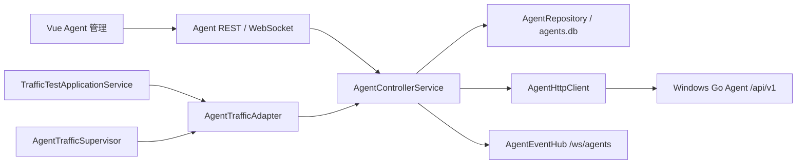

# NetConsole Agent Controller

## 1. 当前范围

阶段 3 将 Windows Go Agent 接入 Python 主程序的多 Agent 控制面。阶段 4B-2 已由 `TrafficTestApplicationService`、`AgentTrafficAdapter` 和 `AgentTrafficSupervisor` 在 Controller 进程内接入 iPerf/真实 fping 的强类型调度、任务映射和恢复同步；阶段 5C-1 的 Agent 管理页仍是只读控制中心。Online MR 远程控制已由独立、默认关闭的 AGENT executor/Web 页签提供固定 start/status/normal stop 和安全包导入，不经过 Agent 管理页，也不开放任意命令、远端强停、删除或升级。



浏览器不直接访问 Agent。Desktop Mode 和 Server Mode 都由 FastAPI 所在主机发起网络连接，因此页面明确提示连接测试的网络视角。

## 2. Agent API 审计与适配

现有 Agent 使用：

- 身份与状态：`GET /api/v1/status`；
- 能力：`GET /api/v1/capabilities`；
- Token Header：`X-Agent-Token`；
- 响应：成功 `{"ok":true,"data":...}`，失败 `{"ok":false,"error":{"message":"..."}}`。

阶段 4B-1 在保持旧接口兼容的前提下新增 Agent fping、任务事件游标和结果接口，并补齐 iPerf 强类型参数。旧 Agent 对新路由返回 404 时，Typed Client 映射为 `AGENT_TRAFFIC_UNSUPPORTED`；能力探测仍将缺失的 capabilities 保留为未知。

`AgentHttpClient` 统一处理 URL、连接/读取超时、HTTP/HTTPS、Token Header、JSON 契约、401、版本兼容和错误映射；禁止自动跟随重定向，也不记录 Header 或 Token。

阶段 4B-2 的流量执行每次请求前重新从当前 Agent 配置和 `SessionCredentialVault` 获取连接信息；Token 不被缓存到 Supervisor、Traffic DTO、JobSpec、SQLite、事件、日志或命令行。启动新任务严格要求 Runtime Snapshot 为 `ONLINE` 且对应 capability、`task_events`、`task_result` 都为 `true`，不根据操作系统猜测能力。

## 3. 数据模型

每局点数据库路径由 `PathResolver.site_agents_db_path(site)` 返回：

```text
<data_root>/sites/<site>/db/agents.db
```

`agent_configs` 保存用户配置，`agent_runtime_snapshots` 保存动态状态。两者通过 `agent_id` 关联，但不会与 `tasks.db` 或 `devices.db` 混用。SQLite 使用 WAL、busy timeout、foreign keys、显式事务和按调用创建连接。

状态固定为：`UNKNOWN / ONLINE / OFFLINE / UNAUTHORIZED / DISABLED`。能力保存为结构化 JSON，未知字段原样保留。

删除入口采用归档：设置 `archived_at` 并禁用 Agent，不物理删除配置或任务历史。相同归档请求幂等返回成功。

## 4. 凭据边界

仓库当前没有可复用的安全持久化机制，因此阶段 3 不自创加密：

- Token 仅保存在 `SessionCredentialVault` 内存中；
- `agents.db` 只保存不可逆推出 Token 的随机 `credential_reference`；
- API 只返回 `has_credential`，不返回 Token；
- 重启 Controller 后需要重新录入 Token；
- 日志和标准化错误不包含 Authorization Header、Token 或底层 traceback。

后续如引入 Windows Credential Manager/DPAPI 或服务端秘密管理，应保持 `credential_reference` 契约，不直接迁移为数据库明文。

## 5. 健康检查与事件

FastAPI lifespan 启动一个健康检查协程，使用有上限的异步并发，不为每个 Agent 创建永久线程。周期和并发可通过：

```text
NETCONSOLE_AGENT_HEALTH_ENABLED
NETCONSOLE_AGENT_HEALTH_INTERVAL
NETCONSOLE_AGENT_HEALTH_CONCURRENCY
```

调度器跳过禁用 Agent；状态内容未变化时不重复写库或广播。手工探测始终更新时间并发布 `agent.probe_completed`。

`AgentEventHub` 独立于 `TaskEventHub`，提供 `agent.created / updated / enabled / disabled / status_changed / probe_completed / deleted`。`/ws/agents` 只提供快照和增量通知；重连后前端会重新调用 REST 获取完整列表。

当前 Server Mode 只支持单 Controller/Uvicorn Worker。多 Worker 会重复轮询，本阶段不引入分布式锁。

## 6. REST API

```text
GET    /api/agents
POST   /api/agents
POST   /api/agents/probe
GET    /api/agents/{agent_id}
GET    /api/agents/{agent_id}/remote/status
GET    /api/agents/{agent_id}/remote/tools
GET    /api/agents/{agent_id}/remote/tasks
GET    /api/agents/{agent_id}/remote/tasks/{task_id}
GET    /api/agents/{agent_id}/remote/tasks/{task_id}/logs
GET    /api/agents/{agent_id}/remote/packages
PATCH  /api/agents/{agent_id}
POST   /api/agents/{agent_id}/probe
POST   /api/agents/{agent_id}/enable
POST   /api/agents/{agent_id}/disable
DELETE /api/agents/{agent_id}
WS     /ws/agents
```

`remote/*` 路由全部只读，由 FastAPI 在服务端加载会话 Token 后访问 Agent；Token 不进入浏览器。这里没有远端任务启动/停止、采集包删除、任意命令或升级。Traffic 使用独立 `TrafficTestApplicationService`；Online MR 使用 `/api/rail-transit/online-mr-agent/*` 的独立受控接口，二者都不复用控制中心只读路由。

只读页面按可见区域轮询：概览/工具 5 秒、任务列表 2 秒、采集包 10 秒，任务日志仅在详情弹窗打开时每秒读取 tail；关闭抽屉、切换 Tab 或卸载页面会停止对应轮询，同一请求不会重叠。

## 7. 已知限制与后续

- Controller 不是 Windows Service 或独立守护进程；桌面退出后的本地 Worker 生命周期没有改变。
- 凭据只在会话内保存。
- `AgentTrafficSupervisor` 不是 Windows Service；其 `stop()` 只停止轮询并标记 `STALE`，不会停止 Agent 上仍在运行的任务。
- Controller 重启后，有 Token 时可从 `traffic_agent_tasks` 恢复同步；无 Token 时标记 `CREDENTIAL_REQUIRED` 并保留最后 Task 状态。
- 仅适配 Windows Go Agent V1；CentOS Agent 尚未实现。
- 阶段 5C-0 已让正式发布脚本构建 `apps/web` 并将 `dist` 作为内部资源打包；Agent 远程 MR 普通启停已默认关闭地开放，真实 MR 验收仍冻结，且没有强停、多 Agent 编排或远端删除。
- Agent Web 当前生产认证仍是可选 `X-Agent-Token`；配置模板中的 `web_username/web_password` 尚未形成实际登录契约，不能把 `admin/admin` 当作已启用认证。

阶段 4B-2 已完成 `TrafficTestApplicationService`、执行端选择、任务中心关联和轮询恢复；阶段 4C 已实现 Traffic REST/WebSocket、实时指标和图表。协议细节见 [Agent 流量测试协议](AGENT_TRAFFIC_API.md) 与 [统一流量测试架构](TRAFFIC_TEST_ARCHITECTURE.md)。

## 8. 本地 Agent 自检

`scripts/maintenance/check_local_agent_runtime.py` 用于同机运行 NetConsole 与 Agent 时的回归检查。脚本在发送任何控制请求前硬限制 Agent URL 主机为 `127.0.0.1` 或 `localhost`，Token 只从 `NETCONSOLE_AGENT_TOKEN` 环境变量读取。

```powershell
python -m scripts.maintenance.check_local_agent_runtime `
  --agent-url "http://127.0.0.1:18080" `
  --iperf-port 5201 `
  --tcp-limit-mbps 2 `
  --duration-sec 10
```

固定检查顺序为状态/工具、`fping 127.0.0.1`（1 秒间隔、4 秒超时、64 字节、10 次）、本机 iPerf server、TCP client、幂等停止、终态、result 和日志。脚本不会启动 MR、删除 Agent 包或启用 `executor=AGENT`。

当前 Agent runner 只对 UDP 应用 `bandwidth_mbps`；TCP 的 2 Mbps 是期望记录而非强制限速，因此本机结果只证明结构化任务、日志和停止链路可用，不作为车地无线带宽验收。2026-07-14 已对本机 `0.2.0-win-agent` 完成一次真实自检：fping 10 个样本，iPerf server/client 均为 `completed`。
