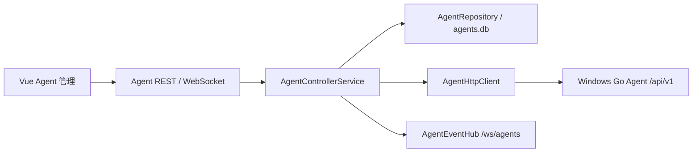

# NetConsole Agent Controller

## 1. 当前范围

阶段 3 将 Windows Go Agent 接入 Python 主程序的多 Agent 控制面。当前只支持配置、健康探测、版本、平台、架构、能力和实时状态，不支持启动 iPerf、Ping、Online MR 或任意命令。



浏览器不直接访问 Agent。Desktop Mode 和 Server Mode 都由 FastAPI 所在主机发起网络连接，因此页面明确提示连接测试的网络视角。

## 2. Agent API 审计与适配

现有 Agent 使用：

- 身份与状态：`GET /api/v1/status`；
- 能力：`GET /api/v1/capabilities`；
- Token Header：`X-Agent-Token`；
- 响应：成功 `{"ok":true,"data":...}`，失败 `{"ok":false,"error":{"message":"..."}}`。

阶段 3 仅为缺失的能力事实来源增加了向后兼容接口，没有修改任务、目标、采集或认证协议。旧 Agent 返回 404 时，Controller 将能力保存为空对象并显示为未知。

`AgentHttpClient` 统一处理 URL、连接/读取超时、HTTP/HTTPS、Token Header、JSON 契约、401、版本兼容和错误映射；禁止自动跟随重定向，也不记录 Header 或 Token。

## 3. 数据模型

每局点数据库路径由 `PathResolver.site_agents_db_path(site)` 返回：

```text
data/sites/<site>/db/agents.db
```

`agent_configs` 保存用户配置，`agent_runtime_snapshots` 保存动态状态。两者通过 `agent_id` 关联，但不会与 `tasks.db` 或 `devices.db` 混用。SQLite 使用 WAL、busy timeout、foreign keys、显式事务和按调用创建连接。

状态固定为：`UNKNOWN / ONLINE / OFFLINE / UNAUTHORIZED / DISABLED`。能力保存为结构化 JSON，未知字段原样保留。

删除入口采用归档：设置 `archived_at` 并禁用 Agent，不物理删除配置或任务历史。相同归档请求幂等返回成功。

## 4. 凭据边界

仓库当前没有可复用的安全持久化机制，因此阶段 3 不自创加密：

- Token 仅保存在 `SessionCredentialVault` 内存中；
- `agents.db` 只保存不可逆推出 Token 的随机 `credential_reference`；
- API 只返回 `has_credential`，不返回 Token；
- 重启 Controller 后需要重新录入 Token；
- 日志和标准化错误不包含 Authorization Header、Token 或底层 traceback。

后续如引入 Windows Credential Manager/DPAPI 或服务端秘密管理，应保持 `credential_reference` 契约，不直接迁移为数据库明文。

## 5. 健康检查与事件

FastAPI lifespan 启动一个健康检查协程，使用有上限的异步并发，不为每个 Agent 创建永久线程。周期和并发可通过：

```text
NETCONSOLE_AGENT_HEALTH_ENABLED
NETCONSOLE_AGENT_HEALTH_INTERVAL
NETCONSOLE_AGENT_HEALTH_CONCURRENCY
```

调度器跳过禁用 Agent；状态内容未变化时不重复写库或广播。手工探测始终更新时间并发布 `agent.probe_completed`。

`AgentEventHub` 独立于 `TaskEventHub`，提供 `agent.created / updated / enabled / disabled / status_changed / probe_completed / deleted`。`/ws/agents` 只提供快照和增量通知；重连后前端会重新调用 REST 获取完整列表。

当前 Server Mode 只支持单 Controller/Uvicorn Worker。多 Worker 会重复轮询，本阶段不引入分布式锁。

## 6. REST API

```text
GET    /api/agents
POST   /api/agents
POST   /api/agents/probe
GET    /api/agents/{agent_id}
PATCH  /api/agents/{agent_id}
POST   /api/agents/{agent_id}/probe
POST   /api/agents/{agent_id}/enable
POST   /api/agents/{agent_id}/disable
DELETE /api/agents/{agent_id}
WS     /ws/agents
```

没有 iPerf、Ping、MR、任意命令、包管理或升级接口。

## 7. 已知限制与后续

- Controller 不是 Windows Service 或独立守护进程；桌面退出后的本地 Worker 生命周期没有改变。
- 凭据只在会话内保存。
- 仅适配 Windows Go Agent V1；CentOS Agent 尚未实现。
- 正式发布脚本尚未确认打包 `frontend/dist`。

阶段 4 才能设计 `TrafficTestService`、Agent 执行端选择、任务中心关联、实时指标和图表；必须继续复用当前 Agent 配置、凭据引用和状态事实来源。
