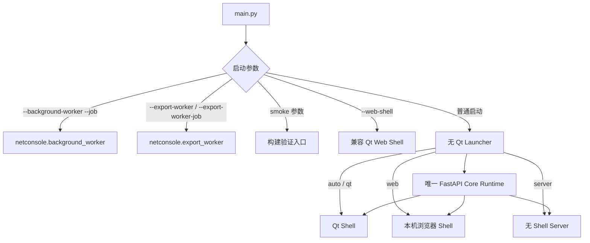
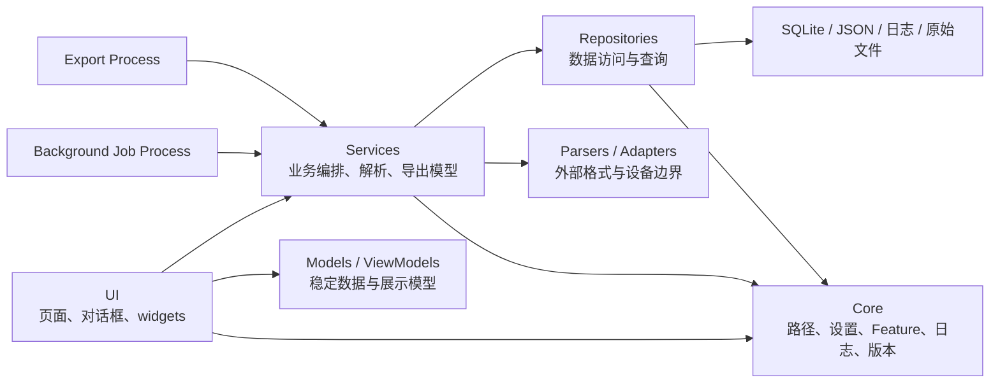
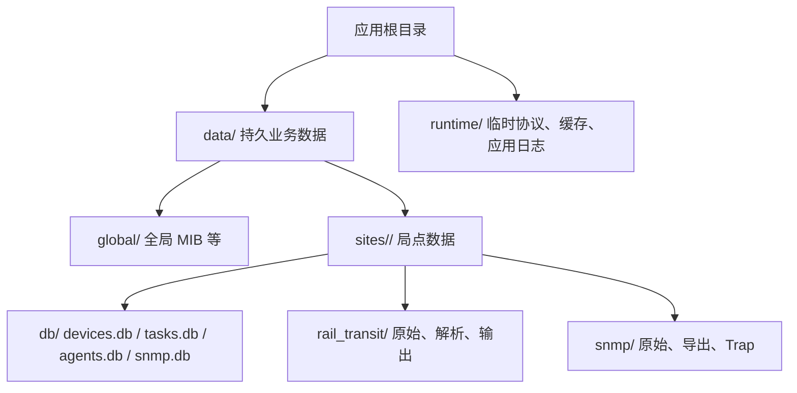
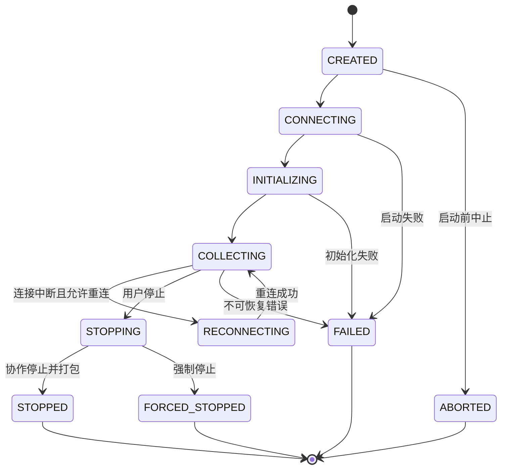

# NetConsole 架构

## 1. 架构目标

本文描述当前源码架构。NetConsole 以 Python Core Runtime 为主体，Electron 是唯一正式桌面产品方向；Launcher 中的 Qt、本机 Web 和 Server Shell 是迁移兼容或开发诊断入口，不再构成正式发布回退。长期目标是 Python Core + FastAPI 永久业务层、Vue 永久主界面和 Electron 最终桌面外壳，Qt 仅保留为迁移事实源并最终删除，详见 [下一代架构](ARCHITECTURE_NEXT.md)。当前架构的首要目标仍是：UI 保持可响应，网络/磁盘/CPU 工作可取消，导出失败不污染目标文件，局点数据边界清晰，历史功能可渐进迁移而不一次性重写。

## 2. 启动与运行形态

`main.py` 是唯一程序入口。它先识别工作进程、smoke 和旧 Qt Web Shell 参数，再由无 Qt 依赖 Launcher 创建 Core Runtime 并选择 Shell：

`--mode auto` 为默认值：隔离子进程实际初始化 Qt Widgets/platform，成功后进入 Qt；能力探测失败时优先打开本机浏览器，无图形/浏览器能力时保持 Server Shell。`--mode web` 与 `--mode server` 的通用路径不导入 PySide6；前者固定使用 Desktop Runtime、随机回环端口和短期会话，后者使用 Server Runtime、默认 `127.0.0.1:8000` 且不主动打开浏览器。远程鉴权完成前，Launcher 只允许 `localhost` 或 IP loopback。Qt WebEngine 单独通过轻量子模块探测，不加载 FastAPI/Core 导入链，也不影响 Qt 原生页面启动。

Launcher 对普通启动执行进程级文件锁；worker、smoke 和内部提权网络管理入口不参与该锁，避免破坏既有子进程协议。Core Runtime 先于 Shell 启动并统一停止 Uvicorn/FastAPI lifespan；Qt 的 WebConsoleHost 只消费该服务，不再拥有其生命周期。`--web-shell` 暂保留原 Qt WebEngine 语义作为兼容入口。当前尚未把所有旧 Qt 页面各自创建的 `BackgroundProcessManager/TaskApplicationService` 全面注入同一容器，不能将本阶段描述为页面级服务对象已经全部统一。

开发态工作进程使用当前 Python；冻结态使用当前可执行文件并带内部参数。页面和服务不得自行拼接另一套 worker 启动协议。发布脚本会构建并打包 `apps/web/dist`，详细边界见 [Web 演进架构](WEB_ARCHITECTURE.md) 和 [Desktop WebHost](WEB_HOST.md)。

## 3. 分层与依赖方向

约束：

- UI 负责输入、状态、轻量 ViewModel 和结果呈现，不承载长任务或大规模业务计算。
- Services 不依赖具体页面；需要向 UI 通知时使用结果对象、事件或回调。
- Repositories 负责数据库连接、事务、查询和数据映射，不放页面文案。
- `core/paths.py` 是路径事实来源；业务模块不得散落硬编码的本机绝对路径。
- `resources/` 存放只读资源和规则；运行数据不得写入源码、`docs/` 或 `tests/`。
- 用户可见文案通过 i18n 资源/服务管理；日志通过 core logger 记录稳定事件，设备密码和认证材料不得进入普通日志。

## 4. 后台任务架构

### 4.1 普通 Background Job

关键契约：

- `JobSpec` 包含 `job_id`、`task_type`、`params` 和取消文件路径。
- worker 的 stdout 只允许输出 JSONL 协议；普通诊断输出重定向到 stderr。
- 取消先写 `.cancel`，handler 通过 `JobContext.check_cancelled()` 协作退出；超时后进程管理器 terminate，再在 3 秒后 kill。
- Job 文件位于 `.local/runtime/cache/background_jobs/`，终态后清理。
- Job Registry 按 AC、配置、设备、文件、Mesh、网络、Online MR、轨道交通、SNMP、无线勘测、Traffic 等领域模块组织；测试校验必需能力集合，不再绑定易漂移的任务总数。
- 领域目录已形成，但大量 handler 仍只是到 `legacy_tasks.py` 的薄适配；不能将“完成注册”写成“完成业务迁移”。
- `services/job_center/runtime/` 负责纯 Python 状态、事件、Job/取消文件、JSONL 解析和终态清理；`task_manager.py` 保留为 Qt/QProcess Adapter。FastAPI 已提供任务路由与 `/ws/tasks`。
- `TaskApplicationService -> TaskRepository -> tasks.db` 保存任务快照与事件；FastAPI 提供任务 REST/WebSocket，Qt signals 继续消费同一 Event Hub 的兼容 payload。
- `Agent Router -> AgentControllerService -> AgentHttpClient -> Go Agent` 承担配置与健康控制面；Traffic 业务由 `TrafficTestApplicationService -> AgentTrafficAdapter/Supervisor` 在 Controller 进程内调用，并映射到 Task Center。`AgentRepository -> agents.db` 分离配置和运行快照，`AgentEventHub` 独立提供 `/ws/agents`，不复用任务或 Traffic 事件含义。

设备批量连接测试（默认 50、上限 200）和批量详情采集（默认 20、上限 50）目前仍是专用线程/线程池路径。它们有取消、逐设备进度和错误隔离，但不属于上述进程 Job 协议。

### 4.2 Export Process

正式导出必须进入独立进程。当前通用注册导出类型 27 个，另有 `trackside_ap_business` 和 `mesh_link_detail` 两个专用入口。默认优先传递数据库路径、文件路径、查询条件或 JSONL，而不是把大数据行塞进 Job JSON；兼容 inline rows 仅显式启用且上限 5000 行。

失败或取消时删除临时文件，只有完整成功才原子替换目标文件。页面不得先创建一个看似成功的半成品；WPS/Excel 占用目标文件时，应提示用户关闭占用后重试。

## 5. 数据与 SQLite

- 通用 SQLite 连接默认 timeout 30 秒、`busy_timeout` 10 秒；需要 WAL 的 repository 显式调用 WAL 初始化，并采用 `synchronous=NORMAL`。
- 并发 worker 各自创建连接，不跨线程共享 SQLite connection。
- 设备管理、FIT AP 资源等主应用数据库默认保持兼容；会话解析数据库和可重建分析表可在明确范围内重构。
- 自动清理只针对受控的运行日志、缓存和临时目录；局点业务文件、数据库、配置和备份不得自动删除。
- `tasks.db` 是持久任务索引，不承担业务原始数据或大结果存储；大结果只记录 `result_path`。

完整目录见 [DATA_LAYOUT.md](DATA_LAYOUT.md)。

## 6. Feature 与 UI

- 一级模块和子能力以 `core/feature_registry.py` 为唯一注册表。
- `FeatureStatus.DISABLED` 是 Registry 级硬禁用，profile、开发覆盖和直接页面入口均不能重新开启；当前用于 SNMP Center 与无线勘测。
- 新页面、Tab、动作或按钮必须登记 Feature key，通过 `FeatureGate` 统一控制可见性和可用性。
- 表格必须使用 item/delegate，不为每个单元格创建 QWidget；首屏可自动列宽，之后尊重用户拖动并持久化。
- 对话框和复杂页面要覆盖 1920×1080，工具栏可滚动或换行，内容使用 splitter/scroll area，深浅主题同时保证文本和状态颜色可辨认。

详见 [FEATURE_MODULES.md](FEATURE_MODULES.md) 和 [ui_table_guidelines.md](ui_table_guidelines.md)。

## 7. 关键业务边界

- Online MR：原始日志是事实来源；实时解析用于视图，正式离线解析由 `online_mr_parse` Job 完成，报告由 Export Process 输出。
- SNMP：单次查询与批量采集有正式 Job handler；MIB 资源、产品参考等部分中心动作仍经过 legacy 薄适配。
- AP Identity：只读 shadow/diagnostics，不改旧 resolver、数据库 schema、workbook 字段或业务统计；阶段 8.3 可见 UI 继续暂缓。
- MR/Mesh：目录数据库可仅作索引，源文件明细应解析到 `source_files.parsed_db_path` 指向的数据库；大样本图表按可见窗口或保留关键点的下采样结果绘制。

阶段 5B-3 的 Online MR LOCAL Application 入口复用现有 `online_mr_collection_start` Worker，不创建第二套 Core。Worker 内纯 Python `OnlineMrTrafficCoordinator` 持有 fping/iPerf 子线程：停止时先显式 stop/join Traffic，再关闭 SSH collector/writer，稳定 metadata 后原子打包，最后退出 Worker 让 Task Runtime 发布终态。强停由 Application Service 先有界协作等待，再通过 `LocalProcessAdapter` 终止进程树；无法确认 flush 时保留 raw、不发布新 ZIP，并把 Session/Mapping 收敛到带警告终态。阶段 5B-4 已让 Legacy Qt 页面通过 `OnlineMrCollectorWorker` 兼容 Adapter 使用该入口；Qt signals、实时 raw tail、快照和页面状态绑定继续保留，页面不再为这些会话重复启动自有 Traffic Worker。

阶段 5B-7 增加纯 Python Agent package importer：只处理已下载 ZIP，在所属局点 staging 中校验路径、公共 JSON、raw 契约和哈希后原子落入 Online MR Session，并登记同局点终态 Task/Mapping；同哈希幂等、不同哈希冲突且不覆盖。该能力现由 5B-13A/13B 的 Agent executor 在远端任务终态后调用，不改变 LOCAL 生命周期。

阶段 5B-8 在现有 `AgentHttpClient` 统一响应和鉴权逻辑上增加 Online MR 类型化客户端，可查询 ping、Agent/工具状态、任务和包列表，并将受大小、超时和取消约束的 ZIP 流式下载到所属局点临时目录后交给 5B-7 importer。固定 start/status/normal stop 路由现由 5B-13A executor 调用；不接受任意 URL、路径或命令。

阶段 5B-11 在 Legacy Qt Online MR 页面增加 Agent 已有采集包同步/导入入口。网络查询、下载和导入通过 `online_mr_agent_packages_sync` / `online_mr_agent_package_import` Worker Process 执行；唯一 IP 候选才允许自动导入，`already_imported` 幂等跳过，`conflict` 不覆盖，无匹配或多匹配只允许经人工选择正式设备并二次确认。Token 只通过该 Worker 的临时环境传递，不进入 Job JSON、SQLite、日志或事件。该入口不开放远程 start/stop、`executor=AGENT` 或 Go Agent 修改，也不改变 LOCAL 生命周期。

阶段 5B-13A/13B 在 `OnlineMrApplicationService` 下增加默认关闭的单 Agent executor 与 Desktop WebHost AGENT 适配层。Vue 只在列车通信 MR 详情的独立页签提交白名单 DTO；Router 严格校验 Desktop、`127.0.0.1` 和短期 Cookie，Service 只从 Agent Profile/会话凭据解析连接信息。远程轮询、时长、重启恢复、下载和导入都留在 Controller；Web 不提供强停、删除、任意命令或 URL。

Online MR 会话生命周期：

## 8. 关停与清理

`ShutdownManager` 负责登记内部任务和子进程。关闭应用时应请求协作取消，必要时终止内部进程；按策略标记为外部工具的进程不由应用盲目 kill。自动清理在主窗口启动后延时执行，不应阻塞首屏。

## 9. 架构变更准入

新增功能至少回答：它是否位于永久架构、运行在哪个进程/线程、如何取消、进度如何传递、数据从哪里读写、Feature key 是什么、失败是否会留下半成品、如何验证。新用户功能默认经 Application Service -> FastAPI -> Vue 建设，不新增 Qt 业务页面；若预计超过 300 ms，默认进入 Job Center；若产生用户文件，默认进入 Export Process。

打包环境由 `main.py` 复用同一入口分派冻结 worker；发布目录和外部工具边界见 [BUILD_AND_RELEASE.md](BUILD_AND_RELEASE.md)。仓库现有独立的 Windows Go Agent V1，并已接入 Python 多 Agent 配置、健康检查、版本、能力、iPerf/fping 调度和默认关闭的单 Agent Online MR 远程执行；CentOS Agent、主动注册、上传与多 Agent MR 编排仍未接入。边界见 [独立 Agent](AGENT.md)、[Agent Controller](AGENT_CONTROLLER.md) 与 [统一流量测试架构](TRAFFIC_TEST_ARCHITECTURE.md)。
