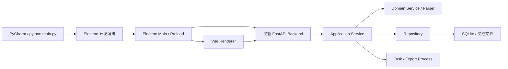
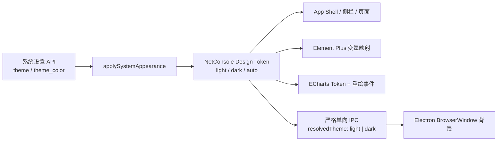

# NetConsole 当前架构

## 产品边界

NetConsole 当前正式桌面产品只有 Electron。Electron Main/Preload 承载窗口、受管 Backend 生命周期和白名单本机能力；Vue 3 是唯一 Renderer；FastAPI/Python Core 是永久业务层。本机 Browser 与无 Shell Server 只用于源码开发、诊断和 API 联调，不构成独立产品或失败回退。

Qt/PySide6/QFluentWidgets 源码、入口、运行依赖和发布链已经删除。历史行为只通过 Git 与[最终迁移矩阵](architecture/MIGRATION_MATRIX.md)追踪，不能恢复 Qt 入口规避未完成业务。

局点与数据存储遵循 `Vue -> /api/v1 -> Site/DataRoot Application Service -> PathResolver/Repository`。复制、SQLite、压缩和完整性校验只在 Python Worker 中执行；Electron Main 只维护 `bootstrap.json`、原生选择器和 Backend 生命周期。详见 [局点与数据存储](storage/README.md)。

## 启动链

- 无参数 `main.py` 与 `apps/desktop_electron` 的 `pnpm dev` 进入同一开发编排链。
- 打包态由 Electron 以内部 `--electron-backend` 启动冻结 Backend。
- Backend 只监听随机 loopback 端口，桌面会话令牌每次启动重新生成，不写 URL、日志或 SQLite。
- `main.py --mode server` 只用于显式本机开发诊断。

## 永久分层

| 层 | 允许职责 | 禁止职责 |
| --- | --- | --- |
| Electron Main/Preload | 窗口、进程、IPC、原生选择器、受控打开/下载 | 设备命令、SQL、Parser、业务状态机、任意命令/路径桥接 |
| Vue Renderer | 页面、表单、表格、图表、轻量显示转换 | SSH/SNMP、数据库、文件业务、命令选择、核心算法 |
| FastAPI Router | 鉴权、DTO、Service 调用、HTTP/WS 映射 | 直接 SQL、设备连接、目录扫描、长任务和业务规则 |
| Application Service | 用例编排、校验、任务、事务与跨服务协作 | Electron/Vue/FastAPI Request、宿主对象 |
| Domain Service / Parser | 设备与业务规则、解析、归一化、报告 | UI、HTTP、IPC |
| Repository | SQLite 查询、事务、迁移、分页与记录映射 | UI、设备命令和业务判定 |

Vue 标准业务表格通过 `apps/desktop_renderer/src/components/table/NcDataTable.vue` 和强类型列定义表达展示契约；文本测量、自动列宽、缺失值、对齐和视图偏好属于共享 Renderer 基础，不由业务页面重复实现。该基础不读取数据库、不执行设备命令，也不改变 DTO 字段语义。现有直接 `el-table` 按 [表格迁移清单](ui/TABLE_INVENTORY.md) 分域收敛，新增违规由 `scripts/ui/` Guard 阻止。

## 后台任务与导出

预计超过 300ms 的网络、磁盘、解析、批量和 CPU 工作进入 Job Center。`TaskApplicationService/TaskRuntime` 维护七状态、JSONL 事件、协作取消和 `tasks.db`；`LocalProcessAdapter` 负责 Worker 进程和 Windows 进程树回收。所有正式导出进入独立 Export Process，先写临时文件，成功后原子替换。

原始业务数据的破坏性生命周期操作遵循
`Vue -> API -> ApplicationService -> Raw Data Lifecycle Service -> Repository/File Adapter`。
Router 不接触 SQL、物理路径或文件 API；Application Service 负责 preview token、确认、审计和 Job 投递；
Lifecycle Service 负责锁、revision、原子重写和回滚；Repository 在单事务中更新 Registry 与 provenance
派生记录。地面无人值守 Syslog 是首个接入场景，READY 归档保持不可变。

页面关闭不等于停止任务。任务取消、重试、Artifact 下载和打开能力必须由任务 owner 明确授权，不能由前端伪造状态。

## 全局主题运行链

- 系统设置仍是主题与强调色的唯一持久化事实源，不新增 localStorage、Pinia 或 Electron 配置副本。
- `light`、`dark`、`auto` 统一作用于侧栏、顶部栏、内容区、Element Plus 浮层和图表；当前不提供隐式“深色侧栏 + 浅色内容”模式。
- Renderer 只向受信 Main 报告解析后的 `light|dark`，不能传任意颜色或窗口参数；Main 只映射到预定义安全背景色。
- 自动测试已经覆盖 Token、主题事件和严格 IPC 契约，但 Electron 多尺寸、多缩放和 Windows 跟随系统的最终视觉验收仍为 `PENDING`，不能由单元测试替代。

## 数据与资源

- 版本唯一来源：`src/netconsole/core/version.py`。
- Feature 唯一来源：`src/netconsole/core/feature_registry.py`。
- 路径唯一来源：`src/netconsole/core/paths.py`。
- 源码开发、打包验证和正式安装包均使用唯一数据根 `D:\NetConsoleData`；自动测试只使用显式的 `D:\NetConsoleTestData\<run-id>`，运行数据不得写回源码或系统应用数据目录。
- 主应用、Task、Agent、Traffic、Online MR 与 MESH 数据各有独立 Repository/领域路径，不跨线程或进程共享 SQLite connection。
- 随包 fping/iPerf 唯一来源为 `resources/tools/`，构建不得联网下载业务工具。

## 当前完成边界

“Qt 已删除”只表示技术栈和启动架构完成收口，不表示所有业务都通过人工或真实设备验收。模块状态以[最终迁移矩阵](architecture/MIGRATION_MATRIX.md)、Navigation Registry、Feature Registry 和测试为准；自动测试不能把 `PARTIAL`、`IMPLEMENTED_UNVERIFIED` 或 `REAL_DEVICE_PENDING` 提升为 `COMPLETE`。

SNMP Center、通用 MIB/OID 平台和无线勘测属于批准删除项。设备管理只保留 SNMP v1/v2c 基础识别；网络工具无线扫描是独立能力。

## 架构门

新增功能必须沿 `Application Service -> FastAPI -> Vue` 建设，并通过 Electron 白名单本机能力完成桌面闭环。当前十个架构门已由 `scripts/architecture/run_all.py` 建立，其中动态图稳定性门覆盖 ECharts 时间轴的 Canvas、Tooltip、Resize、实例生命周期和 series 替换；精确分类、限时例外、历史迁移分类和未解决项见[架构一致性规则](ARCHITECTURE_COMPLIANCE.md)、[当前审计报告](archive/migrations/electron-only/ARCHITECTURE_COMPLIANCE_REPORT.md)及 [E10B 归档](archive/migrations/electron-only/2026-07-18-E10B-architecture-guards-and-remediation.md)。
