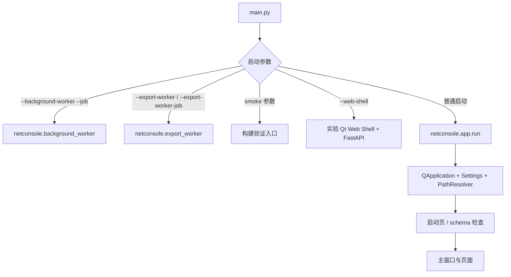
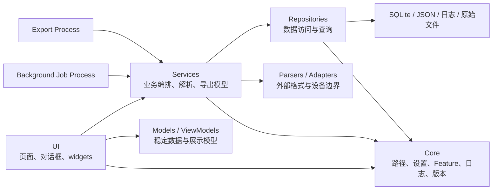
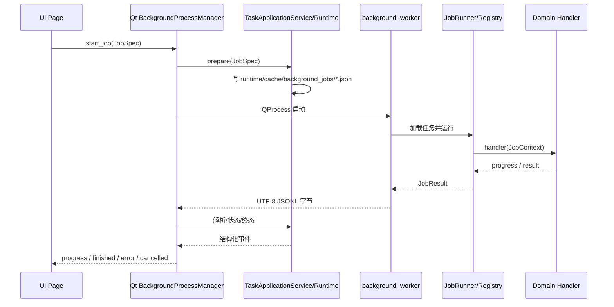
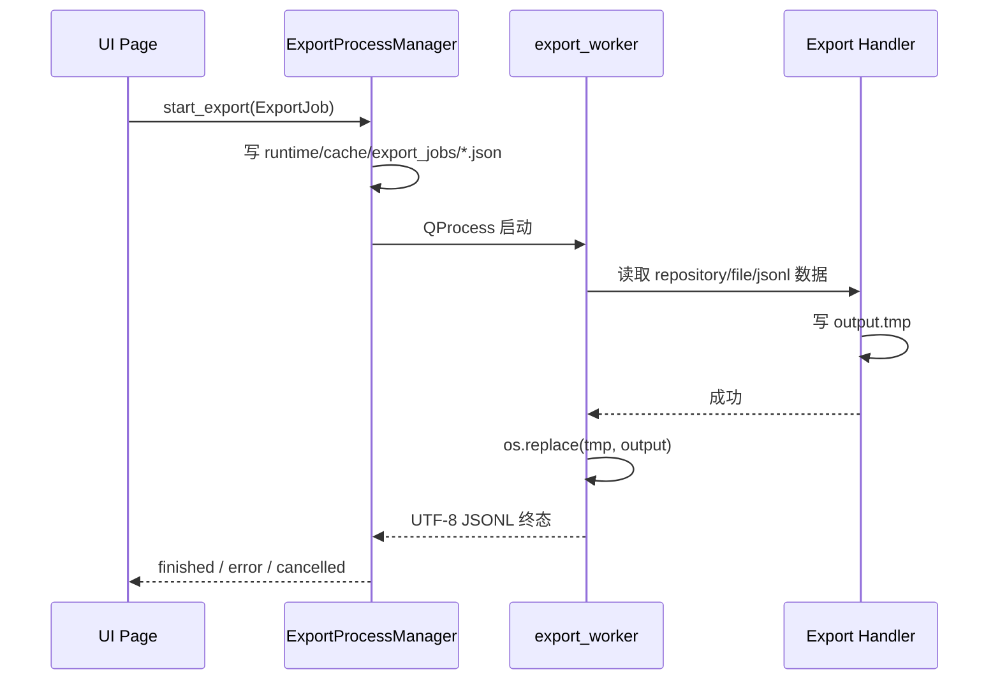
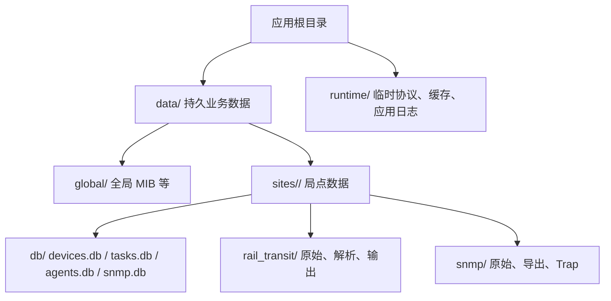
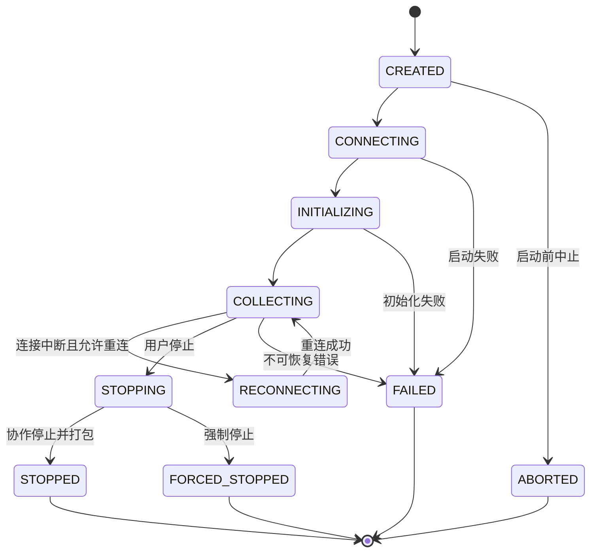

# NetConsole 架构

## 1. 架构目标

NetConsole 是 Windows Qt6 桌面应用。架构的首要目标是：UI 保持可响应，网络/磁盘/CPU 工作可取消，导出失败不污染目标文件，局点数据边界清晰，历史功能可渐进迁移而不一次性重写。

## 2. 启动与运行形态

`main.py` 是唯一程序入口。它先识别工作进程参数，再进入桌面应用：

开发态工作进程使用当前 Python；冻结态使用当前可执行文件并带内部参数。页面和服务不得自行拼接另一套 worker 启动协议。`--web-shell` 加载阶段 3 Vue 任务中心与 Agent 管理，不替换普通启动；当前正式发布脚本尚未打包 `frontend/dist`，详细边界见 [Web 演进架构](WEB_ARCHITECTURE.md)。

## 3. 分层与依赖方向

约束：

- UI 负责输入、状态、轻量 ViewModel 和结果呈现，不承载长任务或大规模业务计算。
- Services 不依赖具体页面；需要向 UI 通知时使用结果对象、事件或回调。
- Repositories 负责数据库连接、事务、查询和数据映射，不放页面文案。
- `core/paths.py` 是路径事实来源；业务模块不得散落硬编码的本机绝对路径。
- `resources/` 存放只读资源和规则；运行数据不得写入源码、`docs/` 或 `tests/`。
- 用户可见文案通过 i18n 资源/服务管理；日志通过 core logger 记录稳定事件，设备密码和认证材料不得进入普通日志。

## 4. 后台任务架构

### 4.1 普通 Background Job

关键契约：

- `JobSpec` 包含 `job_id`、`task_type`、`params` 和取消文件路径。
- worker 的 stdout 只允许输出 JSONL 协议；普通诊断输出重定向到 stderr。
- 取消先写 `.cancel`，handler 通过 `JobContext.check_cancelled()` 协作退出；超时后进程管理器 terminate，再在 3 秒后 kill。
- Job 文件位于 `runtime/cache/background_jobs/`，终态后清理。
- Job Registry 当前注册 83 个任务类型，分布于 AC、配置、设备、文件、Mesh、网络、Online MR、轨道交通、SNMP、无线勘测 10 个领域模块。
- 领域目录已形成，但大量 handler 仍只是到 `legacy_tasks.py` 的薄适配；不能将“完成注册”写成“完成业务迁移”。
- `services/job_center/runtime/` 负责纯 Python 状态、事件、Job/取消文件、JSONL 解析和终态清理；`task_manager.py` 保留为 Qt/QProcess Adapter。FastAPI 已提供任务路由与 `/ws/tasks`。
- `TaskApplicationService -> TaskRepository -> tasks.db` 保存任务快照与事件；FastAPI 提供任务 REST/WebSocket，Qt signals 继续消费同一 Event Hub 的兼容 payload。
- `Agent Router -> AgentControllerService -> AgentHttpClient -> Go Agent` 只承担配置与健康控制面；`AgentRepository -> agents.db` 分离配置和运行快照，`AgentEventHub` 独立提供 `/ws/agents`，不复用任务事件含义。

设备批量连接测试（默认 50、上限 200）和批量详情采集（默认 20、上限 50）目前仍是专用线程/线程池路径。它们有取消、逐设备进度和错误隔离，但不属于上述进程 Job 协议。

### 4.2 Export Process

正式导出必须进入独立进程。当前通用注册导出类型 27 个，另有 `trackside_ap_business` 和 `mesh_link_detail` 两个专用入口。默认优先传递数据库路径、文件路径、查询条件或 JSONL，而不是把大数据行塞进 Job JSON；兼容 inline rows 仅显式启用且上限 5000 行。

失败或取消时删除临时文件，只有完整成功才原子替换目标文件。页面不得先创建一个看似成功的半成品；WPS/Excel 占用目标文件时，应提示用户关闭占用后重试。

## 5. 数据与 SQLite

- 通用 SQLite 连接默认 timeout 30 秒、`busy_timeout` 10 秒；需要 WAL 的 repository 显式调用 WAL 初始化，并采用 `synchronous=NORMAL`。
- 并发 worker 各自创建连接，不跨线程共享 SQLite connection。
- 设备管理、FIT AP 资源等主应用数据库默认保持兼容；会话解析数据库和可重建分析表可在明确范围内重构。
- 自动清理只针对受控的运行日志、缓存和临时目录；局点业务文件、数据库、配置和备份不得自动删除。
- `tasks.db` 是持久任务索引，不承担业务原始数据或大结果存储；大结果只记录 `result_path`。

完整目录见 [DATA_LAYOUT.md](DATA_LAYOUT.md)。

## 6. Feature 与 UI

- 一级模块和子能力以 `core/feature_registry.py` 为唯一注册表。
- `FeatureStatus.DISABLED` 是 Registry 级硬禁用，profile、开发覆盖和直接页面入口均不能重新开启；当前用于 SNMP Center 与无线勘测。
- 新页面、Tab、动作或按钮必须登记 Feature key，通过 `FeatureGate` 统一控制可见性和可用性。
- 表格必须使用 item/delegate，不为每个单元格创建 QWidget；首屏可自动列宽，之后尊重用户拖动并持久化。
- 对话框和复杂页面要覆盖 1920×1080，工具栏可滚动或换行，内容使用 splitter/scroll area，深浅主题同时保证文本和状态颜色可辨认。

详见 [FEATURE_MODULES.md](FEATURE_MODULES.md) 和 [ui_table_guidelines.md](ui_table_guidelines.md)。

## 7. 关键业务边界

- Online MR：原始日志是事实来源；实时解析用于视图，正式离线解析由 `online_mr_parse` Job 完成，报告由 Export Process 输出。
- SNMP：单次查询与批量采集有正式 Job handler；MIB 资源、产品参考等部分中心动作仍经过 legacy 薄适配。
- AP Identity：只读 shadow/diagnostics，不改旧 resolver、数据库 schema、workbook 字段或业务统计；阶段 8.3 可见 UI 继续暂缓。
- MR/Mesh：目录数据库可仅作索引，源文件明细应解析到 `source_files.parsed_db_path` 指向的数据库；大样本图表按可见窗口或保留关键点的下采样结果绘制。

Online MR 会话生命周期：

## 8. 关停与清理

`ShutdownManager` 负责登记内部任务和子进程。关闭应用时应请求协作取消，必要时终止内部进程；按策略标记为外部工具的进程不由应用盲目 kill。自动清理在主窗口启动后延时执行，不应阻塞首屏。

## 9. 架构变更准入

新增功能至少回答：运行在哪个进程/线程、如何取消、进度如何传递、数据从哪里读写、Feature key 是什么、失败是否会留下半成品、如何验证。若预计超过 300 ms，默认进入 Job Center；若产生用户文件，默认进入 Export Process。

打包环境由 `main.py` 复用同一入口分派冻结 worker；发布目录和外部工具边界见 [BUILD_AND_RELEASE.md](BUILD_AND_RELEASE.md)。仓库现有独立的 Windows Go Agent V1，并已接入 Python 多 Agent 配置、健康检查、版本和能力控制面；iPerf/Ping/MR 任务仍未从 Python Controller 调用，也未实现 CentOS Agent、主动注册或上传。边界见 [独立 Agent](AGENT.md) 与 [Agent Controller](AGENT_CONTROLLER.md)。
