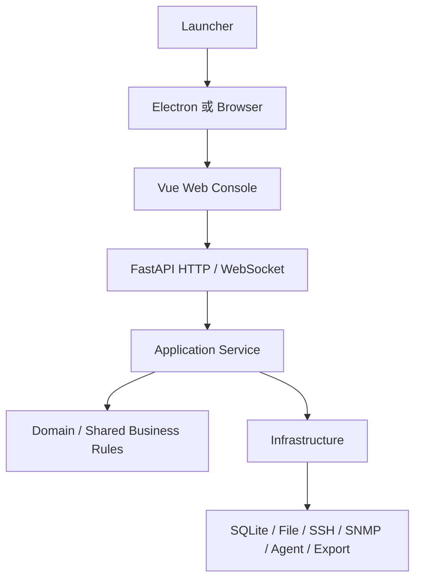

# NetConsole 下一代架构

## 文档定位

本文记录 NetConsole 已确认的长期目标架构和不可跨越的依赖边界。

- 当前实现事实见 [ARCHITECTURE.md](ARCHITECTURE.md)。
- Web 与 Qt 的实际覆盖状态见 [WEB_MIGRATION_MATRIX.md](WEB_MIGRATION_MATRIX.md) 和 [WEB_QT_PARITY_MATRIX.md](WEB_QT_PARITY_MATRIX.md)。
- 分阶段迁移方法见 [WEB_MIGRATION_PLAN.md](WEB_MIGRATION_PLAN.md)。

目标架构不等于当前目录已经完成重排。迁移期间必须同时写清“当前状态”和“目标状态”，不得把规划描述成已实现。

## 战略结论

NetConsole 的长期产品形态确定为：

> **Python Core + FastAPI 作为永久业务层，Vue 作为永久主界面，Electron 作为最终桌面外壳，Qt 仅保留在迁移期并最终删除。**

当前实施阶段是 **Electron 与 Qt 并行迁移**：Qt 保持生产与回退可用，Electron 独立验证新宿主；两者不得复制 Python 业务逻辑，任何 Qt 入口都只能在对应 Web 纵向闭环达到替换门槛后退出。

永久保留：

- Python Core、Application Service、Repository、Parser 与设备适配能力；
- FastAPI HTTP/WebSocket 接口；
- Vue Web Console；
- Windows Go Agent 及后续 Agent 能力；
- Task、Session、Mapping、Artifact 和审计体系。

过渡或未来替换：

- Qt GUI：迁移期生产入口和故障回退，目标是逐模块隐藏并最终删除；
- 当前 Qt Web Shell：迁移期 Desktop WebHost 宿主和生产回退，尚未删除；
- Electron：`apps/desktop_electron/` 已建立可运行安全基础，复用现有 Vue/FastAPI；安装包、升级、托盘和业务模块替换尚未完成。

从本决策起，不再新增 Qt 业务页面，也不在 Qt 页面中建立新的业务规则。新功能默认沿永久链路建设。

## 目标调用链



迁移期间 Qt 可以调用同一套 Application Service，但不得形成第二套业务实现：

```text
Qt 页面 ----┐
            ├─ Application Service ─ Repository / Parser / Adapter
FastAPI ----┘
```

## 分层职责与硬边界

| 层 | 允许职责 | 禁止事项 |
| --- | --- | --- |
| Vue | 展示、输入、轻量校验、状态绑定 | 设备命令、数据库访问、业务状态机、凭据处理 |
| Electron | 窗口、托盘、进程生命周期、受控本机桥接、升级 | 设备业务、数据库、采集、命令解析、通用命令执行 |
| FastAPI Router | DTO 校验、鉴权、调用 Application Service、响应映射 | 直接操作 Repository、SQLite、设备或文件系统业务 |
| Application Service | 用例编排、权限与审计、Task/Session/Artifact 协调 | 依赖 Vue、Electron 或 Qt 控件 |
| Domain / Shared Rules | 稳定业务规则、状态与值对象 | 桌面或 Web 框架依赖 |
| Infrastructure | Repository、设备协议、文件、进程、Agent、导出适配 | 向上持有前端状态 |

API 是永久边界。接口变更必须兼容现有调用方，必要时版本化；不得让 Electron 绕过 FastAPI 直接调用 Python 内部业务对象。

截至 Phase 0.5 第一批，18 个正式 Router 的静态 Application 边界守卫已无临时债务。现有 `src/netconsole/backend/api/main.py:create_app()` 继续作为唯一组合根，集中创建并注入共享 Task、Agent、Traffic、Online MR、Network Tools 和基础资料 Service；没有新增 `ApiRuntimeServices` 类、第二套容器或空 composition 包。该状态只覆盖首批 API 边界，不表示所有 Qt 页面或 legacy handler 已迁移。

## 当前目录与目标职责映射

当前不做大规模搬目录。以下映射用于约束新代码放置，不代表需要立即创建空目录：

| 目标职责 | 当前主要位置 | 迁移说明 |
| --- | --- | --- |
| Launcher / 进程生命周期 | `main.py`、`src/netconsole/launcher/` | 已进入 Core 统一生命周期第一阶段，继续去除 Qt 依赖 |
| Vue 主界面 | `apps/web/` | 永久保留，新用户功能默认进入此处 |
| FastAPI | `src/netconsole/backend/api/` | 永久保留，Router 保持薄层 |
| Application / Domain | `src/netconsole/services/`、`src/netconsole/core/` 等 | 逐用例收敛，不为命名整齐进行批量搬迁 |
| Infrastructure | `src/netconsole/repositories/`、`parsers/`、`adapters/` 等 | 复用现有实现，按实际依赖治理 |
| Qt 业务界面 | `src/netconsole/ui/` | 迁移期保留，只维护和回退，不新增业务页面 |
| Qt Legacy 外壳 | `apps/desktop/`、`src/netconsole/ui/` | 当前生产/回退入口，只做缺陷与兼容维护 |
| Electron 外壳 | `apps/desktop_electron/` | 已有 main/preload/backend supervisor 基础；不复制 `apps/web` 或 Python Core |
| Agent | `apps/agent/` | 独立运行，继续通过受控 API 与 Core 协作 |

未经独立迁移任务批准，不创建空 `domain/`、`application/`、`infrastructure/`，也不为了符合示意图机械移动已有代码。Electron 基础已经落地，但不得在其中建立第二套业务、Renderer 或 Node 后端。

## Electron 本机桥接边界

Electron 只提供经过白名单和参数校验的本机能力。第一阶段已实现：

- `selectFile`
- `selectDirectory`
- `chooseSavePath`
- `downloadBackendResource`：只允许受控 `/api/...` 描述，由 main 访问当前动态回环后端并流式落盘
- 仅限当前原生对话框已授权路径的 `openPath`
- 仅限当前原生对话框已授权路径的 `showItemInFolder`

上述下载只搬运 Python Application Service 已授权的 HTTP 响应，不解释 Artifact，也不等同于按业务 ID 打开本机结果。`openArtifact`、受控目录类型、终端和通知仍是后续能力。

禁止提供：

- `execute(command)`；
- 任意 `open(path)`；
- 任意 `run(exe)`；
- 可拼接 Shell、PowerShell 或批处理参数的通用执行接口。

所有桥接调用必须验证路径归属、参数类型、允许的目标程序和审计信息。业务控制仍经过 FastAPI 和 Application Service。

所有受管桌面能力必须加入同一退出屏障。当前顺序固定为：拒绝新下载、取消并等待在途写入清理；Main 请求 Python 停止；Python 在 Uvicorn 完全退出后发送 `shutdown_ack`；Main 再发送 `exit`；会话路径授权清空后 Electron 才退出。该链路属于宿主 `FOUNDATION_READY`，没有启动 Online MR 完整操作闭环迁移，也不改变 Qt 的生产与回退入口地位。

## 冻结和排除范围

以下历史模块不参与本轮 Web 迁移：

- SNMP 中心；
- 无线勘测。

处理原则：

- 保留历史代码和数据，不进行破坏性删除；
- 保持 Feature Registry 禁用；
- 不进入 Web 导航和默认用户入口；
- 不为它们新增 Qt、Vue 或 Electron 功能；
- 如未来重启，按新架构独立重建并重新验收。

网络工具中的“无线扫描”是独立能力，不等同于“无线勘测”，仍可按迁移计划评估。

## 分阶段落地

1. **架构约束期**：固化本文、迁移计划、开发规则和模块矩阵；停止新增 Qt 业务。
2. **Core/API 收敛期**：逐模块把业务规则从 Qt 页面和 Router 收敛到 Application Service。
3. **Vue 主界面期**：按真实验收门槛完成 Web 功能，Qt 保持并行回退。
4. **Web 默认期**：满足 `REPLACE_READY` 的模块先隐藏 Qt 入口，保留一个发布周期回退。
5. **Electron 外壳期**：安全基础已开始；继续补安装/升级/托盘，并仅在模块达到完整纵向闭环后替换 Qt 入口。
6. **Qt 删除期**：所有目标模块完成迁移、真实验收、发布回退验证后，删除 Qt 业务层和 Qt 运行依赖。

## 完成定义

最终完成不是“Electron 窗口能够打开网页”，而是同时满足：

- Vue 覆盖目标业务模块并成为默认主界面；
- FastAPI/Application Service 是唯一业务控制入口；
- Electron 不包含业务逻辑且本机桥接完成安全审计；
- Qt 页面、Qt Web Shell 和 Qt 运行依赖均可删除；
- Agent、任务、会话、Artifact、权限、审计和升级链路通过真实环境验收；
- Web 或桌面外壳异常时存在明确的服务恢复和数据保护方案。
