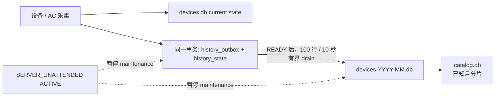
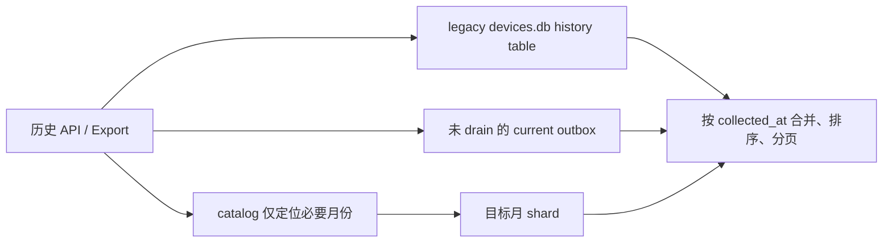
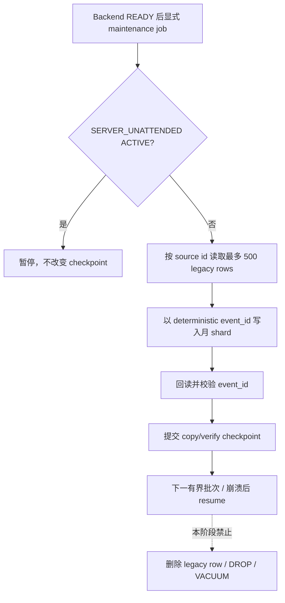

# 数据与路径布局

## 路径原则

`src/netconsole/core/paths.py` 的 `PathResolver` 是所有运行路径的唯一事实源。程序安装目录与业务数据根是两个不同概念：安装目录只保存只读发布物，开发、Electron、Python Backend、打包验证和正式安装包则共同使用安装器选择的机器级数据根。当前机器为 `D:\NetConsoleData`；不得根据运行方式切换到 LocalAppData、用户目录、当前目录、仓库或安装目录。

持久根的解析顺序固定为：显式 `NETCONSOLE_DATA_ROOT`、`HKLM\Software\NetConsole\DataRoot`。未配置时停止启动并提示通过安装程序选择目录，绝不猜测或创建 C 盘/用户目录回退。安装器只接受非系统本地固定磁盘，验证可写、原子重命名、SQLite 写锁和至少 10 GB 可用空间；建议至少 100 GB。`config/storage-manifest.json` 同时记录该根、安装标识、创建/最近打开时间、schema 和迁移兼容信息。

自动测试必须显式设置 `RuntimeMode.TEST` 和 `NETCONSOLE_DATA_ROOT=D:\NetConsoleTestData\<run-id>`。测试根不存在、直接指向 `D:\NetConsoleTestData`、或位于该根以外都会失败。测试清理仅限自己的 `run-id`，不得接触 `D:\NetConsoleData`。

根目录不得出现第二个 `data/` 或 `development/` 业务子树。历史仓库 `data/`、`.local/`、LocalAppData 和 `D:\study\NC-data*` 只可由受控迁移脚本读取；正常运行不会读取、创建或删除它们。

## 顶层布局

```text
D:\NetConsoleData
├─ config/
│  ├─ application.json          # 当前局点和应用设置
│  ├─ site_registry.json        # 局点 Registry
│  ├─ bootstrap/                # 受控 bootstrap 材料
│  └─ storage-manifest.json     # schema 与最低版本兼容门
├─ sites/
├─ backups/
│  └─ database_upgrade/          # 统一数据库升级备份中心，默认永久保留
├─ runtime/
│  ├─ electron/
│  ├─ logs/
│  ├─ cache/
│  ├─ temp/
│  ├─ database_upgrade/          # 升级 journal 与跨进程维护锁
│  └─ locks/netconsole-backend.lock
├─ agents/
├─ migrations/
├─ staging/
└─ .trash/                       # 普通局点安全删除时按需创建
```

Electron 的 `userData`、`sessionData`、`cache`、`logs`、`crashDumps` 和 `temp` 都在 `runtime/`；Backend 日志位于 `runtime/logs/`。应用日志与设备 raw/artifact 分离：`runtime/logs/` 只保存受控事件、诊断和外部 WPS 输出，设备原始回显、MESH/Syslog、配置和 iperf 结果继续写入所属局点的 raw/artifact 目录，不受应用日志 16 KB 摘要限制。`staging/` 只用于正在进行且可恢复的迁移，完成后应为空。迁移报告、冲突保留文件、备份和中断 staging 回收记录写入 `migrations/`，不是普通缓存。`.trash/` 只保存普通局点安全删除后移入的完整目录，目标名为 `<site-id>-<UTC timestamp>`；它与空壳 cleanup 的 `migrations/archive/site-recycle/` 各自保留独立语义。

## 数据库升级备份中心

数据库升级框架只通过 `PathResolver.database_upgrade_backups_dir` 写入 `<data_root>/backups/database_upgrade/`。目录按 `scope_type/scope_id/database_kind/backup_id/` 分区，每个可管理备份包含 `database.sqlite`、`manifest.json`、`validation.json` 和 `migration.log`；成功切换时保留的原始 rollback 文件及 MESH `parsed/` 目录也进入同一 `backup_id`，不得留在业务目录中被后续升级覆盖。

升级前必须先暂停相关写入、完成 WAL checkpoint，并用 SQLite Backup API 创建可独立打开的旧库副本。只有大小、SHA-256、`quick_check` 和 `integrity_check` 均通过后才允许构建影子库和原子切换。`runtime/database_upgrade/*.json` 记录 active、shadow、rollback、备份和切换阶段；Backend 启动时只恢复未到终态的 journal，不删除失败影子库或诊断文件。`runtime/database_upgrade/locks/` 只保存短期跨进程锁文件，不是业务备份。

数据库升级备份不属于缓存，默认不按时间、数量或磁盘空间自动删除。用户只能在“系统设置 / 数据库升级与备份”中查看、重新验证、恢复、打开目录或二次确认后删除；恢复前还会为当前活动库创建新的安全备份。历史 `mesh.sqlite.legacy_*`、`mesh.sqlite.schema_archive_*` 和 `mesh.sqlite.rollback_*` 由显式整理任务迁入该中心，并标记为 `VALID_BACKUP / DUPLICATE_BACKUP / ZERO_BYTE_ARCHIVE / INVALID_DATABASE / UNREADABLE_DATABASE`；0 KB 和损坏文件仍保留在 `_invalid/`，不会被自动清理。

## 局点布局

```text
<data_root>/sites/<site>/
├─ db/
│  ├─ devices.db
│  ├─ history/                   # Phase 2 新历史：按月分片，不参与正常启动维护
│  │  ├─ catalog.db              # 只记录已知分片，不扫描目录发现历史库
│  │  └─ devices-YYYY-MM.db      # append-only change/heartbeat event shard
│  ├─ tasks.db
│  └─ agents.db
├─ files/
│  ├─ backups/
│  ├─ config_center/
│  ├─ file_manager/
│  ├─ imports/
│  ├─ network_tools/
│  └─ rail_transit/
├─ cache/
├─ sync/
└─ site_meta.json
```

切换局点只改变 `sites/<site>` 的业务上下文，不改变 `data_root`。局点名和稳定 `site_id` 的映射由 `config/site_registry.json` 管理；Repository、任务和历史数据继续使用受控的实际局点目录。不得以显示名称、当前工作目录或源代码位置推导局点路径。

`devices.db`、`tasks.db`、`agents.db` 使用各自进程/线程独立的 SQLite 连接，保持 WAL、busy timeout、foreign keys 和幂等初始化。轨旁 AP 逐站规划的唯一事实表为 `ac_trackside_ap_plan(mode='unified')`；空表表示用户已明确清空，维护页、上线概览、PVID 核验和共享范围查询均直接返回空规划。`rail_ap_vlan_plans / groups / group_members / assignments / allocations` 只作为历史留存，不由当前读取链投影，也不再由数据库初始化根据逐站规划生成。当前逐站保存不删除这些历史表。逐站字段和唯一索引升级在数据库初始化事务内幂等执行，失败整体回滚。不可逆 schema 升级必须先备份，并更新 storage manifest；不得以删除或重建真实数据库代替迁移。

## devices.db 当前态与历史态（Phase 2）

Phase 2 的目标是先停止 `devices.db` 因高频快照持续增长，同时保持旧局点可原样升级和查询。当前态继续写入 `devices.db`；新的设备采集历史在同一 current-state 事务中先写入小型 `history_outbox`，READY 后由有界后台 drain 写入 `db/history/devices-YYYY-MM.db`。分片和 catalog 不属于 `Database.initialize()` 的启动工作：启动不会扫描、校验、迁移、checkpoint、retention 或 VACUUM 任一历史分片。

`history_state` 只保存每个 `kind + entity_key` 最近一次有业务意义的指纹和记录时间。变化立即入 outbox；无变化时才按类型独立 heartbeat 周期低频记录。采集时间、采集批次 UUID、raw 路径和其他运行元数据不得单独造成 change。当前实现的默认周期为 device fact/interface 60 分钟、device LLDP 30 分钟、device optical 15 分钟；FIT AP resource/LLDP 30 分钟、FIT AP optical 15 分钟、FIT AP radio 30 分钟。实际历史事件的业务字段由各 producer 显式选择，不能用整行字符串比较。

| 数据类别 | 当前态 producer / storage | 新历史写入路径 | 兼容 consumer / legacy 表 | 业务语义与索引 |
| --- | --- | --- | --- | --- |
| Device fact | `DeviceFactRepository.upsert_device_fact` -> `device_facts` | `device_fact` outbox -> 月分片 | `list_fact_history` + `device_facts_history` | 设备型号、版本、MAC 等事实变化；legacy 按 device/time 查询 |
| Device interface | `replace_device_interfaces` -> `device_interfaces` | `device_interface` outbox -> 月分片 | `list_interface_history` + `device_interfaces_history` | 链路、VLAN、端口和地址语义；`device_uuid, interface_name, collected_at, id` |
| Device optical | `replace_optical_modules` -> `device_optical_modules` | `device_optical` outbox -> 月分片 | `list_optical_history` + `device_optical_modules_history` | RX/TX、阈值、告警和状态；`device_uuid, interface_name, collected_at, id` |
| Device LLDP | `replace_lldp_neighbors` -> `device_lldp_neighbors` | `device_lldp` outbox -> 月分片 | `list_lldp_history` + `device_lldp_neighbors_history` | 邻居、端口、MAC、PVID 等拓扑变化；`device_uuid, local_interface, collected_at, id` |
| FIT AP resource | `AcRepository.replace_fit_ap_resources` -> `ac_fit_ap_resources` / `ap_entities` | `fit_ap_resource` outbox -> 月分片 | `list_fit_ap_resource_history` + `ac_fit_ap_resource_history`；`ap_resource_snapshots` 仍供站点同步/兼容身份证据 | 前者为 AC 全量资源时间线，后者为带 `snapshot_uuid` 的 AP 实体快照；不得假设可删或已合并 |
| FIT AP LLDP | AC resource/optical collection current projection | `fit_ap_lldp` outbox -> 月分片 | `list_fit_ap_lldp_history`、`list_all_ap_lldp_history`、轨旁导出/离线账本；`ac_fit_ap_lldp_history` 与 `ap_lldp_history` | 前者是 AC 采集来源历史，后者维护 latest 标志并供 AP/轨旁消费者；本阶段仅统一新写路径，不删除双轨旧数据 |
| FIT AP optical | `replace_fit_ap_optical` -> `ac_fit_ap_optical` | `fit_ap_optical` outbox -> 月分片 | `ApOpticalHistoryService`、轨旁导出；`ac_fit_ap_optical_history` 与 `ap_optical_history` | 前者为 AC optical 采集历史，后者为 AP/side 投影和 latest 标志；RX/TX/alarm 是变化字段 |
| FIT AP radio | FIT AP resource collection current projection | `fit_ap_radio` outbox -> 月分片 | `list_fit_ap_radio_history` + `ac_fit_ap_radio_history` | radio state、mode、channel、signal/usage 等；`ap_uuid, collected_at, id` |
| FIT AP unauthenticated | `replace_fit_ap_unauthenticated` -> `ac_fit_ap_unauthenticated` | 本阶段暂不切换，继续 legacy | `list_fit_ap_unauthenticated_history` + `ac_fit_ap_unauthenticated_history` | 未知/未认证 AP 证据，字段与身份推断耦合；后续单独定义迁移语义 |
| AP resource snapshot | 站点包/身份兼容写入 | 本阶段不进入通用 history shard | `site_sync` + `ap_resource_snapshots` | `snapshot_uuid` 是快照实体，不是 AC 资源时间线；不得与 `fit_ap_resource` 合并 |
| Station online summary | 站点聚合保存 | 本阶段暂不切换，继续 legacy | `list_station_online_summary_history` + `ac_station_online_summary_history` | 站点级聚合快照，不应按 AP 资源 change-aware 规则去重 |

### rollout、迁移与无人值守边界

- Phase 2A/2B 已实现的边界是路径、catalog/outbox、按月分片、change-aware 新写和 query compatibility；旧 history table、旧索引和当前态表均保留。`devices.db` 中旧历史不会在启动时批量迁移，840 MiB 的旧库可以直接打开。
- Phase 2C 的已接入查询接口可合并相关 legacy history 与新 outbox/shard 事件。没有 dual-write 回 legacy table：切换后的新 producer 仅在 current transaction 内写 outbox；尚未接入 producer 的历史继续保持 legacy 行为，不能因此推断该表已完成切换。轨旁业务快照的轻量 revision 只读取 current DB 中的 `history_outbox/history_state`；`catalog.db` 和月分片仍不参与正常快照或启动扫描，站点包同步暂仍以 legacy 表作为兼容事实源。
- legacy migration 是独立 maintenance，必须在 Backend READY 后显式调度，以 source table + last source id journal、bounded batch、copy/verify checkpoint、幂等 resume 实现。无法无损确定业务实体键或采集时间的旧行不会被猜测写入新历史，而是写入 `history_migration_skips`（source id + reason）并推进 checkpoint；源行仍保留并可查询，后续可由维护工具单独修复。`ap_resource_snapshots` 是站点包/AP 实体快照兼容证据，不作为通用 AC 资源历史迁移源。默认不启用 source deletion；本阶段不得 DROP 表、删除 legacy row、自动 VACUUM 或修改现场 `D:\NetConsoleData`。
- `SERVER_UNATTENDED ACTIVE` 时必须暂停 legacy migration、retention、aggregation 和旧分片维护，保留 Syslog、MR、Ping 和当前任务 persistence 的 I/O 优先级。history drain 按 Phase 2.1 pressure-aware 规则运行：正常压力或磁盘繁忙时暂停，高水位时仅允许极小有界批次；暂停不丢弃 outbox，恢复后可继续 bounded drain；磁盘并发维持为 1 或现有 capability policy 更低值。

Phase 2.1 收口了写入语义：`device_fact.uptime`、接口配置采集时间、LLDP `holdtime/ttl`、光衰 RX/TX/温度/电压/偏置电流，以及 FIT-AP Radio 的 usage/clients/tx_power、FIT-AP Optical 的连续量只作为 heartbeat payload，不参与普通 change fingerprint。设备/AP 身份、型号、版本、链路/邻居、channel/bandwidth、status/alarm、阈值和冲突状态仍在变化时立即记录。各 kind 继续使用独立 sampling 周期，heartbeat 仍保留最新 telemetry payload。

无人值守期间不再无条件阻塞 history：正常压力或磁盘繁忙时暂停；outbox 达到高水位（默认 5,000 条）时仅以最多 10 条的小批量、低频 drain，绝不抢占 Syslog/MR/Ping persistence。`/api/health` 暴露 `history_status`、`history_pending`、`history_oldest_pending_age_seconds`、`history_pressure` 和 `history_error`；deferred runtime 期间为 `deferred`，不会把 history 失败升级为 Core/Unattended 启动失败。

Catalog rollover 会在新月份写入时将其它 ACTIVE 分片收口为 CLOSED，并以真实月份末日填充 `period_end`（包括闰年二月）。

### 写入、查询与升级流程







迁移基础设施当前仅提供显式调用的 copy/verify 批次，并且默认没有任务注册、自动调度或 source deletion。复制成功的 legacy event 以确定性 ID 保存在 shard 内供校验与未来 cutover 使用；在逐表 cutover 尚未启用前，普通兼容查询刻意排除它，继续以 legacy table 为事实源，避免双份返回。`tasks.db` 不在本阶段范围内。

每个局点的 `sync/wps_sync.sqlite` 保存 WPS 云文档配置、DPAPI 加密凭据、同步批次和远端异步任务恢复状态。正式 Workbook 请求在提交前以不含 Token 的 JSON 持久化，完整远端 `task_id` 仅保存在该库；API、任务参数和日志只输出脱敏 ID。常规升级只做幂等增量迁移，不删除、重建或覆盖当前云文档的配置、凭据和历史。产品功能明确退役时允许精确删除对应本地目标及运行状态：必须在同一事务内按稳定旧代码匹配、先处理外键运行记录、保留混合批次中的当前目标历史，并仅在无剩余引用时删除凭据；迁移重复运行必须为 no-op，且不得访问或修改远端文档。程序重启后以原 `target_batch_id + remote_task_id` 恢复查询，不能因本地 Worker 丢失重复提交已取得 ID 的任务。

## Agent 与 Electron

独立 Windows Agent 的真实配置、目标、任务、日志和采集包位于 `<data_root>/agents/local/`。Agent 的交付程序与工具仍是只读发布物；它们不成为运行数据根，也不回退到 LocalAppData。详细规则见 [独立 Agent](AGENT.md)。

Electron 多窗口共用一个 Electron Main 和一个受管 Backend。所有窗口、Backend 子进程和 Worker 都传递同一个 `NETCONSOLE_DATA_ROOT`。Backend 排他锁位于 `runtime/locks/netconsole-backend.lock`，因此开发版和正式版不能同时写同一真实根。

## 会话、导入与导出

Online MR、MESH、配置采集和网络工具的 raw、parsed、view、logs、outputs 都在所属局点的 `files/` 子树中。例如 Online MR Session 位于：

```text
<data_root>/sites/<site>/files/rail_transit/online_mr/<mr>/sessions/<session>/
```

`raw/` 与 session metadata 是采集事实源；现有 parsed SQLite 仍可能被历史查询、图表或报告使用，不能因为“可重建”而自动删除。正式导出写入用户明确选择的目录或业务 `outputs/`，先写临时文件，成功后原子替换。

数据根迁移、`.ncsite`、现场采集包和回传包遵守 [局点与数据存储](storage/README.md)。迁移使用 staging、逐文件 SHA-256、SQLite 完整性检查和冲突保留；来源目录在数据库、文件和哈希均核验完成前不得删除。

```text
files/rail_transit/
├─ mr_raw_mesh/
│  ├─ catalog.sqlite
│  └─ <mr>/
│     ├─ raw/
│     ├─ parsed/
│     ├─ outputs/
│     └─ mesh.sqlite
├─ online_mr/<mr>/sessions/<session>/
├─ ac_mesh_link/
│  ├─ snapshots/<session_id>/raw/ # 一次性与常驻采集共用的原始回显和快照目录
│  ├─ failures/<task_id>/         # 快照提交失败时保留的受控现场
│  └─ resident/<run-hash>/<controller-hash>/
│     ├─ control.json             # 间隔、立即轮询和正常停止请求；不含凭据或命令文本
│     └─ status.json              # Task、连接、心跳、计数和最近快照健康状态
├─ ground_unattended/
│  ├─ active/<run_date>/
│  │  ├─ fleet_ping/<train>/<mr>/<date>/<hour>_<generation>.ndjson
│  │  │                           # 按 MR/小时顺序追加的 Ping 原始流；含预热标记和采样时 AP/站点/区间快照
│  │  ├─ realtime/syslog/<train>/<mr>/<date>/<hour>_<generation>.ndjson
│  │  │                           # UDP WMESH/IFNET/CFGMAN 原始流；保留接收序号、时钟偏差和安全编码原始字节；未识别来源写入 _unidentified
│  │  ├─ ac_snapshots/           # 按小时 AC 快照 JSONL
│  │  ├─ timeline/               # AC/Ping 关联 JSONL
│  │  ├─ scheduler_events.jsonl
│  │  ├─ coverage_summary.csv
│  │  ├─ deep_collection_manifest.json
│  │  ├─ daily_summary.json
│  │  ├─ errors.jsonl
│  │  └─ manifest.json
│  ├─ archives/<run_date>_ground_unattended.zip
│  └─ index.sqlite               # additive schema v7：配置、运行/覆盖/事件、Ping 目标激活时间、停止/归档操作、分段索引和汇总；结构化 Syslog 事件、射频接口/MR 状态投影和 CFGMAN-IFNET 关联；原始文件索引按 run/类型/列车/MR/端位/时间预筛；Boot Session 保存设备前后时钟/uptime/时区/误差，高频原始报文仍只在 NDJSON/READY ZIP
├─ base_data_import/             # 仅显式授权的受控基础资料写入产生
│  ├─ backups/<operation>.sqlite # SQLite Backup API 生成的写前备份
│  └─ operations/<operation>.json# 脱敏审计与相对备份引用
├─ trackside_ap/
│  ├─ raw/
│  ├─ parsed/
│  ├─ outputs/
│  └─ sessions/
└─ car_network/
   ├─ raw/
   ├─ parsed/
   └─ outputs/
```

无人值守 READY ZIP 是封账后的原始事实源之一。查询历史 Ping/Syslog 时，服务优先读取仍存在的
`active/` 普通文件；文件已按归档策略清理时直接流式读取受校验 ZIP 成员，不解压、恢复或覆盖
`active/`。`index.sqlite` 只保存相对路径、时间范围、记录数、大小、哈希和状态；同一运行的
active/archive 并存时返回 `MIXED` 并去重。ZIP 下载只能通过后端按 `archive_id` 解析的 Artifact 端点，
Renderer 和 Electron Bridge 都不接受数据根物理路径。

Syslog 数据分三层：NDJSON/READY ZIP 是不可变原始证据；`ground_unattended_wmesh_events` 兼容保存去重后的
WMESH、IFNET 和 CFGMAN 结构化事件；`ground_unattended_radio_interface_states`、
`ground_unattended_mr_runtime_states` 与 `ground_unattended_radio_correlations` 是可重建投影。
重复 UDP 报文仍保留在原始流，只增加结构化事件的 `duplicate_count`，不会重复切换接口状态或生成综合事件。

活动长 Ping 首次查询按受控时间范围最多返回 3000 个点，完整运行最多返回 10000 个降采样点；增量游标
保存已登记 OPEN 文件的稳定 `file_id` 与下一字节偏移，并绑定 run、列车、MR、目标和预热选项。游标只在
API 调用方内存/Renderer 状态中流转，不写 SQLite、不修改 NDJSON，也不是可提交的物理路径。后续读取从
完整换行结束的位置继续，尚未 flush 完整的一行留到下一次；同一文件中时间较早的晚到记录仍会读取，并由
前端按时间与 sequence 重排。CLOSED/READY 历史数据保持静态有界查询，不通过活动游标修改或恢复原文件。

## 清理边界

局点业务数据的物理瘦身由独立的 Site Retention 用例处理，长期规则见[局点数据保留与清理](storage/SITE_RETENTION.md)。扫描报告位于 `<data_root>/runtime/site_retention/<site_id>/`，只保存局点相对路径、策略、证据摘要和服务端令牌；它不是业务事实源，也不允许 Renderer 回传任意路径。当前第一阶段只覆盖历史数据库备份/过时版本、已被完整会话 ZIP 覆盖的 Online MR 松散 raw 和 90 天以前的 `task_events`。当前数据库、未知数据库、MESH、无人值守、设备采集历史和人工保留数据不自动清理。

自动和手动缓存清理只能处理已白名单的 `runtime/cache/`、`runtime/temp/` 与受认可的运行日志；日志 Housekeeper 每小时 best-effort 检查 `runtime/logs/`，总量超过 300 MB 时按最旧 rotated electron、app、WPS、diagnostic、archive 顺序清到 250 MB。活动 `electron.log`/`app.log`、启动/崩溃诊断、`database_upgrade_audit.jsonl`、最近 5 分钟仍可能被 WPS 占用的文件和未识别文件均受保护；不能因单个文件锁定或删除失败阻断启动。该清理不触及局点数据库、配置、raw、会话业务日志、正式 outputs、报告、备份、Agent 包、迁移材料或 `.trash/`。普通局点删除只允许把 Registry 中的一级 `sites/<site>/` 普通目录原子移动到 `.trash/`，不递归永久删除；移动和 Registry 更新任一阶段失败都必须回滚。执行前必须重新确认规范化路径位于数据根允许子树，并拒绝符号链接和路径逃逸。

任务中心的“清理”不是磁盘清理。它只在当前局点 `tasks.db` 的任务快照上写入 `dismissed_at / dismissed_by / dismiss_reason`，隐藏已结束的历史记录；任务事件、日志、采集结果、会话文件、正式导出和 Artifact 均保留。真正的物理清理只能由独立数据库维护或文件管理用例按白名单、保留期和路径边界执行。

用户可在 NetConsole 外部删除单个导出、Artifact 目录、局点目录或隔离数据根。系统不把这种外部变化回写成新的任务失败：任务列表存在时动态报告 Artifact `MISSING/INVALID`，`tasks.db` 或局点目录不存在时返回空任务状态，新的空数据根不会从旧根恢复任务。必要顶层目录仍由 `PathResolver` 启动流程按当前根创建；任何协调和下载都只解析当前数据根与当前局点下的受控相对路径，不跟随越界路径或符号链接。恢复同一文件后可再次动态识别为 `AVAILABLE`，无需持久化可用性字段。

磁盘统计与缓存清理的默认运行目录是 `<data_root>/runtime/`，而不是数据根同级目录。系统设置和维护脚本只能报告历史目录；未经完成迁移核验和人工保留期确认，不得自动合并或删除它们。
