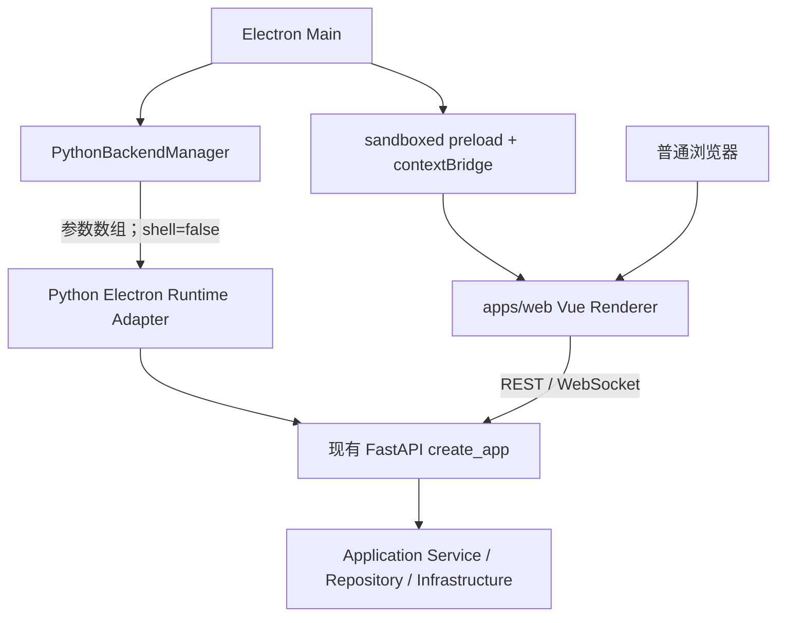

# Electron Desktop 基础架构

## 当前状态

Electron Desktop 安全基础已在 `apps/desktop_electron/` 建立，复用唯一 Vue Renderer `apps/web/` 和唯一 FastAPI 组合根 `src/netconsole/backend/api/main.py:create_app()`。当前正式处于 **Electron 与 Qt 并行迁移阶段**：Qt 仍是生产与回退入口，Electron 是可运行的新宿主基础；这不是安装包发布完成，也不表示任何 Qt 业务模块已经达到替换门槛。

当前并存关系：

```text
apps/desktop/              当前 Qt Web Shell，Legacy/生产回退
apps/desktop_electron/     Electron main/preload/shared，目标桌面外壳基础
apps/web/                  唯一 Vue Renderer，浏览器与 Electron 共用
src/netconsole/            唯一 Python Core/FastAPI/Application Service
```

Qt 目录本阶段不移动、不改名、不删除。Electron 没有复制 Vue 页面、Python Service、Repository、Parser、Agent、Online MR 或报告逻辑。

## 运行架构



职责固定为：

| 层 | 当前职责 | 禁止事项 |
| --- | --- | --- |
| Electron Main | 窗口、Python 子进程、动态端口、会话令牌、CSP、导航和白名单 IPC | 设备、采集、解析、数据库、报告或 Agent 业务 |
| preload | 将固定方法逐个映射到固定 IPC channel | 暴露 `ipcRenderer`、Node `process`、`fs` 或通用 invoke/send |
| Vue | 页面、状态、表单、REST/WebSocket；通过 `src/platform` 选择 Browser/Electron Adapter | 直接访问 Node、持久化 Electron API Token、到处判断宿主全局变量 |
| FastAPI | 鉴权、DTO、Router、静态 Vue、Application Service 组合根 | 复制业务规则或建立 Electron 专属业务 Core |
| Application Service | 原有业务用例、Task/Session/Artifact、采集、报告和存储 | 依赖 Electron、Vue 或 Qt 控件 |

## 开发模式

先准备两个独立前端工作目录的依赖：

```powershell
cd apps/web
pnpm install --frozen-lockfile
cd ../desktop_electron
pnpm install --frozen-lockfile
```

项目根存在 `.venv` 时直接启动：

```powershell
cd apps/desktop_electron
pnpm dev
```

`pnpm dev` 先检查并打包 Electron main/preload，再启动固定回环 Vite dev server，最后启动 Electron。Electron 自己选择 Python 动态端口，因此 Vite 的 `5173` 与 FastAPI 端口没有绑定关系。独立 Git worktree 可通过开发机环境变量 `NETCONSOLE_PYTHON` 指向同一项目虚拟环境；该路径不会进入 Renderer、日志或版本化配置。

自动开发冒烟：

```powershell
cd apps/desktop_electron
pnpm smoke:dev
```

冒烟只有在 Electron、Python、Vue runtime adapter 和真实 `/api/health` 全部成功后才以 0 退出，并检查退出链能够回收 Vite、Electron 和 Python。

## 生产资源模式

源码环境可验证生产资源加载逻辑：

```powershell
cd apps/desktop_electron
pnpm build
pnpm start
```

`pnpm build` 构建单文件 main/preload 和 `apps/web/dist`；`pnpm start` 启动 Electron 与本机 Python，由 FastAPI 在同一动态回环 Origin 提供已构建的 Vue 静态资源。Electron 不使用第二套 Renderer，也不把临时令牌放入页面 URL。

当前尚未建立 Electron 安装包、冻结 Python backend bundle、代码签名、自动升级或发布白名单；现有 PyInstaller/Nuitka Qt 发布链保持原样。正式 Electron 安装包必须另立发布任务，不得把源码 `.venv` 当作交付依赖。

## Python 后端生命周期

`PythonBackendManager` 的状态为 `starting -> ready -> stopped|failed`，并提供幂等 `start()`、`waitUntilReady()`、`getRuntimeInfo()`、`getStatus()` 和 `stop()`：

1. Electron 启动受管 Python，并要求后端直接绑定 `127.0.0.1:0`；Python 在持有监听 socket 后通过 stdout 结构化事件回报实际端口，避免“预选后释放”的抢占窗口。
2. 每次启动生成新的高熵、URL-safe 临时令牌。
3. 使用可执行文件和参数数组启动 `netconsole.backend.electron_runtime`，固定 `shell: false`、`windowsHide: true`、`127.0.0.1` 和端口 `0`。
4. 令牌只通过已持有子进程的 stdin 首行 JSON 传递；不进入参数、环境变量、URL 或配置。
5. Electron 先校验受管子进程管道返回的 `127.0.0.1:<port>`，再使用临时请求头轮询真实 `/api/health`，成功后才加载正式 Vue 页面。
6. stdout/stderr 按行写入 Electron 日志，先移除令牌和常见敏感字段。
7. 正常退出通过同一 stdin 控制管道请求 Uvicorn 优雅退出；父进程异常导致管道 EOF 时，Python 同样退出。
8. 只有优雅停止超时才对本管理器持有的子进程句柄发送终止信号；不按名称扫描或误杀其他 Python。
9. 后端意外退出或强制终止后仍未退出时状态变为 `failed`，只向当前受信 Renderer 发送脱敏状态事件，不谎报 `stopped`。

## 本地 API 安全模型

- FastAPI 只监听 `127.0.0.1`。
- Electron HTTP 请求携带 `X-NetConsole-Session`；原 Qt WebHost 的 `POST /__desktop_session` 和 HttpOnly Cookie 兼容链继续有效。
- Electron 主进程使用非持久化的内存 Session。开发态 Cookie 仅匹配后端 `/ws`，供 WebSocket 自动携带且不发送给普通 Vite/REST 请求；生产态 Vue 与 API 同源，Cookie 匹配 `/` 以便加载受保护的首页和静态资源。两种模式均为 HttpOnly、SameSite Strict，令牌不进入 WebSocket URL，进程退出后 Session 一并销毁。
- 开发态 CORS 只允许命令行校验后的精确 `http://127.0.0.1:<Vite 端口>`；生产态 Vue 与 API 同源。
- Vue 只在模块内存保存 `apiBaseUrl`、`apiToken` 和宿主类型；不写 `localStorage`、`sessionStorage`、URL 或 Pinia 持久化状态。
- 临时令牌用于本机桌面会话，不替代 Agent Token、用户登录、角色权限或业务写操作审计。
- Renderer 被完全攻陷时仍能使用其当前内存令牌，因此 CSP、导航限制、上下文隔离、preload 最小化和短生命周期必须共同成立。

## Electron 安全默认值

正式 BrowserWindow 固定：

```text
nodeIntegration: false
contextIsolation: true
sandbox: true
webSecurity: true
webviewTag: false
partition: non-persistent in-memory session
```

同时执行：

- preload 使用 esbuild 打成单文件，适配 sandboxed preload 的受限 `require` 环境；
- 阻止所有新窗口和 `<webview>`；
- 主窗口同时拦截普通导航和服务端重定向，只允许已登记的精确回环 Origin；
- 拒绝 Renderer 权限请求；
- 生产 CSP 不包含 `unsafe-eval`，开发 CSP 只为 Vite 开放该项；
- `object-src 'none'`、`frame-ancestors 'none'`，`connect-src` 只包含当前回环 Renderer/API/WebSocket Origin；
- IPC 在 main 再次校验参数，并核对发送者必须是当前主窗口的 main frame，且 frame URL 仍属于已登记回环 Origin。

## preload / IPC 白名单

Renderer 当前只能调用：

- `getAppInfo`
- `getBackendStatus`
- `getRuntimeConfig`
- `selectFile`
- `selectDirectory`
- `chooseSavePath`
- `openPath`
- `showItemInFolder`
- `onBackendStatusChanged`
- 内部开发冒烟用 `reportRendererReady`

没有通用 `invoke(channel)`、`send(channel)`、文件读写、环境变量读取、Python 路径设置或命令执行接口。详细路径规则见 [Desktop Native Bridge 契约](DESKTOP_NATIVE_BRIDGE.md)。

## 文件选择与导出边界

- `selectFile`、`selectDirectory` 和 `chooseSavePath` 只调用 Electron 原生对话框。
- main 仅接受白名单 DTO；过滤器数量、名称、扩展名、保存文件名和未知字段均有运行时限制。
- 对话框返回的绝对路径只在当前 Electron 进程内登记为临时授权；`openPath`/`showItemInFolder` 只能回传并使用这些已授权路径。
- `openPath` 只允许原生对话框授予的目录或明确的数据/报告扩展名；程序、脚本、系统控制文件和未知扩展名默认拒绝，不能成为通用程序启动器。
- `chooseSavePath` 只选择目标；Excel、ZIP、PDF、报告和 Artifact 内容继续由 Python Application Service/Export Process 生成。
- 后续 `openArtifact` 必须使用受控 `artifact_id` 解析，不得把当前临时路径授权扩大为任意业务路径接口。

## Qt Legacy 策略

当前 Qt 主程序仍是稳定生产与回退入口。允许：

- P1/P2 缺陷修复；
- 数据安全与必要兼容修复；
- 尚未完成 Web 纵向闭环的业务回退。

禁止：

- 新增大型 Qt 页面；
- 新增 Qt 专属业务规则；
- 新增只能由 Qt 调用的 Application Service；
- 在 Qt 页面内新增采集、解析、数据库或导出逻辑。

## 固定后续迁移顺序

1. Online MR 完整操作闭环
2. 任务中心
3. Agent 管理
4. fping / iPerf 网络工具
5. 离线 MR/MESH 分析
6. 报告和 Artifact 管理
7. AC 管理
8. 配置采集与文件管理
9. SNMP 等剩余模块
10. 删除 Qt Desktop

现有 SNMP Center 与无线勘测继续保持 `DISABLED / FUTURE_REBUILD`；第 9 项只能在独立重建设计批准后开始。

后续不能只迁移只读列表和详情页。每个模块必须按完整纵向业务闭环迁移，包括创建、启动、实时状态、停止、异常、恢复、Artifact 和导出；在达到 `REPLACE_READY` 前不能隐藏 Qt 回退入口。

## 定向验证

```powershell
# Python 启动适配器与既有 Desktop 会话
.\.venv\Scripts\python.exe -m pytest tests\test_electron_runtime.py tests\test_web_host.py

# Electron main/preload/IPC/生命周期与真实 Python 集成
cd apps/desktop_electron
pnpm test
pnpm run typecheck
pnpm run build:main
pnpm smoke:dev

# Vue Browser/Electron Adapter、统一 API/WebSocket 与浏览器回退
cd ../web
pnpm test
pnpm build
```

完整 Windows 安装包、代码签名、升级、托盘和真实发布目录尚未验收，不能从上述源码冒烟推断为通过。
