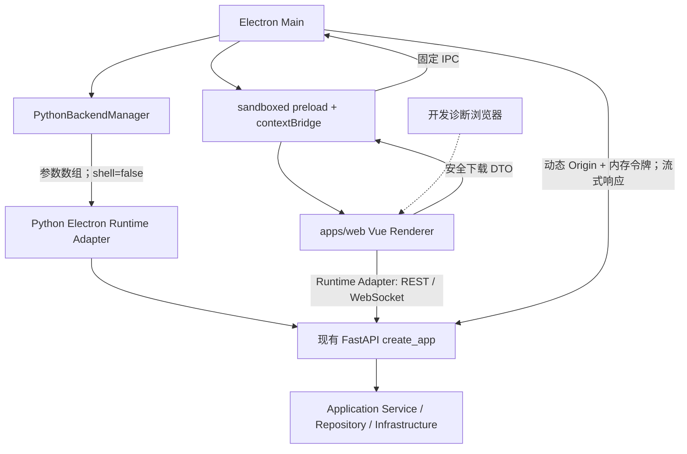

# Electron Desktop 基础架构

## 统一任务窗口

Electron 复用同一 Vue Renderer、FastAPI 会话和 `TaskApplicationService -> TaskRepository -> tasks.db`，提供单实例任务窗口。主窗口只通过严格的 `taskId/module/status` DTO 打开或恢复该窗口；关闭窗口仅隐藏，不取消后台任务，应用退出时再与主窗口、受管后端一并有序关闭。

任务动作以后端 owner capability 为准。当前统一停止入口只显式路由到设备管理、配置采集和文件管理既有 Application Service；其他 owner 保持禁用，不回退到通用 cancel 文件。设备 Export 只有在当前服务仍持有匹配的 Export spec、持久化 Job cancel 路径和活跃进程时才能确认 `STOPPING`。Artifact 使用强类型 DTO 携带不透明标识、正式显示名、大小、类型和受控 API 请求，经既有 Electron 流式下载、临时文件及原子替换保存；统一 DTO 和日志均不向 Renderer 返回服务端绝对路径。

主窗口和任务窗口都安装同一 Renderer diagnostics，覆盖 preload、主 frame 加载失败、崩溃和无响应；脱敏后的后端状态广播到所有受管窗口。关闭任务窗口仍只隐藏窗口，不改变后台任务状态。

文件管理桌面动作使用独立 `executeFileDesktopAction(fda1_*)` 白名单。Renderer 只能提交 60 秒一次性引用；Electron main 只访问当前受管 Python 的固定回环端点，Service 只允许打开受控根内目录或启动固定 WinSCP。路径、程序、参数和凭据不进入 Renderer，Electron WinSCP 启动参数不含密码。

## 当前状态

Electron Desktop 安全基础已在 `apps/desktop_electron/` 建立，复用唯一 Vue Renderer `apps/web/` 和唯一 FastAPI 组合根 `src/netconsole/backend/api/main.py:create_app()`。Electron 是唯一正式桌面产品；Qt 源码、运行时与入口已经退出活动仓库。部分业务仍处于自动实现完成但真实设备待验收状态，不能把“零 Qt”误写成全部业务已经现场验收完成。

当前并存关系：

```text
apps/desktop_electron/     Electron main/preload/shared，目标桌面外壳基础
apps/web/                  唯一 Vue Renderer；Electron 正式使用，浏览器仅开发联调
src/netconsole/            唯一 Python Core/FastAPI/Application Service
```

已删除 Qt 文件的业务去向继续由 Electron-only 迁移矩阵和 E10 Git 历史审计追踪。Electron 没有复制 Vue 页面、Python Service、Repository、Parser、Agent、Online MR 或报告逻辑。

## 运行架构



职责固定为：

| 层 | 当前职责 | 禁止事项 |
| --- | --- | --- |
| Electron Main | 窗口、Python 子进程、动态端口、会话令牌、CSP、导航和白名单 IPC | 设备、采集、解析、数据库、报告或 Agent 业务 |
| preload | 将固定方法逐个映射到固定 IPC channel | 暴露 `ipcRenderer`、Node `process`、`fs` 或通用 invoke/send |
| Vue | 页面、状态、表单、REST/WebSocket；正式运行使用 Electron Adapter，Browser Adapter 仅作开发诊断兼容 | 直接访问 Node、持久化 Electron API Token、为浏览器另建业务页面或验收链 |
| FastAPI | 鉴权、DTO、Router、静态 Vue、Application Service 组合根 | 复制业务规则或建立 Electron 专属业务 Core |
| Application Service | 原有业务用例、Task/Session/Artifact、采集、报告和存储 | 依赖 Electron、Vue 或 Qt 控件 |

## 开发模式

先准备两个独立前端工作目录的依赖：

```powershell
cd apps/web
pnpm install --frozen-lockfile
cd ../desktop_electron
pnpm install --frozen-lockfile
```

项目根存在 `.venv` 时直接启动：

```powershell
cd <仓库根目录>
.\.venv\Scripts\python.exe main.py

# 或从 Electron 子项目启动同一开发链
cd apps/desktop_electron
pnpm dev
```

无参数 `main.py` 与 `pnpm dev` 最终进入同一 `scripts/dev.mjs`。Python 入口优先使用项目锁定的本地 Electron 作为 Node 运行时，因此 PyCharm 不依赖全局 `pnpm`；Electron Main 仍是受管 Python Backend 的唯一生命周期所有者。开发脚本先检查并打包 Electron main/preload，再确认固定回环端口 `5173` 未被占用、启动 Vite dev server，最后启动 Electron；端口冲突时直接失败，不能误连其他 worktree 的 Vite。Electron 自己选择 Python 动态端口，因此 Vite 的 `5173` 与 FastAPI 端口没有绑定关系。Vite 中固定的 `/api`、`/ws` 代理只服务普通 Browser 开发；Electron 的 REST、WebSocket 和下载全部从 Runtime Config 读取受管动态 Origin，不经过固定 `127.0.0.1:8000`。独立 Git worktree 可通过开发机环境变量 `NETCONSOLE_PYTHON` 指向同一项目虚拟环境；该路径不会进入 Renderer、日志或版本化配置。

需要让 Codex、浏览器自动化和 API 诊断访问同一受管运行时时，使用专用入口：

```powershell
cd apps/desktop_electron
pnpm dev:codex
```

该入口为本次进程生成随机开发 Session，创建系统临时数据根，并固定使用 `127.0.0.1:5173` 与 `127.0.0.1:8000`。Vue 仅在 Vite 开发编译中取得内存令牌，先通过受保护的 `/api/dev/session` 建立 HttpOnly、SameSite Strict Cookie，再复用正式 REST、WebSocket 和下载契约；令牌不写仓库、URL、日志、SQLite 或持久浏览器存储。只读 `/api/dev/runtime-status` 仅在显式开发模式、回环请求和有效 Session 下注册，并对数据根脱敏。退出时编排器回收 Electron、Vite、Python、两个端口和严格校验过的临时数据目录。

普通 `pnpm dev` 继续使用动态 Backend 端口并只服务 Electron；`dev:codex` 的固定端口只用于本机自动化。两者都拒绝 `0.0.0.0` 和非回环 Origin。生产打包不接受 `--dev-mode`，不注册开发状态接口和 OpenAPI，也不读取开发固定端口或开发 Session 环境变量。

Electron/Vue 的产品标题统一为 `NetConsole`，侧栏使用“本地网络运维控制台”；内部迁移阶段文案不进入正式界面。

自动开发冒烟：

```powershell
cd apps/desktop_electron
pnpm smoke:dev
```

冒烟只有在 Electron、Python、Vue runtime adapter 和真实 `/api/health` 全部成功后才以 0 退出，并检查退出链能够回收 Vite、Electron 和 Python。

Codex 开发链可用 `pnpm exec node scripts/dev.mjs --codex --smoke` 做同口径冒烟；它还验证受保护的 `/api/dev/runtime-status` 已就绪，并检查固定端口退出后可重新绑定。浏览器与 Electron 专项 E2E 将在独立 Playwright 阶段接入；在脚本真实存在前，不把 Vitest 或 smoke 冒充 E2E。

启动日志使用单调时钟记录 `electron.app_ready -> window_created -> loading_view_shown -> backend.spawn_started -> handshake_received -> health_ready -> renderer.navigation_started -> dom_ready -> mounted -> desktop.interactive`。Vue `mounted` 与可交互状态严格分开：页面先挂载基础壳，加载设置并通过真实 health 后才上报 `interactive`。Desktop 下历史 Task/Agent/Traffic/File 恢复延后到首屏之后执行；普通 Server 模式仍保持同步启动和失败回滚。当前实测基线与优化证据见 [E5 启动性能归档](archive/migrations/electron-only/E5-2026-07-18.md)。

## 生产资源模式

源码环境可验证生产资源加载逻辑：

```powershell
cd apps/desktop_electron
pnpm build
pnpm start
```

`pnpm build` 构建单文件 main/preload 和 `apps/web/dist`；`pnpm start` 启动 Electron 与本机 Python，由 FastAPI 在同一动态回环 Origin 提供已构建的 Vue 静态资源。Electron 不使用第二套 Renderer，也不把临时令牌放入页面 URL。

当前尚未建立 Electron 安装包、冻结 Python backend bundle、代码签名、自动升级或发布白名单；现有 PyInstaller/Nuitka Qt 发布链保持原样。正式 Electron 安装包必须另立发布任务，不得把源码 `.venv` 当作交付依赖。

## Python 后端生命周期

`PythonBackendManager` 的状态为 `starting -> ready -> stopped|failed`，并提供幂等 `start()`、`waitUntilReady()`、`getRuntimeInfo()`、`getStatus()` 和 `stop()`：

1. Electron 启动受管 Python，并要求后端直接绑定 `127.0.0.1:0`；Python 在持有监听 socket 后通过 stdout 结构化事件回报实际端口，避免“预选后释放”的抢占窗口。
2. 每次启动生成新的高熵、URL-safe 临时令牌。
3. 使用可执行文件和参数数组启动 `netconsole.backend.electron_runtime`，固定 `shell: false`、`windowsHide: true`、`127.0.0.1` 和端口 `0`。
4. 令牌只通过已持有子进程的 stdin 首行 JSON 传递；不进入参数、环境变量、URL 或配置。
5. Electron 先校验受管子进程管道返回的 `127.0.0.1:<port>`，再使用临时请求头轮询真实 `/api/health`，成功后才加载正式 Vue 页面。
6. stdout/stderr 按行写入 Electron 日志，先移除令牌和常见敏感字段。
7. 正常退出时 Main 通过同一 stdin 控制管道发送 `shutdown`，Python 控制线程据此请求 Uvicorn 优雅退出；父进程异常导致管道 EOF 时，Python 同样请求退出。
8. Python 只在 `uvicorn.Server.run()` 完全返回后发送 `netconsole.electron_backend.shutdown_ack`，随后等待 Main 的 `exit`；Main 收到该确认后才发送 `exit` 并关闭控制管道。
9. 只有优雅停止确认超时才对本管理器持有的子进程句柄发送终止信号；不按名称扫描或误杀其他 Python。
10. 后端意外退出或强制终止后仍未退出时状态变为 `failed`，只向当前受信 Renderer 发送脱敏状态事件，不谎报 `stopped`。

桌面总退出是单一受管屏障：先等待 Desktop IPC 的下载清理，再完成上述 Python `shutdown_ack -> exit` 握手，最后清空会话路径授权；这些步骤结束后才销毁窗口、释放单实例锁并退出 Electron。Windows 下不依赖可能缺失的 child `exit/close` 事件来判定 Uvicorn 是否已经停止。

## 本地 API 安全模型

- FastAPI 只监听 `127.0.0.1`。
- Electron HTTP 请求携带 `X-NetConsole-Session`；原 Qt WebHost 的 `POST /__desktop_session` 和 HttpOnly Cookie 兼容链继续有效。
- Electron 主进程使用非持久化的内存 Session。开发态 Cookie 仅匹配后端 `/ws`，供 WebSocket 自动携带且不发送给普通 Vite/REST 请求；生产态 Vue 与 API 同源，Cookie 匹配 `/` 以便加载受保护的首页和静态资源。两种模式均为 HttpOnly、SameSite Strict，令牌不进入 WebSocket URL，进程退出后 Session 一并销毁。
- 开发态 CORS 只允许命令行校验后的精确 `http://127.0.0.1:<Vite 端口>`；生产态 Vue 与 API 同源。
- Vue 只在模块内存保存 `apiBaseUrl`、`apiToken` 和宿主类型；不写 `localStorage`、`sessionStorage`、URL 或 Pinia 持久化状态。
- 临时令牌用于本机桌面会话，不替代 Agent Token、用户登录、角色权限或业务写操作审计。
- Renderer 被完全攻陷时仍能使用其当前内存令牌，因此 CSP、导航限制、上下文隔离、preload 最小化和短生命周期必须共同成立。
- Electron Runtime Config 初始化未完成或失败时，Vue 拒绝把 REST/WebSocket/下载静默降级为相对 `/api`；普通 Browser 模式才允许相对路径和 Vite 代理。

## Electron 安全默认值

正式 BrowserWindow 固定：

```text
nodeIntegration: false
contextIsolation: true
sandbox: true
webSecurity: true
webviewTag: false
devTools: false（生产；Vite 开发态为 true）
partition: non-persistent in-memory session
```

同时执行：

- preload 使用 esbuild 打成单文件，适配 sandboxed preload 的受限 `require` 环境；
- 阻止所有新窗口和 `<webview>`；
- 主窗口同时拦截普通导航和服务端重定向，只允许已登记的精确 Renderer 回环 Origin，且同源 `/api`、`/ws` 与桌面会话路径也不得替换 Vue 页面；
- 拒绝 Renderer 权限请求；
- 生产 CSP 不包含 `unsafe-eval`，开发 CSP 只为 Vite 开放该项；
- `object-src 'none'`、`frame-ancestors 'none'`，`connect-src` 只包含当前回环 Renderer/API/WebSocket Origin；
- IPC 在 main 再次校验参数，并核对发送者必须是当前主窗口的 main frame，且 frame URL 仍属于已登记回环 Origin。
- 所有新窗口继续拒绝；设备 Web 管理地址只能通过独立 `openExternalUrl` 白名单动作交给系统浏览器，拒绝 HTTP、凭据 URL 和 Renderer 任意导航。
- Electron 内存 Session 一律拦截 Chromium `will-download`；合法文件只能走 `downloadBackendResource` 的原生保存确认与 main 流式链，不能用 `<a download>`、Blob 或页面导航绕过。
- `did-start-loading`、`did-finish-load`、`did-fail-load`、`preload-error`、`render-process-gone`、`unresponsive/responsive`、`child-process-gone` 和后端状态变化均写入脱敏诊断；主框架失败显示可重试状态页，不保留永久黑屏。
- 默认移除 Electron 应用菜单；仅开发服务器存在且显式设置 `NETCONSOLE_ELECTRON_DEV_MENU=1` 时显示开发菜单。
- 生产 BrowserWindow 显式设置 `devTools: false`；只有已校验的本机 Vite 开发模式允许 DevTools。

## preload / IPC 白名单

Renderer 当前只能调用：

- `getAppInfo`
- `getBackendStatus`
- `getRuntimeConfig`
- `selectFile`
- `selectDirectory`
- `chooseSavePath`
- `downloadBackendResource`
- `openPath`
- `showItemInFolder`
- `openExternalUrl`
- `onBackendStatusChanged`
- 内部开发冒烟用 `reportRendererReady`

没有通用 `invoke(channel)`、`send(channel)`、文件读写、环境变量读取、Python 路径设置或命令执行接口。详细路径规则见 [Desktop Native Bridge 契约](DESKTOP_NATIVE_BRIDGE.md)。

## 文件选择与导出边界

- `selectFile`、`selectDirectory` 和 `chooseSavePath` 只调用 Electron 原生对话框。
- main 仅接受白名单 DTO；过滤器数量、名称、扩展名、保存文件名和未知字段均有运行时限制。
- 下载保存后的绝对路径只进入 Electron Main 的有界临时授权表；只有具备原生 open/reveal 权限的数据或报告文件才向 Renderer 返回 capability ID，`.bin/.conf/.exe` 等仅保存类型返回 `saved` 但不返回 capability。
- `openPath`/`showItemInFolder` 分别校验 capability 的 purpose、action、规范化实际扩展、默认 15 分钟 TTL 和 FIFO 有界状态；程序、脚本和系统控制文件不能通过 reveal 绕过。
- `chooseSavePath` 只选择目标；Excel、ZIP、PDF、报告和 Artifact 内容继续由 Python Application Service/Export Process 生成。
- `downloadBackendResource` 在 Browser 中使用普通下载，在 Electron 中只把匹配设备、配置、文件、AC、MESH、Online MR 和网络工具既有 Artifact 路由的安全相对 API 描述交给 main；普通 `/api` 路由不在白名单。main 使用当前动态后端和请求头令牌流式写同目录临时文件，成功后原子替换，并拒绝用户把最终文件改成不同实际扩展。Renderer 不接收完整文件、任意 URL、Header 或目标路径，令牌不进入 URL、Storage 或日志。
- Browser Adapter 启动原生下载后返回 `started`；Electron 只有保存完成才返回 `saved`，原生保存对话框取消返回 `cancelled`，HTTP、网络、文件或退出中止返回 `failed` 并清理 `.part`。
- Electron 退出先关闭下载入口、取消并等待在途流完成清理；保存对话框仍打开时也不会在退出开始后创建新下载。随后 Main 请求 Python 停止，等待 Uvicorn 退出后的 `shutdown_ack`，再发送 `exit`；全部受管清理结束后才退出 Electron。
- 后续 `openArtifact` 必须使用受控 `artifact_id` 解析，不得把当前临时路径授权扩大为任意业务路径接口。

## Qt 历史回收策略

Qt/PySide6/QFluentWidgets 源码、运行时和桌面入口已经删除，不再允许通过兼容导入、回退壳或开发依赖重新进入活动架构。旧页面只作为 Git 历史事实源参与 E10 审计；每个删除文件必须归类为 `PURE_UI`、`BUSINESS_MOVED`、`ADAPTER_REPLACED`、`DEAD_CODE` 或 `FEATURE_REMOVED`，并关联新位置与测试。

Electron 后续业务实现继续以已交付 Qt 行为和真实业务契约为对照，补齐 Vue → FastAPI → Application Service 纵向闭环；缺失能力必须在 Electron 中明确隐藏或标记待验收，不能恢复 Qt 入口规避迁移。

SNMP Center、通用 MIB/OID 平台与无线勘测已经正式删除，不进入 Electron 迁移、发布或未来重建清单。设备管理只保留 SNMP v1/v2c 只读基础识别，网络工具无线扫描保持独立能力。

Electron 宿主、下载和退出链已完成自动冒烟；Online MR 等业务闭环按对等矩阵继续验收，Qt 只承担未完成能力的源码事实对照。

后续不能只迁移只读列表和详情页。每个模块必须按完整纵向业务闭环迁移，包括创建、启动、实时状态、停止、异常、恢复、Artifact 和导出；在达到 `COMPLETE` 前不能隐藏 Qt 回退入口。浏览器开发联调通过不构成正式产品验收证据。

## 定向验证

```powershell
# Python 启动适配器与既有 Desktop 会话
.\.venv\Scripts\python.exe -m pytest tests\test_electron_runtime.py tests\test_web_host.py

# Electron main/preload/IPC/生命周期与真实 Python 集成
cd apps/desktop_electron
pnpm test
pnpm run typecheck
pnpm run build:main
pnpm smoke:dev

# Vue Browser/Electron Adapter、统一 API/WebSocket 与浏览器回退
cd ../web
pnpm test
pnpm build
```

完整 Windows 安装包、代码签名、升级、托盘和真实发布目录尚未验收；原生保存对话框与关闭后进程残留也仍需在本地主工作区人工点击核对，不能从上述源码冒烟推断为通过。
