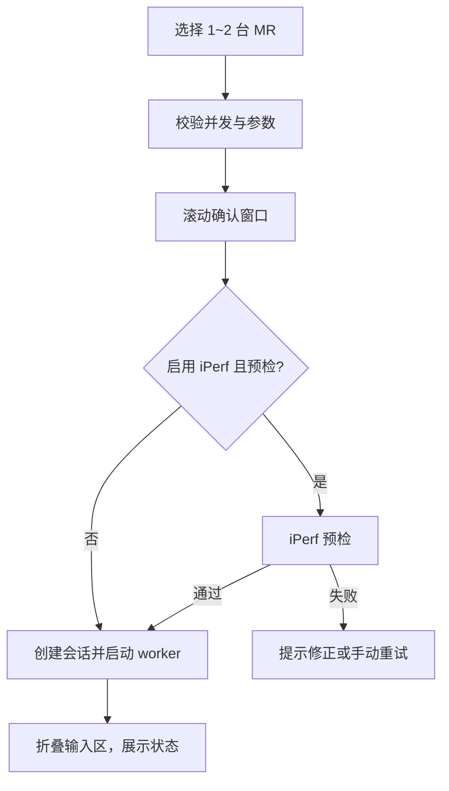

# Online MR 实时采集

## 1. 目标与边界

Online MR 面向车载 MR 的实时 SSH/终端采集、fping 业务质量、随采集 iPerf3、手工备注、会话打包和离线诊断。原始文件是事实来源；实时视图用于现场观察，正式离线解析由 `online_mr_parse` Background Job 完成，报告由 Export Process 生成。

当前最多同时采集 2 台 MR。超过 2 台会在选择和启动阶段被拒绝；采集管理器默认并发也为 2。

页面操作顺序：选择 1～2 台 MR；配置采集周期和高频 Ping；按需配置 iPerf；点击开始并在确认窗口复核设备/参数；启用 iPerf 时完成服务端预检；创建会话后自动收起设备列表和输入区；以实时状态、解析和采集输出为主；运行中可随时添加带时间戳备注；停止后保存并打包会话。页面不再提供独立“收起设备列表”按钮，自动折叠逻辑保留，输入区的展开操作会同时恢复设备选择区域。当前 Qt 页面仍是 Legacy UI；阶段 5B-2A 只建立新的 LOCAL Application Service 启动边界，尚未切换 Legacy UI，也没有改动正常停止流程。

## 2. 启动流程



确认窗口必须展示设备名/地址、Mesh/Channel/Statistics 周期、是否采集配置、每个 Ping 目标和阈值、iPerf 协议/角色/服务端/端口/TCP 或 UDP 参数/并发/方向/预检/自动重连。两台设备同时打流时应明确提示。

单设备选择时 Ping1 默认绑定该设备，Ping2 默认不绑定；用户已手工编辑的 Ping2 目标在单选刷新时保留。双设备选择时 Ping1/Ping2 分别绑定两台设备，并禁止两个槽位指向同一设备。设备绑定改变时才用设备主地址覆盖对应默认目标。

启动成功后输入区折叠；用户可手动展开并恢复 splitter 尺寸。页面宽度小于 1250 px 时主 splitter 垂直排列，达到 1250 px 时水平排列，需保持 1920×1080 下可用。

## 3. 会话状态

实际状态全集：

`CREATED -> CONNECTING -> INITIALIZING -> COLLECTING`

异常或控制分支包括 `RECONNECTING`、`STOPPING`、`STOPPED`、`FORCED_STOPPED`、`FAILED`、`ABORTED`。UI 文案、按钮可用性和恢复逻辑必须覆盖全集，不能只处理“采集中/已停止/失败”。

状态文字同时配色：COLLECTING 为绿色，CONNECTING/INITIALIZING 为蓝色，RECONNECTING/STOPPING 为橙色，FAILED/ABORTED/FORCED_STOPPED 为红色，STOPPED 为灰色；颜色只是辅助，不能替代文字。

默认自动重连开启，间隔 5 秒；最大重连次数为空/0 时表示不设上限。命令超时默认 15 秒。开始停止后不得再创建新的 repeat 连接。

普通停止先协作终止 repeat 和外部工具；5 秒后可显示强制停止按钮。批量停止整体等待上限 30 秒。强制停止会尝试 Ctrl+C/quit 并关闭会话，终态标记为 `FORCED_STOPPED`，不得伪装成正常完成。

### 3.1 停止、最终化与打包契约

以下顺序是后续 Application Service 必须遵守的正式契约。阶段 5B-1 只冻结契约，现有 Legacy 停止状态机尚未按该顺序改造完成。

正常停止固定为：停止接受新操作并将 Task 置为 `STOPPING`；请求停止并等待 fping/iPerf 终态及其 raw、samples、summary flush；解除共享日志镜像和 session 绑定；请求停止 SSH Collection Job；等待 SSH stream、raw writer queue、flush 与连接关闭；写最终 metadata；执行最终解析；验证文件稳定；写 `<session>.zip.tmp` 并用 `os.replace` 原子发布 ZIP；最后才让 Online MR Task 进入终态。打包是会话最后的交付步骤，禁止在 Traffic 或 SSH writer 完成 flush 前解析或打包。

SSH 自然完成、异常退出或达到未来自动时长限制时，也必须先停止并等待 Traffic、完成 Traffic/SSH writer flush，再最终解析和打包，不能因 SSH 已终止而忽略仍运行的子任务。

强制停止先执行有界协作停止，超时后才允许强制终止。结果必须分别记录 `force_stopped`、`finalization_complete`、`package_available` 和 `data_integrity`。无法确认 writer flush 或文件稳定时，不得标记正常 `COMPLETED`、不得把半成品解析成完整结果、不得发布正式 ZIP；必须保留原始会话目录，并允许后续重新最终化或重新打包。旧 metadata 缺少这些字段时只读层返回未知值，不回填或伪造。

打包失败不得删除会话原始目录；必须清除残留 `.zip.tmp`，保留已完成的采集和解析结果，并区分采集失败与打包失败。Task Center 继续使用七状态；`VALIDATING`、`PREPARING_SESSION`、`CONNECTING`、`STARTING_COLLECTION`、`COLLECTING`、`STOPPING_TRAFFIC`、`STOPPING_COLLECTION`、`FINALIZING`、`PARSING`、`PACKAGING` 仅作为业务阶段，不增加 Task Center 状态。

## 4. 设备命令

初始化：

```text
screen-length disable
terminal logging level 7
terminal monitor
system-view
user-interface vty 0 31
idle-timeout 1440 0
return
system-view
probe
return
```

配置采集：`screen-length disable`、`display current-configuration`、`quit`。终端监控独立执行 `screen-length disable`、`terminal monitor`、`terminal logging level 7`。

周期任务：

| 任务 | 主命令 | 默认周期 | repeat |
| --- | --- | --- | --- |
| Mesh link | `display clock`; `display wlan mesh-link` | 1 s | 2 次 |
| Channel busy | `display clock`; `display ar5drv 1 channelbusy` | 9 s | 2 次 |
| Radio statistics | `display clock`; `display ar5drv 1 statistics` | 10 s | 2 次 |
| Switch history | `display clock`; `display wlan mesh-link switch-history` | 300 s | 2 次 |
| Interface rate | `display clock`; `dis counters rate inbound interface`; `dis counters rate outbound interface` | 2 s | 3 次 |
| Wireless status | `display clock`; `display ar5drv 1 client all rssi`; `display ar5drv 1 client all status` | 3 s | 3 次 |

普通 display 准备只执行 `screen-length disable`；probe 准备依次执行 `screen-length disable`、`system-view`、`probe`。Channel busy、Radio statistics、Wireless status 使用 probe；Mesh、Switch history、Interface rate 使用普通 display。`radio_id` 由参数控制，表中的 `1` 是当前模板默认示例，不得在新代码重复硬编码。

Mesh/Channel/Statistics/Switch History 在命令组尾部追加 `repeat 2 delay <interval>`；Wireless/Interface 追加 `repeat 3 delay <interval>`。repeat 的 delay 来自当前会话 interval 参数，不是 parser 推导值。

各任务原始回显写各自 raw 文件；`collector_output_raw.log` 只记录采集器过程，`terminal_monitor_raw.log` 只记录终端 monitor 回显，二者不得混写。

## 5. fping 与 iPerf3

fping 启动前检查工具存在和版本。PIS 默认预设为：64 字节、10 ms 间隔、100 ms timeout、丢包警告 0.7%、延迟警告 100 ms；实际阈值可由预设/表单覆盖。原始采样同时记录本地时间；能从 `display clock` 得到偏移时补充设备对齐时间，否则保留 `offset_source=none`。

iPerf3 默认跟随采集生命周期，不用短固定 duration 代替正式采集时长。启动采集前执行预检；运行中失败可手工重试。批量 worker 失败后，页面会对仍活跃会话安排延迟预检/重试；参数相同的会话复用 batch worker 并镜像日志。TCP 与 UDP 参数、正反向和报告阈值分开处理，停止采集时同步停止打流。

## 6. 会话文件

会话位于 `.local/data/sites/<site>/rail_transit/online_mr/<mr>/sessions/<session>/`。完整 raw/parsed/logs/outputs 布局见 [DATA_LAYOUT.md](DATA_LAYOUT.md)。

打包先生成 `<session>.zip.tmp`，成功后原子替换 `<session>.zip`；错误时删除临时包并保留 raw 会话。采集失败不能删除现场证据。

手工备注带毫秒时间。若选择了运行中设备，只写入所选会话；否则写入所有运行中会话。每个目标追加 UTF-8 的 `manual_notes.jsonl` 和 `manual_notes.txt`，页面表格最多保留 500 行。没有运行中会话时仅显示在当前 UI，不写伪会话文件。

阶段 5B-1 新增纯 Python `OnlineMrQueryService`，只读复用 `OnlineMrSessionStore`、`OnlineMrCollectionPaths`、`session_meta.json` 和 `parsed/online_diagnosis.sqlite`。它提供会话摘要/详情、Artifact 白名单、日志字节游标分块、备注/时间轴、数据库摘要和既有指标查询；SQLite 使用独立 URI 只读连接，不执行 migration，不持有 Qt/FastAPI 对象。公共 DTO 只返回相对引用，不暴露服务端绝对路径。Qt 页面尚未切换到该服务，FastAPI Router、Vue 页面、Traffic Application Layer 与 Agent MR 接入均不属于本阶段。

阶段 5B-2A 新增纯 Python `OnlineMrApplicationService`。新入口先创建 Controller Task 和同局点 `tasks.db` 中的待关联记录，采集进程创建会话后通过 `online_mr_session_created` 结构化事件补齐 `controller_task_id -> session_id`；Task 快照显式保存顶层局点、设备和所有者摘要，不扫描嵌套配置，也不把密码、命令或绝对路径写入任务/映射 DTO。Online MR 业务阶段使用独立 `OnlineMrPhase`，不扩展 Job Center 七状态。

初始连接在会话创建后失败时，会话 metadata 固定落为 `FAILED`，原始目录继续保留。显式 `recover_mappings()` 可核对已失去活动宿主的旧会话并标为 `ABORTED`，但不会自动解析、打包或删除 raw。当前执行端仅支持 `LOCAL`；`AGENT` 返回稳定的 `EXECUTOR_UNSUPPORTED`，Legacy Qt 页面尚未接入该 Application Service。`duration_minutes` 自动停止必须等 Traffic 子任务停止与 flush 协调完成后再实现，正常停止、强停和最终打包顺序不在 5B-2A 修改范围。

## 7. 解析与报告

- 实时 parser/cache：为运行中图表和状态服务，可因 stale、时间轴或样本塌缩检测而重建。
- 离线 parser：`online_mr_parse` Job 从 raw 重建 `parsed/online_diagnosis.sqlite`，融合主链路、信道、射频、接口、fping、iPerf 和切换事件。
- 报告：页面当前正式路径使用 Export Process 和车载 MR 离线 Excel exporter。
- AP Identity：只在 `online_mr_parse` 旧结果后附加只读 `identity_shadow`；不改变实时生产匹配、parsed schema 或报告业务统计。

## 8. 验证清单

- 单/双 MR 选择、Ping 槽位绑定和手工目标保留；
- 确认窗口完整性、iPerf 预检失败/重试；
- 状态全集、自动重连、普通/强制/批量停止；
- 各 raw 文件不串流，停止后不再启动 repeat；
- display clock 对齐与无偏移回退；
- 1/2/9/10/300 秒周期及 radio 参数；
- 1080p、窄/宽 splitter、输入区折叠恢复；
- 打包原子替换、失败保留 raw、备注多会话写入；
- 实时视图、离线解析和报告三条路径不互相越权。

## 9. Windows Agent sidecar 边界

独立 Agent 的 Online MR 由 `apps/agent/mr_collector_py/collector_cli.py`（发布后为 `tools/windows-x64/mr_collector/netconsole-mr-collector.exe`）通过 Netmiko 执行；Go 进程只负责启动/停止 sidecar、任务状态、原始日志 tail、实时 view 和 ZIP。Agent 不生成正式分析报告，也不把 `stop.request` 打进采集包。

Agent 会保留主程序兼容的 raw 文件名，并提供 `/api/v1/mr/collect/live`、`/api/v1/mr/collect/raw-tail`、`/api/v1/mr/collect/raw-summary`。fping 与可选 iPerf Client 共享 MR 生命周期；独立 iPerf Server/Client 和 TCP fallback 仍在各自工具页运行。
