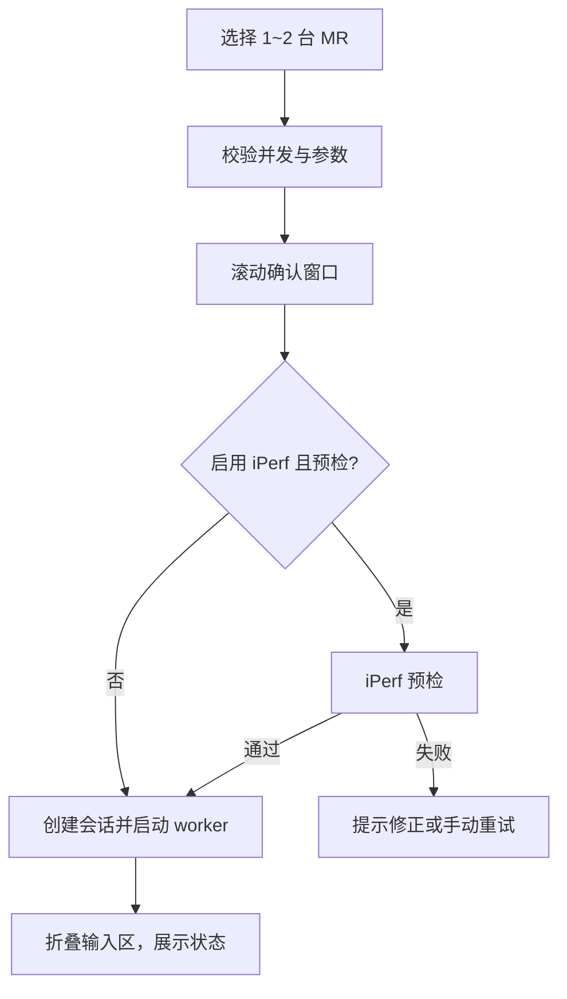

# Online MR 实时采集

## 1. 目标与边界

Online MR 面向车载 MR 的实时 SSH/终端采集、fping 业务质量、随采集 iPerf3、手工备注、会话打包和离线诊断。原始文件是事实来源；实时视图用于现场观察，正式离线解析由 `online_mr_parse` Background Job 完成，报告由 Export Process 生成。

当前最多同时采集 2 台 MR。超过 2 台会在选择和启动阶段被拒绝；页面按当前局点的 ApplicationService 操作引用计算可用并发，不再使用旧采集管理器作为运行状态来源。

页面操作顺序：选择 1～2 台 MR；配置采集周期和高频 Ping；按需配置 iPerf；点击开始并在确认窗口复核设备/参数；启用 iPerf 时完成服务端预检；创建会话后自动收起设备列表和输入区；以实时状态、解析和采集输出为主；运行中可随时添加带时间戳备注；停止后保存并打包会话。页面不再提供独立“收起设备列表”按钮，自动折叠逻辑保留，输入区的展开操作会同时恢复设备选择区域。Vue 只调用 `OnlineMrApplicationService` 对应 API；重复停止由 Application Service 幂等过滤，页面状态由 operation 查询和 Task Event Hub 共同驱动。

## 2. 启动流程



确认窗口必须展示设备名/地址、Mesh/Channel/Statistics 周期、是否采集配置、每个 Ping 目标和阈值、iPerf 协议/角色/服务端/端口/TCP 或 UDP 参数/并发/方向/预检/自动重连。两台设备同时打流时应明确提示。

单设备选择时 Ping1 默认绑定该设备，Ping2 默认不绑定；用户已手工编辑的 Ping2 目标在单选刷新时保留。双设备选择时 Ping1/Ping2 分别绑定两台设备，并禁止两个槽位指向同一设备。设备绑定改变时才用设备主地址覆盖对应默认目标。

启动成功后输入区折叠；用户可手动展开并恢复 splitter 尺寸。页面宽度小于 1250 px 时主 splitter 垂直排列，达到 1250 px 时水平排列，需保持 1920×1080 下可用。

## 3. 会话状态

实际状态全集：

`CREATED -> CONNECTING -> INITIALIZING -> COLLECTING`

异常或控制分支包括 `RECONNECTING`、`STOPPING`、`STOPPED`、`FORCED_STOPPED`、`FAILED`、`ABORTED`。UI 文案、按钮可用性和恢复逻辑必须覆盖全集，不能只处理“采集中/已停止/失败”。

状态文字同时配色：COLLECTING 为绿色，CONNECTING/INITIALIZING 为蓝色，RECONNECTING/STOPPING 为橙色，FAILED/ABORTED/FORCED_STOPPED 为红色，STOPPED 为灰色；颜色只是辅助，不能替代文字。

默认自动重连开启，间隔 5 秒；最大重连次数为空/0 时表示不设上限。命令超时默认 15 秒。开始停止后不得再创建新的 repeat 连接。

普通停止先协作终止 repeat 和外部工具；5 秒后可显示强制停止按钮。批量停止整体等待上限 30 秒。强制停止会尝试 Ctrl+C/quit 并关闭会话，终态标记为 `FORCED_STOPPED`，不得伪装成正常完成。

### 3.1 停止、最终化与打包契约

以下顺序是 Application Service 必须遵守的正式契约，当前 LOCAL 与 Electron 调用链共用该入口。

正常停止固定为：停止接受新操作并将 Task 置为 `STOPPING`；请求停止并等待 fping/iPerf 终态及其 raw、samples、summary flush；解除共享日志镜像和 session 绑定；请求停止 SSH Collection Job；等待 SSH stream、raw writer queue、flush 与连接关闭；写最终 metadata；执行最终解析；验证文件稳定；写 `<session>.zip.tmp` 并用 `os.replace` 原子发布 ZIP；最后才让 Online MR Task 进入终态。打包是会话最后的交付步骤，禁止在 Traffic 或 SSH writer 完成 flush 前解析或打包。

SSH 自然完成、异常退出或达到未来自动时长限制时，也必须先停止并等待 Traffic、完成 Traffic/SSH writer flush，再最终解析和打包，不能因 SSH 已终止而忽略仍运行的子任务。

强制停止先执行有界协作停止，超时后才允许强制终止。结果必须分别记录 `force_stopped`、`finalization_complete`、`package_available` 和 `data_integrity`。无法确认 writer flush 或文件稳定时，不得标记正常 `COMPLETED`、不得把半成品解析成完整结果、不得发布正式 ZIP；必须保留原始会话目录，并允许后续重新最终化或重新打包。旧 metadata 缺少这些字段时只读层返回未知值，不回填或伪造。

打包失败不得删除会话原始目录；必须清除残留 `.zip.tmp`，保留已完成的采集和解析结果，并区分采集失败与打包失败。Task Center 继续使用七状态；`VALIDATING`、`PREPARING_SESSION`、`CONNECTING`、`STARTING_COLLECTION`、`COLLECTING`、`STOPPING_TRAFFIC`、`STOPPING_COLLECTION`、`FINALIZING`、`PARSING`、`PACKAGING` 仅作为业务阶段，不增加 Task Center 状态。

## 4. 设备命令

初始化：

```text
screen-length disable
terminal logging level 7
terminal monitor
system-view
user-interface vty 0 31
idle-timeout 1440 0
return
system-view
probe
return
```

配置采集：`screen-length disable`、`display current-configuration`、`quit`。终端监控独立执行 `screen-length disable`、`terminal monitor`、`terminal logging level 7`。

周期任务：

| 任务 | 主命令 | 默认周期 | repeat |
| --- | --- | --- | --- |
| Mesh link | `display clock`; `display wlan mesh-link` | 1 s | 2 次 |
| Channel busy | `display clock`; `display ar5drv 1 channelbusy` | 9 s | 2 次 |
| Radio statistics | `display clock`; `display ar5drv 1 statistics` | 10 s | 2 次 |
| Switch history | `display clock`; `display wlan mesh-link switch-history` | 300 s | 2 次 |
| Interface rate | `display clock`; `dis counters rate inbound interface`; `dis counters rate outbound interface` | 2 s | 3 次 |
| Wireless status | `display clock`; `display ar5drv 1 client all rssi`; `display ar5drv 1 client all status` | 3 s | 3 次 |

普通 display 准备只执行 `screen-length disable`；probe 准备依次执行 `screen-length disable`、`system-view`、`probe`。Channel busy、Radio statistics、Wireless status 使用 probe；Mesh、Switch history、Interface rate 使用普通 display。`radio_id` 由参数控制，表中的 `1` 是当前模板默认示例，不得在新代码重复硬编码。

Mesh/Channel/Statistics/Switch History 在命令组尾部追加 `repeat 2 delay <interval>`；Wireless/Interface 追加 `repeat 3 delay <interval>`。repeat 的 delay 来自当前会话 interval 参数，不是 parser 推导值。

各任务原始回显写各自 raw 文件；`collector_output_raw.log` 只记录采集器过程，`terminal_monitor_raw.log` 只记录终端 monitor 回显，二者不得混写。

## 5. fping 与 iPerf3

fping 启动前检查工具存在和版本。PIS 默认预设为：64 字节、10 ms 间隔、100 ms timeout、丢包警告 0.7%、延迟警告 100 ms；实际阈值可由预设/表单覆盖。原始采样同时记录本地时间；能从 `display clock` 得到偏移时补充设备对齐时间，否则保留 `offset_source=none`。

iPerf3 默认跟随采集生命周期，不用短固定 duration 代替正式采集时长。启动采集前执行预检；运行中失败可手工重试。批量 worker 失败后，页面会对仍活跃会话安排延迟预检/重试；参数相同的会话复用 batch worker 并镜像日志。TCP 与 UDP 参数、正反向和报告阈值分开处理，停止采集时同步停止打流。

## 6. 会话文件

会话位于 `.local/data/sites/<site>/files/rail_transit/online_mr/<mr>/sessions/<session>/`。完整 raw/parsed/logs/outputs 布局见 [DATA_LAYOUT.md](DATA_LAYOUT.md)。

打包先生成 `<session>.zip.tmp`，成功后原子替换 `<session>.zip`；错误时删除临时包并保留 raw 会话。采集失败不能删除现场证据。

手工备注带毫秒时间。若选择了运行中设备，只写入所选会话；否则写入所有运行中会话。每个目标追加 UTF-8 的 `manual_notes.jsonl` 和 `manual_notes.txt`，页面表格最多保留 500 行。没有运行中会话时仅显示在当前 UI，不写伪会话文件。

纯 Python `OnlineMrQueryService` 只读复用 `OnlineMrSessionStore`、`OnlineMrCollectionPaths`、`session_meta.json` 和 `parsed/online_diagnosis.sqlite`。它提供会话摘要/详情、Artifact 白名单、日志字节游标分块、备注/时间轴、数据库摘要和既有指标查询；SQLite 使用独立 URI 只读连接，不执行 migration，不持有 FastAPI/Electron/Vue 对象。公共 DTO 只返回相对引用，不暴露服务端绝对路径。FastAPI Router 和 Vue 在该边界上提供实时展示；Agent MR 远程执行继续受独立安全开关和正式 Application Service 约束。

阶段 5B-2A 新增纯 Python `OnlineMrApplicationService`。新入口先创建 Controller Task 和同局点 `tasks.db` 中的待关联记录，采集进程创建会话后通过 `online_mr_session_created` 结构化事件补齐 `controller_task_id -> session_id`；Task 快照显式保存顶层局点、设备和所有者摘要，不扫描嵌套配置，也不把密码、命令或绝对路径写入任务/映射 DTO。Online MR 业务阶段使用独立 `OnlineMrPhase`，不扩展 Job Center 七状态。

初始连接在会话创建后失败时，会话 metadata 固定落为 `FAILED`，原始目录继续保留。显式 `recover_mappings()` 对 LOCAL 继续把失去活动宿主的旧会话标为 `ABORTED`，不自动解析、打包或删除 raw；对 AGENT 则从持久 Mapping 恢复远端状态、截止时间、正常停止和包导入。AGENT 默认关闭，关闭时返回 `ONLINE_MR_AGENT_EXECUTOR_DISABLED`。Electron 页面启动后的遗留会话核对复用同一恢复逻辑。

阶段 5B-3 为新 LOCAL 入口增加纯 Python `OnlineMrTrafficCoordinator`，由同一个 Background Worker 持有 fping/iPerf 与 SSH 采集生命周期。正常停止或达到显式 `duration_minutes` 上限时，先停止并 join Traffic，再停止 SSH collector、等待 writer/连接关闭、写最终 metadata，最后原子发布 ZIP；Worker 返回以后 Task 才进入终态。Traffic 工具缺失或运行失败写入 `traffic_summary/finalization_warnings`，不会让映射悬挂；无法确认 flush 时不发布正式 ZIP。

历史页面自管 fping 的执行、统计、事件发布和摘要写入已经收敛到纯 Python `FpingV5ProbeRunner`；旧 UI Adapter 已删除，正式 LOCAL 主路径只依赖该 Runner 的业务契约。

`online_mr_task_sessions` schema v2 增加 LOCAL 生命周期字段；阶段 5B-13A 的 schema v3 再增加 Agent Profile、远端 Task/Session/Package、最近状态、连续失败次数和 Controller 截止时间，迁移不重建既有行。实际时长统一使用 `max(0, ended_at - started_at) / 60` 并保留三位小数。LOCAL 正常与强停契约保持不变；AGENT 只提供正常停止，远端终态必须先下载并安全导入 package，Controller Task 才能终态。详细见 [Online MR Agent 远程执行器](ONLINE_MR_AGENT_EXECUTOR.md)。

### 6.1 阶段 5B-3A 真实设备验收

在真实 MR 上分别执行正常手动停止、`duration_minutes` 自动到期和强停。每次停止并等待最终化后，用只读检查器核对 Task、Session、Mapping、Traffic 输出和 ZIP：

远程验收场景使用 fping `interval_ms=1000`、`timeout_ms=4000`，仅用于验证 Traffic 生命周期与落盘，不作为链路质量验收依据。

```powershell
python -m scripts.maintenance.check_online_mr_session_state --site "<局点>" --session-id "<session_id>"
python -m scripts.maintenance.check_online_mr_session_state --task-id "<controller_task_id>"
```

检查器使用 SQLite `mode=ro`，不初始化或迁移数据库，不解析、不打包、不删除或改写会话文件。退出码 `0` 表示无失败项（允许强停的部分完整警告），`1` 表示存在验收失败项，`2` 表示参数、定位、数据库或文件读取失败。

- 正常手动停止：Task/Session/Mapping 均终态，fping/iPerf 已启用项输出非空，Traffic flush 完成，正式 ZIP 可读且不含 `stop.request`；
- 自动到期：除上述检查外，`stop_reason` 应为 `duration_elapsed`，实际时长在 Task、Mapping 与 metadata 中一致；
- 强停：Task/Session/Mapping 不再活动，raw 保留，无法确认 flush 时允许 `WARNING`，但必须为部分完整且不得发布正式 ZIP。

定向测试和只读检查器通过不等于真实链路验收通过；只有三类现场运行全部完成并留存检查结果后，才能确认阶段 5B-3 的 LOCAL 生命周期现场稳定。

## 7. 解析与报告

- 实时 parser/cache：为运行中图表和状态服务，可因 stale、时间轴或样本塌缩检测而重建。
- 离线 parser：`online_mr_parse` Job 从 raw 重建 `parsed/online_diagnosis.sqlite`，融合主链路、信道、射频、接口、fping、iPerf 和切换事件。
- 报告：页面当前正式路径使用 Export Process 和车载 MR 离线 Excel exporter。
- AP Identity：只在 `online_mr_parse` 旧结果后附加只读 `identity_shadow`；不改变实时生产匹配、parsed schema 或报告业务统计。

## 8. 验证清单

- 单/双 MR 选择、Ping 槽位绑定和手工目标保留；
- 确认窗口完整性、iPerf 预检失败/重试；
- 状态全集、自动重连、普通/强制/批量停止；
- 各 raw 文件不串流，停止后不再启动 repeat；
- display clock 对齐与无偏移回退；
- 1/2/9/10/300 秒周期及 radio 参数；
- 1080p、窄/宽 splitter、输入区折叠恢复；
- 打包原子替换、失败保留 raw、备注多会话写入；
- 实时视图、离线解析和报告三条路径不互相越权。

## 9. Windows Agent sidecar 边界

独立 Agent 的 Online MR 由 `apps/agent/mr_collector_py/collector_cli.py`（发布后为 `tools/windows-x64/mr_collector/netconsole-mr-collector.exe`）通过 Netmiko 执行；Go 进程只负责启动/停止 sidecar、任务状态、原始日志 tail、实时 view 和 ZIP。Agent 不生成正式分析报告，也不把 `stop.request` 打进采集包。

Agent 会保留主程序兼容的 raw 文件名，并提供 `/api/v1/mr/collect/live`、`/api/v1/mr/collect/raw-tail`、`/api/v1/mr/collect/raw-summary`。fping 与可选 iPerf Client 共享 MR 生命周期；独立 iPerf Server/Client 和 TCP fallback 仍在各自工具页运行。

## 10. Agent Executor Contract（5B-6 历史设计，5B-13A 已受控启用）

阶段 5B-6 只固化 Controller 侧契约，不调用 Agent HTTP API、不创建远端任务、不下载或导入采集包。`OnlineMrApplicationService.start_collection()` 是 executor 分派入口；`LOCAL` 继续复用已验收的 `start_local_collection()`，`AGENT` 在创建 LOCAL Worker、Task/Session 映射或 TrafficCoordinator 之前稳定返回 `ONLINE_MR_EXECUTOR_UNSUPPORTED`。已有 AGENT 映射也不会被 LOCAL stop/force stop、Task Event Hub 或本地遗留恢复误处理。

### 10.1 当前 Agent 能力与协议缺口

Go Agent 已有 `/api/v1/mr/collect/{start,stop,status,live,raw-tail,raw-summary}`、统一任务查询/事件、采集包下载、Netmiko sidecar 和密码脱敏。现有 start 请求已能表达目标、会话归属、采集项、周期、Radio、fping、iPerf 和现场展示上下文；私有 `meta/request.private.json` 只用于 sidecar 连接，任务参数和目标快照使用脱敏副本，最终 ZIP 排除该文件和 `stop.request`。

仍未接通的边界：

- Go MR 请求尚未执行 `duration_minutes` 自动停止；
- Agent task/status/live 三类响应尚未归一为 Controller 的 start/status/stop DTO；
- Controller 已能手工查询、下载并导入 Agent ZIP，但尚未接远程任务生命周期；
- Agent 终态到 Controller Task/Session/Mapping 的自动同步链尚未建立。

因此 5B-6 不把 Agent 已有本地 Web 采集能力描述为 Python Controller 已接入。

### 10.2 请求与响应模型

`src/netconsole/models/online_mr_agent.py` 定义未来 Controller 边界：

- `OnlineMrAgentStartRequest`：`site/device/mr/owner/agent_id`、最小连接目标、采集项、interval、Radio、fping、iPerf、`display_context`、`duration_minutes`、`stop_strategy` 和自动打包策略；
- `OnlineMrAgentStartResponse`：`agent_task_id/session_id/task_type/status/started_at` 与稳定错误；
- `OnlineMrAgentStatusResponse`：采集器、fping、iPerf、包、错误摘要和完整性；
- `OnlineMrAgentStopResponse`：停止结果、原因和包状态。

目标密码使用 `SecretStr`。`transport_payload()` 是未来 HTTP 私有请求，允许为连接临时包含明文密码，但返回值禁止写入日志、事件、数据库和包；`public_payload()`、模型 JSON 和 repr 不含明文密码。主程序映射继续只保存 `agent_id` 和业务摘要，不新增凭据字段。

### 10.3 状态与交付映射

| Agent 状态 | Controller Task | OnlineMrPhase | Mapping | 说明 |
| --- | --- | --- | --- | --- |
| `created/starting` | `STARTING` | `PREPARING_TASK/STARTING_COLLECTION` | `PENDING_SESSION` | 尚未确认远端采集运行 |
| `running` | `RUNNING` | `COLLECTING` | `LINKED` | 远端 Task 与 Session 已关联 |
| `stopping` | `STOPPING` | `STOPPING_TRAFFIC` | `LINKED` | 等待 Agent 最终化与打包 |
| `stopped/completed` | `RUNNING` | `FINALIZING` | `LINKED` | 远端已终态，但包未下载/导入时 Controller 不能伪完成 |
| 上述状态且包已校验导入 | `COMPLETED` | `TERMINAL` | `TERMINAL` | 本地主程序已取得兼容会话事实文件 |
| 包下载或校验失败 | `FAILED` | `TERMINAL` | `TERMINAL` | Agent 远端 raw 保留，记录下载/校验错误 |
| `failed` | `FAILED` | `TERMINAL` | `TERMINAL` | 不伪造成功 |
| `force_stopped` | `CANCELLED` | `TERMINAL` | `TERMINAL` | `data_integrity=partial` |
| `aborted/cancelled` | `CANCELLED` | `TERMINAL` | `TERMINAL` | 不自动解析、不删除远端 raw |

Terminal mapping 不得被后续轮询或本地 Task 事件改回 ACTIVE。带 warning 的正常终态保留 warning；是否完整由包内 metadata 和校验结果决定。

### 10.4 错误码与包契约

5B-6 当时的稳定错误为 `ONLINE_MR_EXECUTOR_UNSUPPORTED`；5B-13A 默认关闭时改为 `ONLINE_MR_AGENT_EXECUTOR_DISABLED`，开启后使用已预留的 unreachable/auth/version/tool/collector/start/stop/status/package/import 等稳定错误码。

Agent ZIP 使用单一会话根目录，必须包含主程序需要的 `manifest.json`、`raw/` 十四类事实文件、`session_meta.json`、`task.json`、`stop_reason.json`、`agent_info.json` 和 `system_info.json`。逻辑会话目录还包括 `parsed/`、`view/`、`logs/`、`outputs/`；ZIP 不保证为空目录有独立 entry，importer 会在校验通过后创建缺失空目录。

禁止包内出现 `stop.request`、`meta/request.private.json`、`.tmp`、路径穿越或绝对路径。包下载到临时文件后必须先校验根目录、metadata、raw 契约和敏感信息，再原子提交到 `PathResolver` 管理的局点会话目录；校验失败不得覆盖既有会话，也不得删除 Agent 远端 raw。5B-7 已实现本地 ZIP 校验与导入，5B-8/5B-9 接入受控手工下载，5B-10 增加只读同步和正式设备候选解析。

Agent Task/Event 向 Controller 只允许传递稳定 ID、状态、指标和相对 artifact 引用；不得传递 Agent 私有绝对路径、Token、密码或私有请求内容。

## 11. Agent Package Importer（5B-7，由手工下载流程调用）

`OnlineMrAgentPackageImporter` 只处理已经下载到本机的 Online MR ZIP，不连接 Agent、不启动远端任务。Importer 是同步 IO 服务，UI/API 调用者必须放入后台任务，不能阻塞 Renderer。导入目标固定为当前局点：

```text
files/rail_transit/online_mr/<device_name>__<device_id>/sessions/<session_id>/
```

流程为：只读检查 ZIP 列表和公共 JSON，在当前局点 `files/imports/online_mr/.<import_id>.tmp/` 创建 staging，复制并复核源 ZIP 哈希，安全解压，补齐可能未写入 ZIP 的空目录，写入归一化 `session_meta.json` 和 `import_manifest.json`，再原子移动到正式 Session。源 ZIP 保留不删除；数据库登记失败会删除本次新建的正式目录并回滚 Mapping，不影响已有会话。

### 11.1 安全校验

- ZIP 只允许一个外层 Session 根目录或无外层根目录；成员路径拒绝 `..`、绝对路径、Windows 盘符、UNC、空路径段、重复路径、符号链接和加密成员；
- 必须满足 5B-6 的 `manifest/task/session_meta/agent/system/stop_reason` 与十四个 raw 文件契约；空的 `parsed/view/logs/outputs` 由 importer 补齐；
- `stop.request`、`meta/request.private.json` 和 `.tmp` 永久禁止；
- 公共 JSON 中 `password/credential/secret/token/private_key` 等字段只允许空值或 Agent 固定脱敏占位符 `******`，其他非空值仍按明文凭据拒绝；`session_meta.json` 不允许 Agent 私有绝对路径，raw 日志不做全文敏感词扫描；
- 解压总文件数和声明的未压缩大小有上限，提取时再次校验目标仍位于 staging 内；校验失败不创建正式目录、Task 或 Mapping。

### 11.2 幂等、冲突与登记

Agent Web 的目标 ID/名称可以是现场临时值，不能直接作为 Controller 正式资产身份。Importer 区分包内 `source identity` 与调用方选择的 `resolved identity`：`strict` 要求设备 ID、设备名和 MR 身份一致；`ip_match` 在身份不同但包内采集 IP 与显式 `expected_host` 相同时允许导入；`manual_override` 只有同时显式允许覆盖时才可导入，并产生警告。FIT-AP 的 DHCP 场景不默认使用 IP 匹配。

导入后的 Task、Session metadata 和 Mapping 均使用 resolved identity；原始 source identity、匹配方式和警告写入 `session_meta.json.import_context` 及 `import_manifest.json.identity`。Manifest 还保存源文件名、SHA-256、Agent/Controller Task、Session、终态、完整性、文件数量和总大小，不保存本机绝对路径。相同 Session 与相同哈希再次导入返回 `already_imported`，且要求原 Task/Mapping 仍完整；相同 Session 但哈希不同、已有其他目录或映射时返回 `conflict`，默认不覆盖。

导入成功后在所属局点 `tasks.db` 写入 `source=agent` 的终态 Task 和 `executor_kind=AGENT / mapping_state=TERMINAL` 的映射；如果明确提供的 `controller_task_id` 已对应同一 AGENT 身份、设备和 Session，则更新现有 Task/Mapping，不重复创建。`stopped/completed` 映射为 `Task COMPLETED + Session STOPPED`；warning 终态保留警告；`failed` 映射为 `FAILED`；`force_stopped` 映射为 `CANCELLED + FORCED_STOPPED + data_integrity=partial`；`aborted/cancelled` 映射为取消/中止终态。默认 `strict` 拒绝 `created/starting/running/stopping` 包；显式 `partial` 只作为中止证据导入，不伪造完成态。

导入后的源包保存为 Session 内 `outputs/<session_id>.zip`，Task 仅保存相对 artifact 引用。验收脚本支持 `executor=AGENT`：继续检查身份、raw、终态、ZIP 和 Mapping，但不套用 LOCAL 专属的 Traffic flush 与“Traffic 停止 < 本地打包 < Task 终态”事件顺序。Importer 本身不连接 Agent、不自动解析或生成报告；下载能力由下一节的独立客户端编排。

## 12. Agent HTTP 客户端（5B-8 下载；5B-13A 增加固定启停路由）

`OnlineMrAgentHttpClient` 复用现有异步 `AgentHttpClient` 的 URL、`X-Agent-Token`、统一响应、超时和禁止重定向逻辑，提供 `ping`、Agent/工具状态、Online MR Task、package 列表和 package 下载。5B-13A 只增加固定 `/api/v1/mr/collect/start` 与 `/api/v1/tasks/<id>/stop`，不接受调用方任意 URL。配置中的 Token 使用 `SecretStr`，异常和下载结果不包含 Token、远端私有路径或响应原文。

下载固定使用 `/api/v1/packages/<package_id>/download`，不信任响应中的下载 URL。ZIP 流式写入所属局点 `files/imports/online_mr/downloads/*.zip.part`，同时计算 SHA-256，并受超时、取消和 `max_download_bytes` 限制；完成后关闭句柄并原子改名为 `.zip`。失败、取消或超限删除 `.part`，不删除远端 package。

`OnlineMrAgentDownloadService` 将下载完成的 ZIP 在线程中交给 5B-7 importer。下载失败不调用 importer；校验失败或冲突时保留下载 ZIP，正式 Session 不受污染；导入成功或幂等确认后默认清理临时下载 ZIP。错误统一映射为 `ONLINE_MR_AGENT_*`，覆盖 unreachable、timeout、auth、version、tool/collector、Task 不存在、package 未就绪、下载失败、超限、响应无效和 package invalid。

历史 5B-7 阶段未把该服务接入 `OnlineMrApplicationService`、FastAPI 或 Vue，当时 `executor=AGENT` 返回 `ONLINE_MR_EXECUTOR_UNSUPPORTED`；该描述只记录阶段事实，不代表当前产品入口状态。

## 13. Controller 手工下载与导入（5B-9）

`OnlineMrAgentControllerService` 是 Client/DownloadService 的轻量门面，5B-13A 增加按 Profile 的 start、Task status 与 normal stop；它仍不改变 LOCAL 采集路径，Token 只从共享的进程内凭据容器读取。

维护脚本可先只列出 Agent 现有采集包：

```powershell
$env:NETCONSOLE_AGENT_TOKEN = "<token>"
python -m scripts.maintenance.download_import_agent_online_mr_package `
  --agent-url "http://<agent-host>:18080"
```

选定 Online MR `package_id` 后，手工下载并导入当前局点：

```powershell
python -m scripts.maintenance.download_import_agent_online_mr_package `
  --agent-url "http://<agent-host>:18080" `
  --package-id "<package_id>" `
  --site "<site_id>" `
  --device-id "<device_id>" `
  --device-name "<device_name>" `
  --mr-id "<mr_id>" `
  --mr-name "<mr_name>" `
  --expected-host "<device_ip>" `
  --identity-match-policy ip_match
```

如果包内没有可核验 IP，但操作人员已经确认真实车辆，可改用 `--identity-match-policy manual_override --allow-identity-override`。脚本默认仍为 `strict`，不会因为已填写目标参数而自动放宽身份校验；输出会同时显示 Agent 包身份、本地正式身份、匹配方式和警告。

脚本先查询 ping、Agent/工具状态和 package 列表，再按固定 `/api/v1/packages/<package_id>/download` 路由下载；可选列表字段缺失时显示为空或 `unknown`，不会请求返回值中的任意 URL。成功或幂等导入后输出 Controller Task、Session 和只读验收命令；冲突或无效包保留下载 ZIP，远端 package 始终保留。Token 可通过 `NETCONSOLE_AGENT_TOKEN` 提供，输出和异常摘要不回显 Token。

真实 Agent 验证只允许先在 Agent Web 手工完成采集，再由该脚本下载已有包。导入后运行：

```powershell
python -m scripts.maintenance.check_online_mr_session_state --task-id "<controller_task_id>"
```

应确认所属局点 `tasks.db`、Session、`executor=AGENT` Mapping、raw、`outputs/<session_id>.zip` 和 `import_manifest.json` 一致，且没有误写 `demo/tasks.db`。历史 5B-9A 使用 `0.2.0-win-agent` 的真实停止态 Online MR 包完成列表、HTTP 下载、`ip_match` 身份解析、安全导入与幂等复跑；当时尚未启用的远程控制/API 状态不得当作当前事实。

## 14. Agent 只读同步与包导入入口（5B-10）

`OnlineMrAgentControllerService` 复用阶段 3 的 `AgentRepository`、`AgentConfig` 和进程内 `SessionCredentialVault`，不创建第二套 Online MR Agent Profile 或数据库。服务层可列出/读取既有 Profile、测试连接、查询状态与工具、同步远端 package，并调用既有下载/importer；Token 只在构造 HTTP Client 时从凭据容器取出，不进入 DTO、日志、异常、事件或 manifest。

只读同步固定调用 `ping/status/tools/packages`，再按每个 Online MR package 的只读 Task 详情读取脱敏 `params.target/session`，补全来源设备和采集 IP。同步不下载、不导入、不删除远端包，也不发送 start/stop。返回项包含 package/task/session、来源身份、当前局点候选设备、匹配方式和 `not_imported/already_imported/conflict/unknown` 导入状态；已导入判断核对 `source_package_id`、Agent Task、Session、`import_manifest.json` 以及终态 Task/Mapping，远端列表未提供哈希时不伪造哈希结论，最终同 Session 不同哈希冲突仍由下载后的 importer 判定。

设备候选只查询当前局点 `devices.db` 的正式静态设备表，并同时检查主/备地址；不查询 FIT-AP 资源表，因此 DHCP FIT-AP 不会被自动选为正式身份。唯一匹配返回 `ip_match` 候选；零匹配要求手工指定；多个正式设备使用同一 IP 时返回冲突，禁止自动导入。Agent 包内临时 ID/名称始终只作为 source identity 保存。

只读显示候选和导入状态：

```powershell
python -m scripts.maintenance.download_import_agent_online_mr_package `
  --agent-url "http://<agent-host>:18080" `
  --site "<site_id>" `
  --list-packages-with-match
```

按唯一静态 IP 候选下载并导入：

```powershell
python -m scripts.maintenance.download_import_agent_online_mr_package `
  --agent-url "http://<agent-host>:18080" `
  --package-id "<package_id>" `
  --site "<site_id>" `
  --identity-match-policy ip_match `
  --auto-resolve-by-ip
```

无匹配或多匹配时命令在下载前结束；原有 `--device-id/--device-name/--mr-name`、`manual_override` 和显式覆盖入口继续保留。新导入 manifest 增加 `source_package_id`，旧 5B-9 导入仍可通过 Agent Task/Session 识别为已导入。5B-10 是历史导入切片，当时不接 FastAPI/Vue，也不远程启动、停止或删除 Agent MR 任务/包。

5B-10 已对 `127.0.0.1:18080` 的真实 `0.2.0-win-agent` 做只读同步：既有 12 车包解析出 `10.122.12.249`，在“宁波地铁12号线”唯一匹配设备 204“列车12-MR-CT”，并根据既有 manifest、Task 和 Mapping 返回 `already_imported`；验证未重复下载、导入或删除远端包。

## 15. 历史 Qt Agent 包入口（5B-11，已删除）

该入口已随 Qt 页面删除。其安全契约继续适用于永久 Agent 链：复用已登记 Profile，临时 Token 只存在于受管进程内存/环境，任务 JSON、`tasks.db`、日志、事件和导入 manifest 均不保存 Token。

同步通过 `online_mr_agent_packages_sync` Job 展示 Agent/工具状态、远端包、包内临时设备身份、采集目标 IP、本地候选和导入状态。导入通过 `online_mr_agent_package_import` Job 执行下载及 5B-7 importer：

- `not_imported` 且只有一个正式设备 IP 候选时，可按 IP 匹配导入；
- `already_imported` 不重复下载或写入；
- `conflict` 禁止自动或手工覆盖；
- 无匹配或多匹配时不自动导入，只能由操作人员选择当前局点正式设备并二次确认 `manual_override`；
- 对话框关闭、局点切换或应用退出时，所属 Job Center 子进程按既有取消/清理协议回收。

导入完成后，对话框显示 Controller Task、Session 和本地会话目录，并提供复制 Package ID、复制只读验收命令和打开导入目录操作；这些操作只使用本次本地导入结果，不会把 Agent Token 或密码拼入命令、路径或 URL。

5B-11 不新增 Agent start/stop/delete API，不修改 Go Agent 或 Agent Web，不开放 `executor=AGENT`，不改变 LOCAL Online MR 启动、停止、Traffic flush、raw 和打包生命周期，也不接 FastAPI/Vue。

## 16. 本地 Agent 自检边界（5B-12A）

维护脚本 `python -m scripts.maintenance.check_local_agent_runtime` 只允许连接 `127.0.0.1` 或 `localhost`，用于验证 Agent 状态、工具、fping/iPerf 任务、日志和终态。它不会调用 MR start/stop，不会下载或删除采集包，也不会改变本节仍为 `ONLINE_MR_EXECUTOR_UNSUPPORTED` 的远程执行边界。

自检固定使用 fping `interval_ms=1000 / timeout_ms=4000 / packet_size=64 / count=10`；iPerf 使用回环 TCP、单流和 10 秒。当前 TCP 2 Mbps 仅为期望记录，不能当作车地链路限速或性能结论。

## 17. Web 实时展示（5C-2，只读）

Vue 路由 `/rail-transit/online-mr` 只展示当前局点的运行中或最近会话。FastAPI 的 `/api/online-mr/sessions/...` 仅提供 GET：当前/最近会话、详情、采集器状态、`view/*.json` 轻量预览、raw 白名单尾部和 raw 摘要。缺失或尚未生成的 raw 返回成功空结果，不创建文件、不回填 metadata，也不触发解析、打包或数据库迁移。

raw 尾部白名单固定为 `mesh_link`、`channel_busy`、`fping_samples`、`fping_summary`、`fping_raw`、`iperf_client`、`switch_history`、`collector_output` 和 `wireless_status`。响应只包含相对引用；`tasks.db` 使用 SQLite `mode=ro` 读取 Task/Mapping，不实例化会执行 schema 初始化的 Repository。

页面状态和轻量预览每 2 秒刷新，最近会话、采集器与 raw 摘要每 5 秒刷新；原始日志只有展开后才每秒读取一次。页面隐藏或卸载时停止定时器，同类请求未完成时不重复发起，连续三次失败后才显示错误。终态会话若遗留 `view/live_mr_status.json` 的 `running` 采集器状态，查询层以 `session_meta.json` 终态校正为停止，事实文件本身保持不变。

5C-2 的只读查询接口本身不提供控制 API。5C-10A 另在 Desktop Host 增加 LOCAL start/normal stop 薄入口；轨交 Electron 对等阶段继续增加 LOCAL force-stop/recover 和独立报告入口。Traffic flush、SSH writer、metadata、原子 ZIP 与 Task 终态顺序仍保持第 3 节契约；没有建立第二套采集器或状态机。

## 18. 在线列车通信统一展示（5C-7A，只读）

`/rail-transit/train-communication` 在 5C-2 查询边界上聚合正式列车/MR、AC Mesh-Link、活动或最近 Online MR Session、fping/iPerf、关联 Task 和采集包。Agent 已导入 Session 和 5B-13A 远端执行结果都可按 `executor=AGENT` 只读显示；当前 Web 不提供 AGENT 控制入口。

聚合页不修改本节任何采集命令、raw、Traffic flush、最终化或打包契约。5C-10A 只在 MR 详情增加受四重安全条件保护的 LOCAL start/normal stop；原始片段继续通过逻辑名称白名单读取 tail。详细控制边界见 [Web 本地 Online MR 受控启停](ONLINE_MR_WEB_CONTROL.md)，聚合优先级、状态和刷新规则见 [在线列车车地通信检测](TRAIN_COMMUNICATION_MONITORING.md)。

## 19. Web LOCAL 受控启停（5C-10A）

Web 控制仅在显式启用、Desktop 模式、严格 `127.0.0.1` 和已认证 Host 短期 Cookie 同时满足时可用。正式 Electron Runtime 显式启用；其他宿主未显式传参时仍由默认关闭的 `ONLINE_MR_WEB_CONTROL_ENABLED` 控制。启动 DTO 不接受凭据、命令、Agent URL 或路径；后端从正式 MR 资料和当前局点设备库补齐连接配置，并固定 `owner=web_local`、`executor=LOCAL`。

启动、正常停止、强停和恢复分别复用 `OnlineMrApplicationService.start_local_collection()`、`stop_operation()`、`force_stop_operation()` 与 `recover_mappings()`。同 MR 重复启动返回现有活动 Mapping，重复停止沿用 ApplicationService 终态幂等；Web 不直接操作 fping/iPerf、SSH、metadata、ZIP 或 Task 数据库。AGENT 控制继续使用独立契约，且不提供强停。完整契约见 [Web 本地 Online MR 受控启停](ONLINE_MR_WEB_CONTROL.md)。
