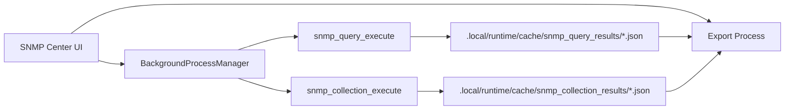

# SNMP Center

## 1. 能力范围

SNMP Center 统一管理 H3C/标准 MIB 资源、MIB 字典与设备视图、OID 浏览、OID 模板、监控任务、Trap/告警记录和拓扑。当前页面可见 Tab：

1. SNMP 概览
2. H3C MIB 资源
3. MIB 字典/当前设备视图
4. MIB Browser
5. OID 模板
6. SNMP 监控任务
7. Trap/告警
8. 拓扑

单次查询和推荐工作流由中心内部使用，不是独立可见 Tab；不得仅因类已实例化就写成产品导航。

## 2. 查询能力

MIB Browser 支持：Get、Get Next、Get Bulk、Get Subtree、Walk、Bulk Walk、Table Walk、Set。

`services/snmp/request_builder.py` 把可 JSON 序列化 payload 构造成 Query/Set/Collection request；Client 只负责协议通信；`SnmpQueryService` 和 `SnmpCollectionService` 编排操作、取消与进度；`services/snmp/result_formatter.py` 负责稳定 payload 和浏览器/查询表格行；`result_cache.py` 负责原子缓存。页面不得绕过这些边界直接拼协议结果。

请求边界：

| 参数 | 范围 | 默认 |
| --- | --- | --- |
| `max_repetitions` | 1～50 | 10 |
| `non_repeaters` | 0～50 | 0 |
| `max_rows` | 1～10000 | 200 |
| timeout | 100～60000 ms | 2000 ms |
| retries | 0～10 | 1 |

内部 `SnmpOperation` 枚举保留 GET/GETNEXT/GETBULK/WALK/SET 基础类型；Get Subtree、Bulk Walk 和 Table Walk 通过字符串请求规范化和 service 专用分支实现。这是兼容模型，不应据此删掉页面能力。

标量 Get 可自动补 `.0`。完整实例 OID 查询失败时 client 具有受控 fallback；表根 OID 不允许直接当标量 Get，应提示切换 Walk/Bulk Walk。实例节点可返回列 OID，并切换到 Bulk Walk。

Walk 类操作按 `max_rows`、取消和进度执行。Set 默认禁用，只有明确开启、提供 RW community 或 SNMPv3 authPriv 且对象标记 writable 时允许；执行前 Get、Set、执行后 Get 验证。Trap/Notification 定义不可 Get/Set。

## 3. 后台执行与缓存

查询和批量采集结果以临时文件写完后原子替换缓存 JSON；失败清理 temp。UI 最多展示 500 行，但完整缓存结果可交给 Export Process 导出，不能把 UI 上限当成数据上限。

查询与 collection 已有正式领域 handler。MIB 资源、产品参考和部分中心数据刷新/动作仍通过 legacy 薄适配，Job Center 领域迁移尚未全部完成。

## 4. 批量采集

批量采集只支持只读 GET、GETNEXT、GETBULK、WALK，不支持 Get Subtree、Bulk Walk、Table Walk 或 Set。并发范围 5～50；每台设备使用独立 client/SQLite 连接，设备内 OID 顺序执行。支持 retries、部分失败、取消和 `stop_on_failure`（停止提交新任务，不抹除已完成结果）。

缓存必须清除 community、认证密钥等凭据，仅保存必要的目标标识、结果和稳定错误信息。

## 5. MIB 资源与 H3C 目录

全局 MIB 库位于 `.local/data/global/mibs/global_mib.db`，原始归档、原始文件、references、compiled、index 和 reports 分开保存；局点 SNMP 数据位于 `.local/data/sites/<site>/db/snmp.db` 与 `snmp/{raw,exports,traps}`。

导入器解析 `IMPORTS` 依赖并报告缺失模块；批量归档中可在候选模块间解析依赖。模块名会去除文件名前置数字序号，例如 `01-HH3C...` 归一为 `HH3C...`，但 `13-WLAN` 等产品分类仍作为目录/类别信息保留。

资源源类型包括 standard、h3c_v5、h3c_v7v9；Browser 默认偏向 H3C V7/V9 源和 H3C 产品树。版本标签是检索/分类信息，不代表所有设备版本已经实机验证。H3C 私有 MIB 不随仓库分发，需由用户导入合法取得的官方归档/参考资料。

## 6. Trap 与拓扑边界

Trap 页面展示定义和已存记录；这不等于应用在所有环境都已运行完整 Trap Receiver。监听端口 162 可能需要管理员权限，部署可选择 1162 等非特权端口并配套转发。Receiver 生命周期、Windows 防火墙、服务权限和长期运行需要按部署单独验证。

拓扑快照和导出使用局点 topology 目录。SNMP 邻接数据只是拓扑证据之一，不应在数据缺失时推断不存在的链路。

## 7. SQLite 与 UI

Repository 使用统一连接 helper、busy timeout，并在需要的库启用 WAL。后台 worker 各自建立连接；大查询、导入、刷新和导出不得阻塞 UI。表格采用分页/按需展示，列宽和主题遵守 [ui_table_guidelines.md](ui_table_guidelines.md)。

## 8. 验证清单

- v2c/v3 请求构建、timeout/retries 和凭据不落缓存；
- 标量 `.0`、完整实例 fallback、表根提示和列 OID 返回；
- GetBulk 参数、Walk 上限、取消和大结果导出；
- Set 默认禁用、权限检查和前后 Get 验证；
- 5～50 并发、部分失败、stop-on-failure 与独立 client；
- MIB 依赖、前缀归一、H3C V5/V7V9 分类和缺失模块；
- Trap 定义不可查询、端口权限提示；
- 500 行 UI 上限不截断完整缓存/导出；
- 深浅主题、空状态、错误状态和 SQLite 锁竞争。
