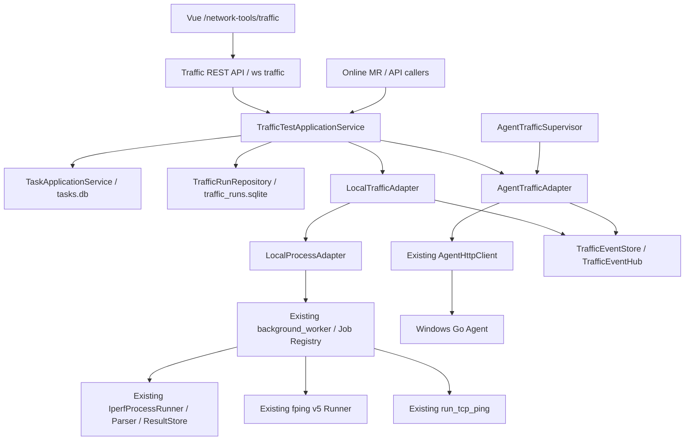

# 统一流量测试架构

## 1. 当前状态

阶段 4C 已在阶段 4B-2 的纯 Python 流量测试应用层之上接入 Web 调用能力，统一支持本地或 Windows Go Agent 执行：

- iPerf Server；
- iPerf Client（TCP/UDP、上传/下载/双向）；
- fping v5 高频 Ping；
- TCP 端口测试（本地复用永久 Network Tools Service，Agent 复用既有 `ping_probe`）。

当前已提供 Traffic REST API、独立 Traffic WebSocket 和 Vue 流量测试页面。Online MR 继续通过具名协调器复用 Traffic 能力，不把会话和 MR 状态机搬入通用 Traffic Service。SNMP Center、通用 MIB/OID 平台与无线勘测已删除。

## 2. 组件关系



没有第二套 Task Manager、Agent Client、iPerf parser 或 Python Core。Local/Agent Adapter 只负责执行差异，业务调用者统一依赖 `TrafficTestApplicationService`。

## 3. 领域模型

固定测试类型：

```text
IPERF_SERVER
IPERF_CLIENT
HIGH_FREQUENCY_PING
TCP_PORT_TEST
```

固定执行端：

```text
LOCAL
AGENT
```

统一关联字段：

```text
traffic_run_id
controller_task_id
parent_task_id
correlation_id
retry_of_traffic_run_id
```

重试总是创建新的 Traffic Run 和 Controller Task，不覆盖旧记录。iPerf Server/Client 可用 `correlation_id` 配对；`parent_task_id` 只为后续 Online MR 联动预留，阶段 4B-2 没有接入 MR 父任务。

Task 生命周期继续只有七状态：

```text
PENDING → STARTING → RUNNING → STOPPING
                         ├─ COMPLETED
                         ├─ FAILED
                         └─ CANCELLED
```

远端 `sync_state` 为 `ACTIVE / STALE / CREDENTIAL_REQUIRED / AGENT_OFFLINE / COMPLETED / ERROR`，只描述 Controller 与 Agent 的同步健康度，不是第八个 Task 状态。

## 4. 本地执行边界

本地调用链：

```text
TrafficTestApplicationService
→ LocalTrafficAdapter
→ LocalProcessAdapter
→ Existing background_worker
→ traffic_local_* handler
→ LocalTrafficAdapter worker execution
→ Existing iPerf/fping Core
```

四个 Job type：

```text
traffic_local_iperf_server
traffic_local_iperf_client
traffic_local_fping
traffic_local_tcp_port_test
```

`LocalProcessAdapter` 是既有 `TaskRuntime` 的纯 Python进程宿主，只负责 `Popen`、stdout/stderr 并发读取、等待、取消宽限、terminate/kill 和 shutdown。Windows 下优先使用 Job Object 的 kill-on-close 回收 Worker 及其 iPerf/fping 子进程树；绑定失败时降级到原 terminate/kill 路径。它不复制任务状态机，也不依赖 PySide6 或 FastAPI。

父进程完成回调会把 TaskRuntime 终态同步回 `TrafficRun`，包括强制停止后的 `CANCELLED` 收口和 `worker_forced_stop` 系统事件，避免本地 Run 长期停留在 `STOPPING`。

Worker stdout 只承载低频 Job JSONL；带宽区间、RTT 和丢包样本直接写 Traffic EventStore/Repository，不能进入全局 Task Event 表。fping 多目标使用独立进程和共享取消，样本按批次写 SQLite；timeout 保持 `rtt_ms=null`，没有有效样本时返回 `TRAFFIC_PARSE_FAILED`，不伪造零延迟或零丢包。TCP 端口测试在同一 Worker 中复用 `run_tcp_ping()`，在每次探测及间隔等待之间检查取消。

## 5. Agent 执行与凭据

Agent 启动前必须满足：

- 配置存在、未归档且启用；
- Runtime Snapshot 为 `ONLINE`；
- 对应 `iperf_server`、`iperf_client`、`fping` 或 `tcp_ping_probe` capability 为 `true`；
- iPerf/fping 要求 `task_events` 与 `task_result`；兼容 TCP `ping_probe` 当前只要求 `task_events`；
- Token 认证模式下，当前 `SessionCredentialVault` 中存在凭据。

能力只使用 Agent Runtime Snapshot，不根据操作系统名称猜测。

Token 只在 Controller 进程内、每次 HTTP 请求前读取。禁止写入：

```text
JobSpec / job JSON / command line
tasks.db / traffic_runs.sqlite
events.jsonl / raw logs / summary
Traffic DTO / Supervisor state
```

停止使用明确的 `agent_id + agent_task_id`。Controller Task ID 与 Agent Task ID 始终独立；通用 `/api/tasks/{id}/cancel` 不处理 Agent Traffic，避免页面显示成功但远端继续运行。阶段 4C 的 Traffic API 必须调用 `TrafficTestApplicationService.cancel()`。

## 6. Supervisor 与恢复

`AgentTrafficSupervisor` 提供：

```text
start
stop
attach
detach
recover_active_runs
```

它使用单一 asyncio 调度循环、有限并发、事件游标和指数退避，不为每个 Agent 任务创建永久线程。远端状态映射固定为：

```text
created   → STARTING
running   → RUNNING
stopping  → STOPPING
completed → COMPLETED
failed    → FAILED
cancelled → CANCELLED
```

Controller 已进入 `STOPPING` 后不会被远端 `running` 回退；必要时按具体远端 Task ID 幂等重发停止。未知远端状态只记录同步错误并保留最后 Task 状态，不伪造终态。

Controller 正常关闭只停止轮询并将活动映射标记为 `STALE`，不会停止 Agent 任务。恢复查询以 `traffic_agent_tasks.sync_state != COMPLETED` 为准，即使远端或 Run 已进入终态，只要 mapping 未完成仍会继续对账。重启后：

- 有 Token：从未完成映射恢复轮询并对账；
- 无 Token：标记 `CREDENTIAL_REQUIRED`，保留最后 Task 状态；
- 重新录入 Token：再次调用 `recover_active_runs()`；
- completed：iPerf/fping 必须取得 result 后才进入 Controller 完成态；兼容 TCP `ping_probe` 可按任务快照收口；
- failed/cancelled：Agent 重启导致 result 缺失时可用任务快照和错误摘要收口。

如果 Agent 启动已成功但本地登记失败，Controller Task 保持原始 `FAILED`，Run 先进入等待远端清理的失败清理态。后续远端 `cancelled` 或 `task not found` 只完成清理 mapping，不覆盖原始启动失败错误。

本地任务不能被新宿主接管；宿主 PID 失效后沿用既有规则标记 `FAILED`。

## 7. 数据边界

统一运行索引：

```text
<data_root>/sites/<site>/files/network_tools/traffic/
├─ parsed/traffic_runs.sqlite
└─ runs/<traffic_run_id>/
   ├─ events.jsonl
   ├─ summary.json
   ├─ remote_result.json
   └─ raw/
```

`traffic_runs.sqlite` 包含：

| 表 | 用途 |
| --- | --- |
| `traffic_runs` | Run、Controller Task、配置、状态、摘要和相对文件引用 |
| `traffic_agent_tasks` | Agent/Controller Task 映射、远端游标和同步状态 |
| `traffic_ping_samples` | 高频 Ping 与本地 TCP 端口探测的结构化样本 |

SQLite 使用 WAL、busy timeout、foreign keys、显式事务、独立连接和幂等 schema 初始化。Ping 批量写入并用 Run/序号及目标/探测序号去重。

iPerf interval 不写入 Traffic 库。事实源继续是：

```text
<data_root>/sites/<site>/files/network_tools/iperf/parsed/iperf_results.sqlite
```

本地和 Agent iPerf 都复用现有 Python parser；Agent 重放用远端事件键幂等写 interval。`traffic_runs.local_iperf_run_id` 只保存关联。

## 8. 事件边界

每个 Controller Traffic Event 包含：

```text
sequence
timestamp
traffic_run_id
controller_task_id
source
type
payload
remote_sequence
```

`sequence` 在单 Run 内由 Controller 单调递增；Agent 原始序号单独保留为 `remote_sequence`，重复轮询不会重复镜像。事件类型为 `state / stdout / stderr / sample / summary / error / system`。

`TrafficEventHub` 使用有界队列。慢订阅者可丢弃中间绘图样本，但关键事件溢出时会断开订阅，调用者从 EventStore 游标恢复；Repository/EventStore 才是完整事实源。事件写入前会拒绝敏感键并脱敏绝对路径。

## 9. Web 接入

阶段 4C 新增 `src/netconsole/backend/api/traffic_router.py`，只作为 `TrafficTestApplicationService` 的薄适配层，不复制执行逻辑、Agent 协议或解析器。

REST 入口：

```text
GET  /api/traffic/execution-targets
POST /api/traffic/iperf/server
POST /api/traffic/iperf/client
POST /api/traffic/fping
GET  /api/traffic/runs
GET  /api/traffic/runs/{traffic_run_id}
GET  /api/traffic/runs/{traffic_run_id}/summary
GET  /api/traffic/runs/{traffic_run_id}/events
GET  /api/traffic/runs/{traffic_run_id}/ping-samples
POST /api/traffic/runs/{traffic_run_id}/cancel
POST /api/traffic/runs/{traffic_run_id}/retry
```

实时入口：

```text
/ws/traffic/{traffic_run_id}
```

客户端先通过 REST 读取 Run、事件和样本，再以 `after_event`、`after_sample` 排他游标连接 WebSocket。服务端只发送 `ready`、`event/events`、`samples` 和 `heartbeat` 增量消息，不发送全量快照；断线重连前前端重新使用 REST 补齐事实数据。高频 Ping 采样只通过 Traffic 专用 REST/WS 通道传递，不进入全局 `/ws/tasks`。FastAPI lifespan 负责启动和停止 `TrafficTestApplicationService`，从而绑定 `AgentTrafficSupervisor`；无参数 `python main.py` 启动同一 Electron 开发编排链。

Vue 页面位于 `apps/web/src/views/network-tools/TrafficTestView.vue`，菜单入口为“网络工具 / 流量测试”，包含 iPerf Server、iPerf Client、高频 Ping、实时日志、ECharts RTT 曲线、历史任务、停止和原配置重试。

TCP 端口测试新增独立薄路由 `src/netconsole/backend/api/network_tools_router.py` 和 `POST /api/network-tools/tcp-port-test`，只调用 `NetworkToolsApplicationService -> TrafficTestApplicationService`。组合页位于 `apps/web/src/views/network-tools/NetworkToolsView.vue`，保留并嵌入现有 `TrafficTestView`；中央 API router、Vue route/nav 与 Feature 接线由集成任务统一完成。

Traffic API 错误统一返回稳定 `TRAFFIC_*` code；响应不返回 traceback、Token 或绝对路径。

## 10. 错误与当前限制

Traffic 错误使用稳定 `TRAFFIC_*` code。启动失败、工具缺失、连接拒绝/超时、解析失败、停止超时、凭据缺失、能力不支持、远端同步和结果缺失互相区分；Task/Traffic Run 不保存 traceback 或 Token。

当前限制：

- Controller 不是 Windows Service，退出后本地任务不会继续；
- 只接入现有 Windows Go Agent，CentOS Agent 尚未实现；
- 本地高频 Ping 暂不支持指定源地址，Agent 支持强类型 `source_address`；
- 现有 Agent `ping_probe` 不生成结构化 result/sample，远端 TCP 端口测试仅能恢复和展示任务终态；
- Traffic Service 不接管设备、AC、FIT-AP 或 MESH 的领域状态机；SNMP Center、通用 MIB/OID 平台与无线勘测已删除。

后续业务迁移不得把执行、Token、工具路径或任意命令下放到页面和路由。
