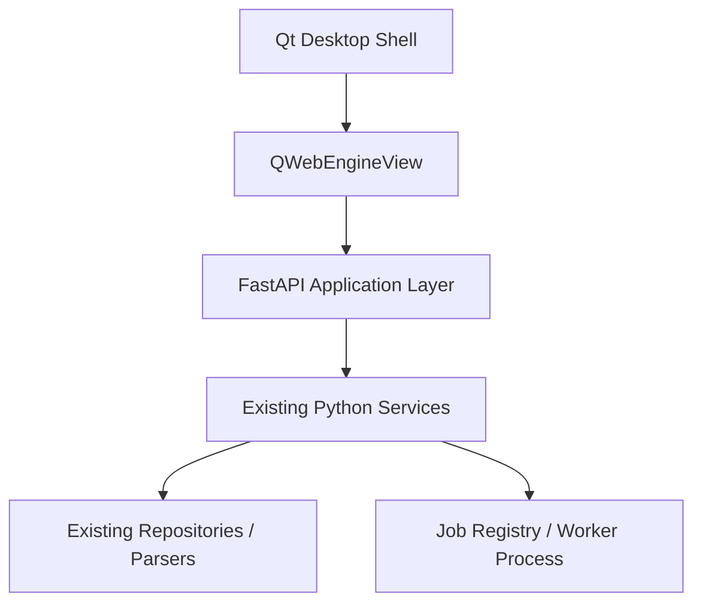
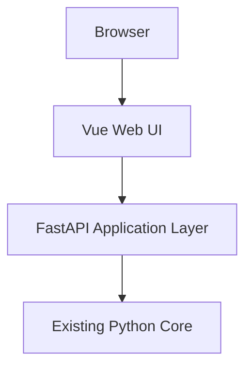
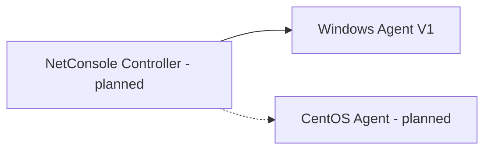
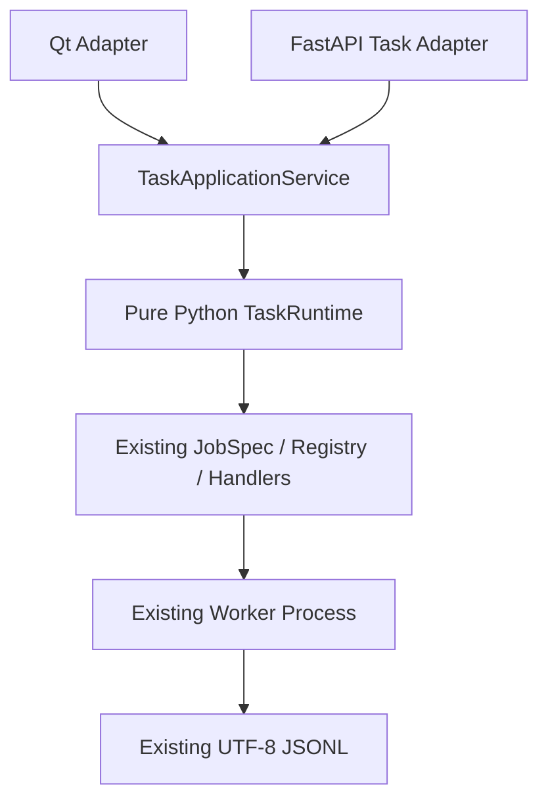

# NetConsole Web 演进架构

## 1. 正式基线

NetConsole 采用渐进式 Web 演进，不重建第二套 Python Core，不搬移现有 `services/`、`repositories/`、`parsers/` 和 `models/`。当前 Qt 主程序继续作为正式生产入口；阶段 2 已建立 Vue Web Shell 和任务中心，但尚未接入设备、AC、MR、SNMP 等业务页面。

目标方向：Qt 逐步壳化，Web 成为主要 UI，Python 成为统一业务核心。每次迁移必须保留可运行旧入口，并以生产调用链、测试和回滚边界确认是否完成。

## 2. 运行形态

### 2.1 Desktop Mode



阶段 2 的 `python main.py --web-shell` 加载 Vue Dashboard/任务中心、任务 API 和 OpenAPI，不替换当前 `python main.py` 的 Qt 主窗口。

### 2.2 Server Mode



Server Mode 可通过 `python -m netconsole.backend.api.main` 启动，并提供同一套 Vue 任务中心。鉴权、正式部署、远程访问策略和业务 API 仍未实现，不得将其描述为可交付服务版。

### 2.3 Agent Mode



Windows Go Agent 已有独立 REST/Web、任务和采集能力，但 Python 主程序的多 Agent Controller 尚未接入；CentOS Agent 仍是规划项。Agent 不共享主程序 SQLite connection、Job Center 或数据根。

## 3. RuntimeMode

`netconsole/core/runtime_mode.py::RuntimeMode` 是宿主运行模式的统一枚举：

| 模式 | 值 | 本机能力 |
| --- | --- | --- |
| Desktop Mode | `desktop` | 后续可通过受控 Native Bridge 提供文件选择、打开目录和外部程序调用 |
| Server Mode | `server` | 使用浏览器上传/下载；禁止假定可访问服务端桌面或本机外部程序 |

当前枚举只建立契约，尚未新增 Native Bridge 或业务分支。

## 4. API 契约

- API DTO 位于 `netconsole/models/api/`，使用 Pydantic，禁止在路由中散落无约束 dict。
- FastAPI 路由位于 `netconsole/backend/api/`，只编排应用服务，不复制 Repository 或业务算法。
- 当前提供 `GET /api/health`、任务查询/详情/事件/取消、`/ws/tasks` 和自动 OpenAPI `/docs`。
- 版本来自 `netconsole/core/version.py`，API 不维护第二份版本号。
- 后续前端使用统一生成或封装的 API Client；页面不得各自散写请求和错误协议。

## 5. 任务边界



阶段 2 已完成：

- `TaskState` 七状态契约；
- 纯 Python `TaskEventHub`、`TaskRuntime` 和 `TaskApplicationService`；
- Job 文件、取消文件、JSONL 分块解析、终态和清理从 Qt Adapter 中下沉；
- 原 `BackgroundProcessManager` 保留名称、signals、QProcess、源码/冻结启动命令和页面调用方式。
- 每局点 `tasks.db`、`TaskRepository`、`TaskSnapshot` 和事件历史；
- 任务 REST API、WebSocket 和 Vue 任务列表/详情/日志/停止入口。

仍未实现：

- 业务任务创建 API；
- 独立于桌面/FastAPI 生命周期的 Controller daemon；
- Agent 任务事件适配；
- Export Process 的 Web 接口。

本地 Worker 仍由宿主进程管理。页面关闭但宿主仍存活时可从 `TaskRepository` 恢复；正常退出会取消所属任务，异常退出后再次启动会把失去 PID 宿主的本地活动任务核对为 `FAILED`。不得把旧快照误报为仍在运行；真正退出桌面后继续运行需要独立 Controller/Agent。

## 6. 冻结边界

在收到独立任务前，以下模块不参与 Web 迁移或业务重构：

- SNMP Center：Registry 状态为 `DISABLED`，Qt 菜单/页面工厂不注册，不创建 Web 路由；保留现有 MIB、OID、查询、采集、监控、Trap、拓扑、数据库和文件；
- 无线勘测 `module.wifi_survey`：Registry 状态为 `DISABLED`，Qt 菜单/页面工厂不注册，不创建 Web 路由；保留扫描、勘测、热力图、导出及硬件适配逻辑；
- `network_tools.wireless_scan` 是不同能力，当前保持可用，但 Web 迁移优先级为 HOLD。

本阶段同样未修改 MR 命令、MESH 规则、AP Identity、光衰判断、iPerf、数据库 schema、Agent 协议或 Export Process。

## 7. 目录边界

阶段 0～2 新增：

```text
desktop/                         # 实验 Qt Web Shell
netconsole/backend/api/          # FastAPI Application/API 骨架
netconsole/models/api/           # Pydantic API DTO
netconsole/services/job_center/runtime/  # 纯 Python 任务运行时
netconsole/services/job_center/task_application_service.py
netconsole/repositories/task_repository.py
frontend/                        # Vue 3 / TypeScript / Vite 任务中心
```

明确禁止新增重复的 `backend/services/`、`backend/repositories/`，也不把现有核心目录搬入 `backend/`。

## 8. 启动与验证

```powershell
# 当前正式 Qt 桌面入口
.\.venv\Scripts\python.exe main.py

# 构建 Vue（使用项目可用的 pnpm/Node 环境）
cd frontend
pnpm install
pnpm test
pnpm build
cd ..

# Desktop Web Shell
.\.venv\Scripts\python.exe main.py --web-shell

# FastAPI Server Mode
.\.venv\Scripts\python.exe -m netconsole.backend.api.main
```

实验服务默认仅绑定 `127.0.0.1`。`frontend/dist` 是忽略提交的构建产物；缺失时后端保留阶段 1 占位页。当前正式发布脚本尚未打包 `frontend/dist`，发布接入需单独验证。

## 9. 下一阶段

下一阶段只接入 Agent 管理 Web 化；随后依次为 iPerf/Ping、Online MR、MR/MESH/FIT-AP/轨旁 AP、设备/AC/配置采集。SNMP Center 和无线勘测继续冻结。
