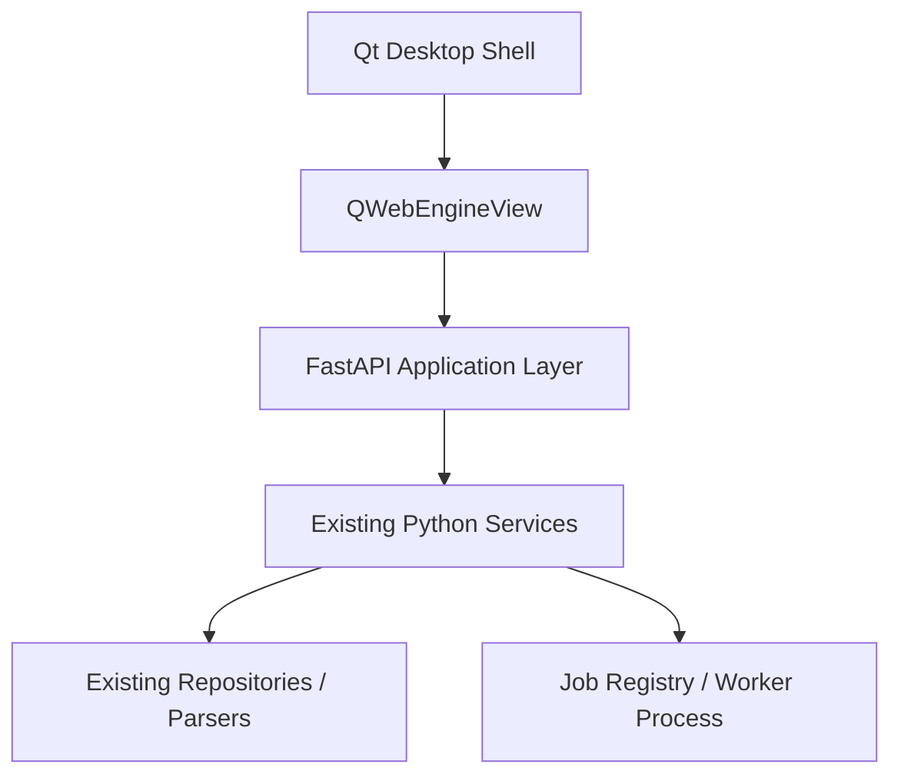
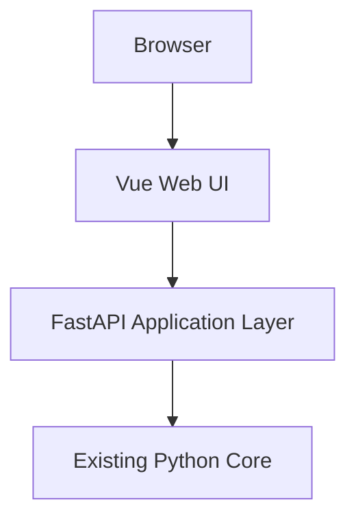
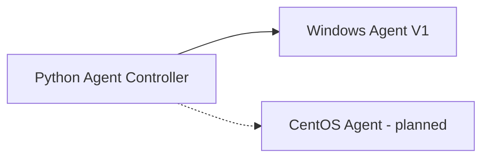
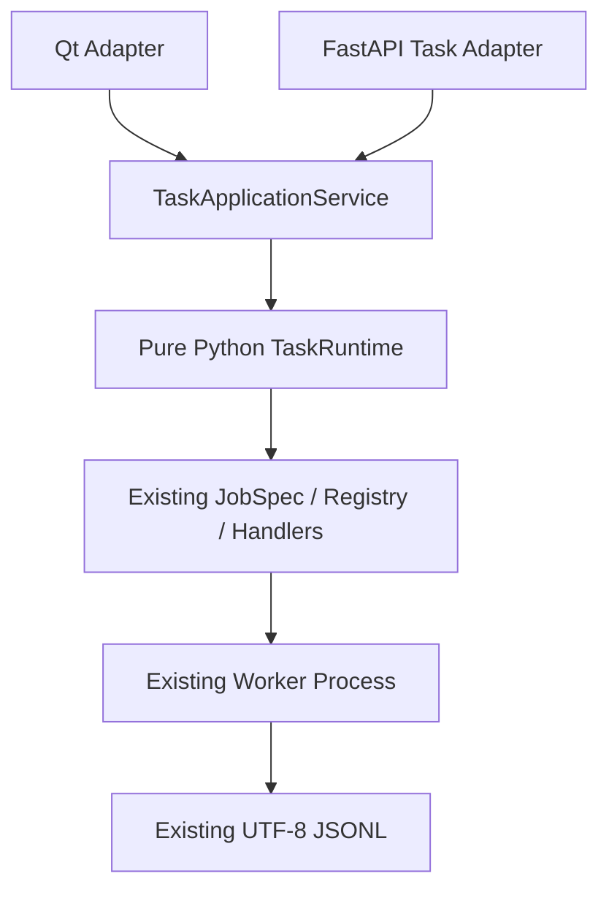

# NetConsole Web 演进架构

## 1. 正式基线

NetConsole 采用渐进式 Web 演进，不重建第二套 Python Core，不搬移现有 `services/`、`repositories/`、`parsers/` 和 `models/`。当前 Qt 主程序继续作为正式生产入口；阶段 3 已建立 Vue Web Shell、任务中心和 Agent 管理控制面，阶段 4C 已接入统一 Traffic REST API、独立 WebSocket 和 Vue 流量测试页面，阶段 4D 已完成 Qt Web Shell 生命周期与加载稳定化。阶段 5B-2A 已建立 Online MR 纯 Python DTO、只读查询边界、LOCAL Application Service 与 Task/Session 持久映射，但尚未创建 Online MR API 或 Web 页面。

目标方向：Qt 逐步壳化，Web 成为主要 UI，Python 成为统一业务核心。每次迁移必须保留可运行旧入口，并以生产调用链、测试和回滚边界确认是否完成。

## 2. 运行形态

### 2.1 Desktop Mode



阶段 3 的 `python main.py --web-shell` 加载 Vue Dashboard、任务中心、Agent 管理、对应 API 和 OpenAPI，不替换当前 `python main.py` 的 Qt 主窗口。

### 2.2 Server Mode



Server Mode 可通过 `python -m netconsole.backend.api.main` 启动，并提供同一套 Vue 任务中心。鉴权、正式部署、远程访问策略和业务 API 仍未实现，不得将其描述为可交付服务版。

### 2.3 Agent Mode



Windows Go Agent 已有独立 REST/Web、任务、真实 fping、iPerf、增量事件和结果能力；Python 主程序通过 `TrafficTestApplicationService`、`AgentTrafficAdapter` 和 `AgentTrafficSupervisor` 完成强类型启动、停止、状态/事件/结果同步及 Controller Task 映射。Agent 不共享主程序 SQLite connection、Job Center 或数据根；CentOS Agent 仍是规划项。

## 3. RuntimeMode

`src/netconsole/core/runtime_mode.py::RuntimeMode` 是宿主运行模式的统一枚举：

| 模式 | 值 | 本机能力 |
| --- | --- | --- |
| Desktop Mode | `desktop` | 后续可通过受控 Native Bridge 提供文件选择、打开目录和外部程序调用 |
| Server Mode | `server` | 使用浏览器上传/下载；禁止假定可访问服务端桌面或本机外部程序 |

当前枚举只建立契约，尚未新增 Native Bridge 或业务分支。

## 4. API 契约

- API DTO 位于 `src/netconsole/models/api/`，使用 Pydantic，禁止在路由中散落无约束 dict。
- FastAPI 路由位于 `src/netconsole/backend/api/`，只编排应用服务，不复制 Repository 或业务算法。
- 当前提供 `GET /api/health`、任务查询/详情/事件/取消、`/ws/tasks`、Agent 管理 API/`/ws/agents`、Traffic REST API 和 `/ws/traffic/{traffic_run_id}`，以及自动 OpenAPI `/docs`。
- 版本来自 `src/netconsole/core/version.py`，API 不维护第二份版本号。
- 后续前端使用统一生成或封装的 API Client；页面不得各自散写请求和错误协议。

## 5. 任务边界



阶段 2 已完成：

- `TaskState` 七状态契约；
- 纯 Python `TaskEventHub`、`TaskRuntime` 和 `TaskApplicationService`；
- Job 文件、取消文件、JSONL 分块解析、终态和清理从 Qt Adapter 中下沉；
- 原 `BackgroundProcessManager` 保留名称、signals、QProcess、源码/冻结启动命令和页面调用方式。
- 每局点 `tasks.db`、`TaskRepository`、`TaskSnapshot` 和事件历史；
- 任务 REST API、WebSocket 和 Vue 任务列表/详情/日志/停止入口。

阶段 3 已完成：

- `AgentConfig` 与 `AgentRuntimeSnapshot` 分离；
- 每局点 `agents.db`、`AgentRepository`、会话级凭据和安全归档；
- `AgentHttpClient`、`AgentControllerService`、单调度器健康检查和独立 `AgentEventHub`；
- Agent REST API、`/ws/agents` 与 Vue Agent 管理页面；
- Element Plus 按需导入和 Dashboard/任务中心/Agent 页面路由分包。

阶段 4B-1 已完成：

- Go Agent 独立 `fping` 任务，`ping_probe` 继续明确为 TCP Connect；
- 每任务持久 `events.jsonl`、排他游标增量读取和安全 `result.json` 描述；
- iPerf 3.20 强类型执行参数与原始 stdout/stderr 事件，统一指标继续使用 Python parser；
- Python `AgentHttpClient` 流量任务 DTO 与强类型方法；
- 阶段 4B-1 本身未创建 Traffic 数据库、应用服务、Controller 轮询、FastAPI Traffic 路由或 Vue 页面。

阶段 4B-2 已完成：

- `TrafficTestApplicationService` 统一本地/Agent iPerf Server、iPerf Client 与高频 Ping；
- 本地任务继续使用既有 Job Registry、Worker Process 和 JSONL，新增纯 Python `LocalProcessAdapter`，不依赖 Qt；
- Agent Token 只在 Controller 进程内按请求从 `SessionCredentialVault` 读取，不进入 JobSpec、任务库、Traffic 库、事件或命令行；
- 每局点 `traffic_runs.sqlite` 保存运行索引、Agent 映射和独立 Ping 样本，iPerf interval 继续只写既有 `iperf_results.sqlite`；
- `TrafficEventStore` 保存每 Run 的 Controller 事件序列，`TrafficEventHub` 承载高频实时事件，样本不进入全局 `/ws/tasks`；
- `AgentTrafficSupervisor` 以单一异步循环、有限并发和退避恢复远端同步；Controller 关闭只停止轮询，不停止 Agent 任务；
- 本地 fping `packet_size` 已真实传入 `-b`，原 Qt iPerf/Ping 页面与 Online MR 编排继续保留；
- 未创建 Traffic REST API、Traffic WebSocket 路由或 Vue 流量页面。

阶段 4C 已完成：

- 新增 `src/netconsole/backend/api/traffic_router.py`，以薄适配方式暴露执行端、iPerf Server、iPerf Client、高频 Ping、历史 Run、事件、样本、停止和重试接口；
- 新增专用 `/ws/traffic/{traffic_run_id}`，高频样本不进入全局 `/ws/tasks`；
- FastAPI lifespan 绑定 `TrafficTestApplicationService.start/stop`，从而启动和停止 `AgentTrafficSupervisor`；
- Vue 新增“网络工具 / 流量测试”页面，包含三类表单、执行端选择、实时状态、ECharts RTT 曲线、日志、历史任务、停止和原配置重试；
- 继续不修改 Online MR、原 Qt iPerf/Ping、Agent 协议、设备、AC、FIT-AP、MESH、SNMP Center 或无线勘测。

阶段 4D 已完成：

- Qt Web Shell 启动期间先显示本地状态页，再以 Qt 定时器等待 FastAPI，避免同步探测阻塞 UI；服务失败或超时显示可重试页面，不再白屏；
- Qt 退出前先卸载 Vue 页面和 WebSocket，再停止 Uvicorn；正常关闭和 `Ctrl+C` 后均不残留 Web Shell Python、FastAPI 或 QtWebEngine 进程；
- Vue 外部链接交给系统浏览器，JavaScript error/warning 写入应用日志；WebEngine 默认上下文菜单关闭；
- Desktop Web Shell 与 Server Mode 均验证 `/`、`/tasks`、`/agents` 和 `/network-tools/traffic`；普通 Qt 启动继续不监听 FastAPI 端口；
- 不新增 QWebChannel 业务桥接。文件选择、目录选择、打开目录、外部程序和通知仍是后续受控 Native Bridge 范围；
- 离屏冒烟覆盖 100%/125%/150% 缩放和 1280×720、1920×1080、2560×1440。该验证确认路由、DOM、构建和关闭链路，不代替 Windows 实机上的字体、表格、图表和滚动人工观察。

阶段 5B-1 已完成：

- `OnlineMrQueryService` 只读复用现有 Session Store、会话 metadata、受控 Artifact 和 `online_diagnosis.sqlite`，不建立第二套会话索引或 Core；
- Pydantic DTO 明确会话、日志、指标、文件、备注、时间轴和 Task/Session 只读映射边界；旧 metadata 不存在的 task、agent、最终化字段保持未知；
- 日志使用受控 source 和字节游标分块，SQLite 使用独立只读连接、缺表兼容、参数绑定和确定性降采样，不重跑 parser、不补零、不混合 Ping 目标或 Radio；
- 正式冻结 Traffic/SSH/writer flush 后再解析、最终化和原子打包的生命周期契约；本阶段未修改 Legacy 启停、Traffic、Agent、FastAPI、Vue 或数据库 schema。

阶段 5B-2A 已完成：

- 新增纯 Python `OnlineMrApplicationService`，LOCAL 启动复用 `LocalProcessAdapter`、既有 Job Registry、Worker 和采集服务，不建立第二套 Core；
- 在每局点既有 `tasks.db` 中增加 Task/Session 映射，先持久化 Controller Task，再通过 `online_mr_session_created` 结构化事件关联会话；Task 快照使用显式顶层局点/设备摘要，不扫描嵌套连接配置；
- `OnlineMrPhase` 只表示业务生命周期，Job Center 继续使用既有七状态；初始连接失败收口为会话 `FAILED`，遗留活动会话可显式核对为 `ABORTED`，raw 不解析、不打包、不删除；
- 执行端目前只支持 `LOCAL`，`AGENT` 返回稳定不支持错误；Legacy Qt 尚未切换，`duration_minutes`、Traffic 子任务协调、停止/强停和最终化顺序继续延期。

仍未实现：

- Online MR、设备、AC、FIT-AP、MESH 等业务页面的 Web 创建 API；Online MR 当前只有 Query/Application Service，尚未接 FastAPI、Vue 或 Legacy Qt；
- 独立于桌面/FastAPI 生命周期的 Controller daemon；
- Export Process 的 Web 接口。

本地 Worker 仍由宿主进程管理。页面关闭但宿主仍存活时可从 `TaskRepository` 恢复；正常退出会取消所属任务，异常退出后再次启动会把失去 PID 宿主的本地活动任务核对为 `FAILED`。不得把旧快照误报为仍在运行；真正退出桌面后继续运行需要独立 Controller/Agent。

## 6. 冻结边界

在收到独立任务前，以下模块不参与 Web 迁移或业务重构：

- SNMP Center：Registry 状态为 `DISABLED`，Qt 菜单/页面工厂不注册，不创建 Web 路由；保留现有 MIB、OID、查询、采集、监控、Trap、拓扑、数据库和文件；
- 无线勘测 `module.wifi_survey`：Registry 状态为 `DISABLED`，Qt 菜单/页面工厂不注册，不创建 Web 路由；保留扫描、勘测、热力图、导出及硬件适配逻辑；
- `network_tools.wireless_scan` 是不同能力，当前保持可用，但 Web 迁移优先级为 HOLD。

阶段 4B-2 未迁移 Online MR、原 Qt iPerf/Ping 页面、MR 命令、MESH 规则、AP Identity、光衰判断或 Export Process；仅为现有 Online MR fping Worker机械透传既有 `packet_size`，未改变目标、会话或编排契约。Agent 认证、目标和旧专用接口保持兼容。SNMP Center 与无线勘测仍为硬禁用。

## 7. 目录边界

阶段 0～3 新增：

```text
apps/desktop/                    # 实验 Qt Web Shell
src/netconsole/backend/api/          # FastAPI Application/API 骨架
src/netconsole/models/api/           # Pydantic API DTO
src/netconsole/services/job_center/runtime/  # 纯 Python 任务运行时
src/netconsole/services/job_center/task_application_service.py
src/netconsole/repositories/task_repository.py
src/netconsole/services/agent/   # Agent Controller、HTTP Adapter、凭据和事件
src/netconsole/repositories/agent_repository.py
apps/web/                        # Vue 3 / TypeScript / Vite 任务与 Agent 管理
src/netconsole/services/traffic/     # 统一 Traffic 应用层、执行适配、事件与 Supervisor
src/netconsole/repositories/traffic_run_repository.py
src/netconsole/backend/api/traffic_router.py
apps/web/src/views/network-tools/TrafficTestView.vue
```

明确禁止新增重复的 `backend/services/`、`backend/repositories/`，也不把现有核心目录搬入 `backend/`。

## 8. 启动与验证

```powershell
# 当前正式 Qt 桌面入口
.\.venv\Scripts\python.exe main.py

# 构建 Vue（使用项目可用的 pnpm/Node 环境）
cd apps/web
pnpm install
pnpm test
pnpm build
cd ..

# Desktop Web Shell
.\.venv\Scripts\python.exe main.py --web-shell

# FastAPI Server Mode
.\.venv\Scripts\python.exe -m netconsole.backend.api.main
```

实验服务默认仅绑定 `127.0.0.1`。`apps/web/dist` 是忽略提交的构建产物；缺失时后端保留阶段 1 占位页。当前正式发布脚本尚未打包 `apps/web/dist`，发布接入需单独验证。

## 9. 下一阶段

下一阶段按阶段 5B-3 继续收口 Online MR 生命周期，优先补齐 Traffic 子任务停止/flush 与最终化协调，再决定 `duration_minutes` 自动停止；不得绕过既有 Python Core、Job Center、Agent Controller 和 Traffic API 边界，也不直接迁移大页面。SNMP Center 和无线勘测继续冻结，除非收到独立任务。
