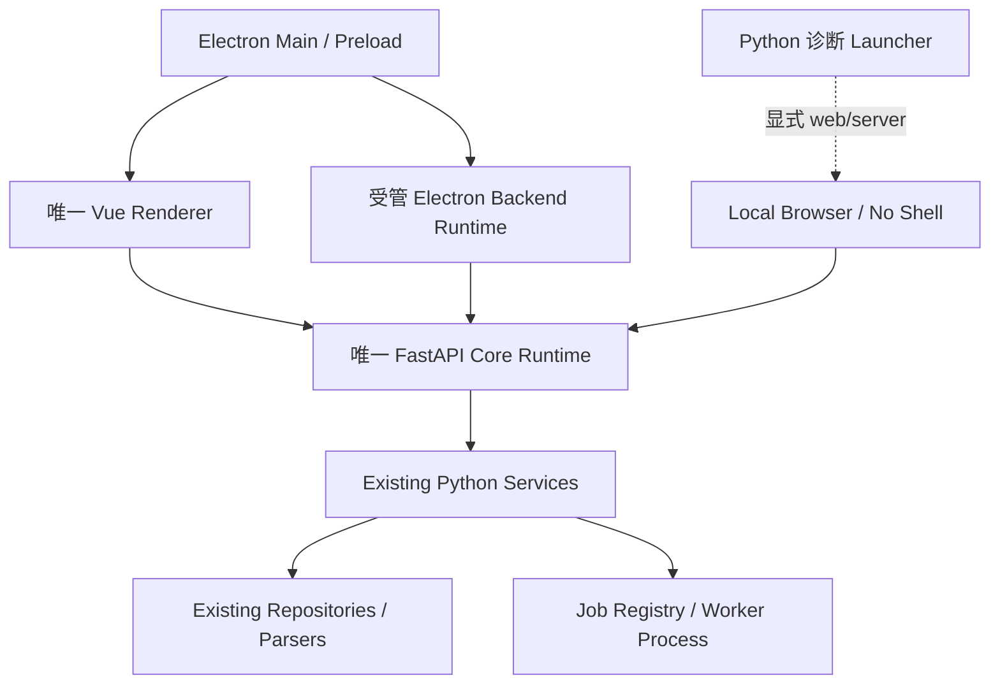
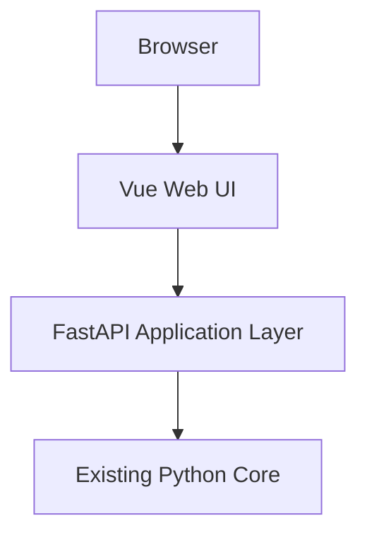
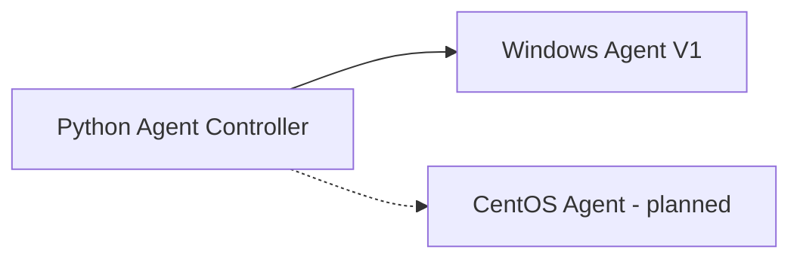
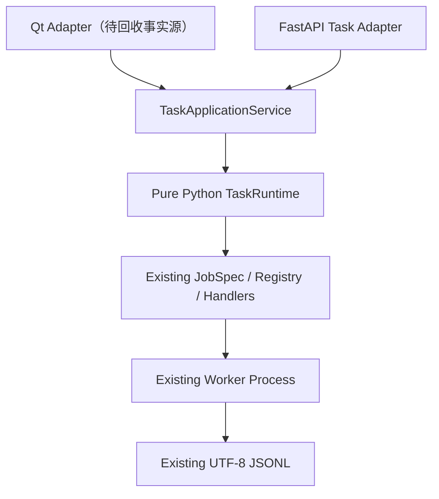

# NetConsole Web 演进架构

## 1. 正式基线

NetConsole 采用渐进式 Electron/Vue 演进，不重建第二套 Python Core，不搬移现有 `services/`、`repositories/`、`parsers/` 和 `models/`。正式桌面产品只有 Electron；Qt 已退出发布与回退产品范围，只保留源码作为迁移事实源。本机浏览器和无 Shell Server 只保留开发、诊断及 API 联调能力，不作为独立产品。模块达到 `COMPLETE` 前不删除对应 Qt 事实源。

最终方向已经明确：Python Core + FastAPI 是永久业务层，Vue 是永久主界面，Electron 是最终桌面外壳，Qt 只在迁移期保留并最终删除。Electron 安全基础已建立，但业务替换仍必须先收敛 Application Service、薄化 Router并完成 Vue 完整纵向闭环与真实验收。完整目标和阶段门槛见 [下一代架构](ARCHITECTURE_NEXT.md)、[Electron Desktop](ELECTRON_DESKTOP.md) 与 [Web 迁移计划](WEB_MIGRATION_PLAN.md)。

## 2. 运行形态

### 2.1 Electron Desktop Mode



正式桌面开发从 `apps/desktop_electron` 启动。无参数 `python main.py` 不再启动任何桌面 Shell；`--mode auto/qt`、Qt probe 和旧 `--web-shell` 已删除。只有开发者显式指定 `--mode web|server` 才进入本机兼容诊断，不承担客户发布、Qt 功能对等或人工验收，也不产生第二套 Vue/FastAPI 逻辑。

### 2.2 Server Mode



Server Mode 可通过 `python main.py --mode server` 或 `python -m netconsole.backend.api.main` 启动，并提供同一套 Vue 页面；前者纳入 Launcher 单实例和统一诊断。该模式不导入 Qt、不主动打开浏览器。当前 Launcher 只接受 `localhost` 或 IP loopback，明确拒绝非回环绑定；鉴权、正式部署和远程访问策略完成前，不得将其描述为可交付服务版。

### 2.3 Agent Mode



Windows Go Agent 已有独立 REST/Web、任务、真实 fping、iPerf、增量事件和结果能力；Python 主程序通过 `TrafficTestApplicationService`、`AgentTrafficAdapter` 和 `AgentTrafficSupervisor` 完成强类型启动、停止、状态/事件/结果同步及 Controller Task 映射。Agent 不共享主程序 SQLite connection、Job Center 或数据根；CentOS Agent 仍是规划项。

## 3. RuntimeMode

`src/netconsole/core/runtime_mode.py::RuntimeMode` 是宿主运行模式的统一枚举：

| 模式 | 值 | 本机能力 |
| --- | --- | --- |
| Desktop Mode | `desktop` | Electron 已提供文件/目录/另存为、临时授权路径和受管后端下载 Bridge；按业务 ID 打开的 `openArtifact`、终端和通知仍待独立实现 |
| Server Mode | `server` | 使用浏览器上传/下载；禁止假定可访问服务端桌面或本机外部程序 |

RuntimeMode 仍由 Python Core 使用；Electron Native Bridge 位于独立 main/preload 边界，不向 Python Application Service 增加宿主依赖。当前白名单、宿主条件和永久禁止输入见 [Desktop Native Bridge 契约](DESKTOP_NATIVE_BRIDGE.md)。

Electron Desktop 自己持有退出屏障：先拒绝新下载并取消、等待在途写入清理，再请求 Python 停止；Python 在 Uvicorn 完全退出后发送 `shutdown_ack`，Main 回发 `exit`，最后 Electron 才退出。该宿主生命周期加固不自动提升业务页面的对等状态；Qt 只保留为尚未完成真实验收能力的迁移事实源。

## 4. API 契约

- API DTO 位于 `src/netconsole/models/api/`，使用 Pydantic，禁止在路由中散落无约束 dict。
- FastAPI 路由位于 `src/netconsole/backend/api/`，只编排应用服务，不复制 Repository 或业务算法。
- 当前提供 `GET /api/health`（含后端 build id）、任务查询/详情/事件/取消、`/ws/tasks`、Agent 管理 API/`/ws/agents`、Traffic REST API 和 `/ws/traffic/{traffic_run_id}`，以及设备管理、网络工具、配置采集、文件管理的模块化 API 和自动 OpenAPI `/docs`。
- 版本来自 `src/netconsole/core/version.py`，API 不维护第二份版本号。
- 后续前端使用统一生成或封装的 API Client；页面不得各自散写请求和错误协议。

## 5. 任务边界



阶段 2 已完成：

- `TaskState` 七状态契约；
- 纯 Python `TaskEventHub`、`TaskRuntime` 和 `TaskApplicationService`；
- Job 文件、取消文件、JSONL 分块解析、终态和清理从 Qt Adapter 中下沉；
- 原 `BackgroundProcessManager` 保留名称、signals、QProcess、源码/冻结启动命令和页面调用方式。
- 每局点 `tasks.db`、`TaskRepository`、`TaskSnapshot` 和事件历史；
- 任务 REST API、WebSocket 和 Vue 任务列表/详情/日志/停止入口。

阶段 3 已完成：

- `AgentConfig` 与 `AgentRuntimeSnapshot` 分离；
- 每局点 `agents.db`、`AgentRepository`、会话级凭据和安全归档；
- `AgentHttpClient`、`AgentControllerService`、单调度器健康检查和独立 `AgentEventHub`；
- Agent REST API、`/ws/agents` 与 Vue Agent 管理页面；
- Element Plus 按需导入和 Dashboard/任务中心/Agent 页面路由分包。

阶段 4B-1 已完成：

- Go Agent 独立 `fping` 任务，`ping_probe` 继续明确为 TCP Connect；
- 每任务持久 `events.jsonl`、排他游标增量读取和安全 `result.json` 描述；
- iPerf 3.20 强类型执行参数与原始 stdout/stderr 事件，统一指标继续使用 Python parser；
- Python `AgentHttpClient` 流量任务 DTO 与强类型方法；
- 阶段 4B-1 本身未创建 Traffic 数据库、应用服务、Controller 轮询、FastAPI Traffic 路由或 Vue 页面。

阶段 4B-2 已完成：

- `TrafficTestApplicationService` 统一本地/Agent iPerf Server、iPerf Client 与高频 Ping；
- 本地任务继续使用既有 Job Registry、Worker Process 和 JSONL，新增纯 Python `LocalProcessAdapter`，不依赖 Qt；
- Agent Token 只在 Controller 进程内按请求从 `SessionCredentialVault` 读取，不进入 JobSpec、任务库、Traffic 库、事件或命令行；
- 每局点 `traffic_runs.sqlite` 保存运行索引、Agent 映射和独立 Ping 样本，iPerf interval 继续只写既有 `iperf_results.sqlite`；
- `TrafficEventStore` 保存每 Run 的 Controller 事件序列，`TrafficEventHub` 承载高频实时事件，样本不进入全局 `/ws/tasks`；
- `AgentTrafficSupervisor` 以单一异步循环、有限并发和退避恢复远端同步；Controller 关闭只停止轮询，不停止 Agent 任务；
- 本地 fping `packet_size` 已真实传入 `-b`，原 Qt iPerf/Ping 页面与 Online MR 编排继续保留；
- 未创建 Traffic REST API、Traffic WebSocket 路由或 Vue 流量页面。

阶段 4C 已完成：

- 新增 `src/netconsole/backend/api/traffic_router.py`，以薄适配方式暴露执行端、iPerf Server、iPerf Client、高频 Ping、历史 Run、事件、样本、停止和重试接口；
- 新增专用 `/ws/traffic/{traffic_run_id}`，高频样本不进入全局 `/ws/tasks`；
- FastAPI lifespan 绑定 `TrafficTestApplicationService.start/stop`，从而启动和停止 `AgentTrafficSupervisor`；
- Vue 新增“网络工具 / 流量测试”页面，包含三类表单、执行端选择、实时状态、ECharts RTT 曲线、日志、历史任务、停止和原配置重试；
- 继续不修改 Online MR、原 Qt iPerf/Ping、Agent 协议、设备、AC、FIT-AP、MESH、SNMP Center 或无线勘测。

阶段 4D 已完成：

- Qt Web Shell 启动期间先显示本地状态页，再以 Qt 定时器等待 FastAPI，避免同步探测阻塞 UI；服务失败或超时显示可重试页面，不再白屏；
- Qt 退出前先卸载 Vue 页面和 WebSocket，再停止 Uvicorn；正常关闭和 `Ctrl+C` 后均不残留 Web Shell Python、FastAPI 或 QtWebEngine 进程；
- Vue 外部链接交给系统浏览器，JavaScript error/warning 写入应用日志；WebEngine 默认上下文菜单关闭；
- Desktop Web Shell 与 Server Mode 均验证 `/`、`/tasks`、`/agents` 和 `/network-tools/traffic`；普通 Qt 启动继续不监听 FastAPI 端口；
- 不新增 QWebChannel 业务桥接。Electron 已实现文件选择与受管后端下载；按业务 ID 打开的 `openArtifact`、受控目录、已登记终端和通知仍属于后续 Native Bridge；WinSCP、IPOP 和其他通用外部程序不在初始白名单；
- 离屏冒烟覆盖 100%/125%/150% 缩放和 1280×720、1920×1080、2560×1440。该验证确认路由、DOM、构建和关闭链路，不代替 Windows 实机上的字体、表格、图表和滚动人工观察。

阶段 5B-1 已完成：

- `OnlineMrQueryService` 只读复用现有 Session Store、会话 metadata、受控 Artifact 和 `online_diagnosis.sqlite`，不建立第二套会话索引或 Core；
- Pydantic DTO 明确会话、日志、指标、文件、备注、时间轴和 Task/Session 只读映射边界；旧 metadata 不存在的 task、agent、最终化字段保持未知；
- 日志使用受控 source 和字节游标分块，SQLite 使用独立只读连接、缺表兼容、参数绑定和确定性降采样，不重跑 parser、不补零、不混合 Ping 目标或 Radio；
- 正式冻结 Traffic/SSH/writer flush 后再解析、最终化和原子打包的生命周期契约；本阶段未修改 Legacy 启停、Traffic、Agent、FastAPI、Vue 或数据库 schema。

阶段 5B-2A 已完成：

- 新增纯 Python `OnlineMrApplicationService`，LOCAL 启动复用 `LocalProcessAdapter`、既有 Job Registry、Worker 和采集服务，不建立第二套 Core；
- 在每局点既有 `tasks.db` 中增加 Task/Session 映射，先持久化 Controller Task，再通过 `online_mr_session_created` 结构化事件关联会话；Task 快照使用显式顶层局点/设备摘要，不扫描嵌套连接配置；
- `OnlineMrPhase` 只表示业务生命周期，Job Center 继续使用既有七状态；初始连接失败收口为会话 `FAILED`，遗留活动会话可显式核对为 `ABORTED`，raw 不解析、不打包、不删除；
- 执行端目前只支持 `LOCAL`，`AGENT` 返回稳定不支持错误；Legacy Qt 尚未切换，`duration_minutes`、Traffic 子任务协调、停止/强停和最终化顺序继续延期。

第一批 Web 双轨迁移已接入：

- 设备列表、筛选、详情、后台连接测试和真实受控写入；秘密字段只写不回显，普通浏览器不提供外部终端；
- 复用 Traffic Run 的网络工具总览，并补充本地/Agent TCP 端口测试；
- 复用 Config Lifecycle、Snapshot 和 Job 的配置采集、查看、比较与受控 Artifact 下载；不提供设备写入或删除；
- 局点本地文件只读浏览和受控下载；设备远程文件与删除、上传、重命名继续延期。

四个新页面及其受控动作同时由 Vue 和 FastAPI 的同一 Feature Gate 状态约束；禁用后导航/按钮隐藏且 API 返回 404。设备管理按请求读取当前局点，避免 Qt 切换局点后 WebHost 继续访问旧局点。设备、配置和文件 Web 任务共享一个 `LocalProcessAdapter`；服务级锁保证同设备活动连接测试/配置采集在并发请求下也只创建一个 Task。文件索引只接受受控目录与后缀白名单，明确排除解析数据库、运行文件、未知 raw 和未知 imports 格式。宿主关闭时，协作取消、terminate、kill 共用单一总预算，并行停止本地 Adapter、AC 刷新和 Traffic，避免超过 WebHost 等待窗口。

Web parity foundation 已建立：

- `apps/web/src/navigation/registry.ts` 是 Web 菜单顺序、父子归属、Qt/Feature 映射与对等状态的单一导航来源；AppLayout 不再手工维护菜单或 `startsWith` 活动项链；
- 固定顶级顺序为 Dashboard、设备、AC、轨道交通、配置、文件、网络工具、任务、Agent、命令、日志、设置、功能开关；当前只渲染已有真实路由，未完成页面登记为 `NOT_STARTED` 且不显示占位入口；
- AC 轨旁 AP 规划和轨交轨旁 AP 业务保持分属两个模块；Online MR 收集/分析保持轨交归属；无线扫描保持网络工具归属；SNMP Center 和无线勘测不注册 Web 导航；
- Router 的正式业务路由携带 `navigationId`、`featureId`、`moduleId`、`title` 和 `desktopOnly`，兼容 `/ac-management` 与 `/network-tools/overview` 重定向；已接入页面的 FastAPI Router 同步执行 Feature Gate，不能只靠 Vue 隐藏；
- 深色子菜单覆盖标题、内嵌菜单、箭头、hover/active/disabled 状态；全局不再强制 `min-width: 960px`，侧栏支持折叠和窄屏抽屉；
- 真实 Qt/Electron 状态和替换条件以 [Qt/Electron 功能对等矩阵](development/qt-electron-parity-matrix.md) 为准，聚合展示不得升级为完整替代。

仍未实现：

- 设备正式编辑、AC 写操作、远程设备文件管理和统一登录/角色权限；
- 独立于桌面/FastAPI 生命周期的 Controller daemon；
- Export Process 的 Web 接口。

本地 Worker 仍由宿主进程管理。页面关闭但宿主仍存活时可从 `TaskRepository` 恢复；正常退出会取消所属任务，异常退出后再次启动会把失去 PID 宿主的本地活动任务核对为 `FAILED`。不得把旧快照误报为仍在运行；真正退出桌面后继续运行需要独立 Controller/Agent。

## 6. 冻结边界

在收到独立任务前，以下模块不参与 Web 迁移或业务重构：

- SNMP Center：Registry 状态为 `DISABLED`，Qt 菜单/页面工厂不注册，不创建 Web 路由；保留现有 MIB、OID、查询、采集、监控、Trap、拓扑、数据库和文件；
- 无线勘测 `module.wifi_survey`：Registry 状态为 `DISABLED`，Qt 菜单/页面工厂不注册，不创建 Web 路由；保留扫描、勘测、热力图、导出及硬件适配逻辑；
- `network_tools.wireless_scan` 是不同能力，当前保持可用，但 Web 迁移优先级为 HOLD。

阶段 4B-2 未迁移 Online MR、原 Qt iPerf/Ping 页面、MR 命令、MESH 规则、AP Identity、光衰判断或 Export Process；仅为现有 Online MR fping Worker机械透传既有 `packet_size`，未改变目标、会话或编排契约。Agent 认证、目标和旧专用接口保持兼容。SNMP Center 与无线勘测仍为硬禁用。

## 7. 目录边界

阶段 0～3 新增：

```text
src/netconsole/ui/               # 待回收 Qt 页面与事实源
apps/desktop_electron/           # Electron main/preload/shared 安全基础
src/netconsole/backend/api/          # FastAPI Application/API 骨架
src/netconsole/models/api/           # Pydantic API DTO
src/netconsole/services/job_center/runtime/  # 纯 Python 任务运行时
src/netconsole/services/job_center/task_application_service.py
src/netconsole/repositories/task_repository.py
src/netconsole/services/agent/   # Agent Controller、HTTP Adapter、凭据和事件
src/netconsole/repositories/agent_repository.py
apps/web/                        # Vue 3 / TypeScript / Vite 任务与 Agent 管理
src/netconsole/services/traffic/     # 统一 Traffic 应用层、执行适配、事件与 Supervisor
src/netconsole/repositories/traffic_run_repository.py
src/netconsole/backend/api/traffic_router.py
apps/web/src/views/network-tools/TrafficTestView.vue
```

明确禁止新增重复的 `backend/services/`、`backend/repositories/`，也不把现有核心目录搬入 `backend/`。Electron 只保留安全宿主基础；不创建第二套 Renderer、Node 业务后端或 `domain/application/infrastructure` 空骨架，不为目标目录示意图机械移动已有包。

## 8. 启动与验证

```powershell
# 正式桌面开发入口
cd apps/desktop_electron
pnpm dev
cd ../..

# 显式本机开发诊断
.\.venv\Scripts\python.exe main.py --mode web
.\.venv\Scripts\python.exe main.py --mode server --host 127.0.0.1 --port 8000

# 构建 Vue（使用项目可用的 pnpm/Node 环境）
cd apps/web
pnpm install
pnpm test
pnpm build
cd ..

# FastAPI Server Mode
.\.venv\Scripts\python.exe -m netconsole.backend.api.main
```

本机模式固定绑定 `127.0.0.1`；Server 模式默认同样只绑定回环地址。`apps/web/dist` 是忽略提交的构建产物；源码模式缺失时后端显示资源不可用页。源码模式只使用当前 `apps/web/dist`，冻结模式只使用包内 `netconsole/assets/web`；发布脚本每次重新构建并校验 `web-build-meta.json` 后才打包。生命周期、build id 和 fallback 见 [Desktop WebHost](WEB_HOST.md)。

## 9. 下一阶段

下一阶段继续禁止新增 Qt 业务页面，逐模块把 Qt 页面和 Router 中的业务编排收敛到 Application Service，并补齐权限、审计、状态恢复和真实验收。Electron 基础不得扩展为通用 Native Bridge；只有业务模块完成完整纵向闭环后才可切换默认入口。后续 Online MR 改造继续沿既有 Python Core、Job Center、Agent Controller 和 Traffic API 边界渐进迁移，不直接搬运大页面。5C-10A-B Web LOCAL 自动时长与 5B-13A-A Agent 真实 MR 验收在列车下电期间冻结；回环 Fake 结果不替代现场验收。SNMP Center 和无线勘测当前状态为 `BLOCKED` 并排除迁移，网络工具无线扫描保持独立范围。
