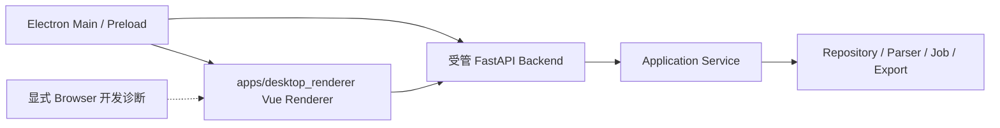

# Electron Renderer Runtime

## 运行形态

NetConsole 只有一套 Vue 与一套 FastAPI 组合根：

正式桌面由 Electron 启动。无参数 `python main.py` 是 PyCharm/源码态的同一 Electron 编排入口；`--mode server` 只用于 loopback 开发诊断，不构成独立 Browser 产品、发布入口或失败回退。生产包不启动 Vite，不开放开发状态接口、OpenAPI 或默认 DevTools。

## 工作区

AppLayout 下的浏览器式工作区由 Vue Router 路由元数据和 Pinia `workspace` Store 管理。标签模型只保存内部规范化路由、稳定资源身份、实例 ID、缓存键、标题和固定状态；普通导航复用同一 identity，复制标签显式创建独立实例。敏感 query、临时窗口标记、绝对路径和超长/无效路由不会进入恢复快照。

每个工作区窗口内部都有相同的标签栏与 `KeepAlive` 容器。重型 MESH、Online MR、任务和配置页面在 `onActivated/onDeactivated` 间恢复图表尺寸与必要轮询、暂停页面级刷新；它们不会停止 Python 后台任务、删除分析结果或改写业务状态。浏览器模式以本地存储恢复当前标签，Electron 模式改用受控 Main IPC 与窗口布局存储；两者都不依赖 Node 或直接访问 Electron。

Electron 附加窗口只接受强类型内部路由请求，由 Main 的 `WorkspaceWindowController` 创建并继续使用同一 Vue/FastAPI 组合根。Windows 通知区域、主窗口隐藏和明确退出属于宿主生命周期，不属于 Vue Store；详见 [Electron Desktop 基础架构](./DESKTOP.md)。

## API 边界

- DTO 位于 `src/netconsole/models/api/`，Router 位于 `src/netconsole/backend/api/`。
- Router 只做鉴权、校验、Service 调用和 HTTP/WebSocket 映射。
- 页面和 Router 不得直接操作 Repository、SQLite、设备命令、SSH/SNMP 或业务文件。
- Electron 与 Browser 开发态复用相同 API client；Browser 不获得原生文件、终端或目录能力。
- 开发服务器默认只绑定 `127.0.0.1`，不增加无认证 shell、SQL 或命令接口。

## Desktop Bridge

Renderer 只能调用 main/preload 暴露的强类型白名单动作。文件选择、另存为、打开目录、Artifact 下载、固定外部工具及工作区窗口请求必须使用会话内授权、固定 endpoint/语义 ID 和参数复验；禁止把 `fs`、`child_process`、任意 URL、任意 argv、`BrowserWindow` 参数或服务端绝对路径暴露给 Renderer。

## 任务与生命周期

FastAPI lifespan 持有共享 Application Service；Electron Main 持有 Backend 和子窗口生命周期。退出时先拒绝新下载、等待或取消在途写入，再通过受控握手停止 Backend，最后清理窗口、会话授权和子进程。

普通后台任务复用唯一 Task Center；Traffic 使用独立高频 REST/WebSocket，不把样本灌入全局 `/ws/tasks`。页面刷新和子窗口关闭不能伪造或终止后台状态。

## 资源与发布

- 源码态 Vue 由 Vite 或当前 `apps/desktop_renderer/dist` 提供；打包态只使用包内构建资源。
- Frontend/Backend build id 必须一致。
- Browser 模式不单独发布或做产品对等验收。
- Qt Web Shell、Qt probe、`auto/qt` 和 Browser 产品回退均不存在。

模块实现和真实验收状态见[正式包功能矩阵](../release/PACKAGED_FEATURE_MATRIX.md)。历史 Web/Qt 阶段记录见[迁移归档](../archive/migrations/qt-to-electron/README.md)。
