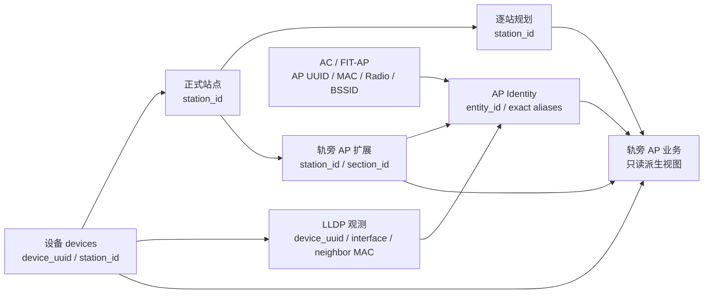

# 轨旁 AP 主数据与关联模型

## 1. 权威边界

`/rail-transit/base-data` 的页面草稿是站点、设备站点绑定、区间、轨旁 AP、逐站规划和车载 MR 的唯一编辑聚合。`TracksideApPlanningTab.vue` 是受控双态组件，只接收 `modelValue / stations / editing / readonly / saving`：`editing=false` 时只渲染文本与状态标签，`editing=true` 时才发出草稿、校验和“从设备管理生成站点”意图；它不加载基线、不维护锁、不保存、不轮询任务。

站名、区间名和 VLAN 都是展示或业务属性，不能作为关系主键。活动关系使用：

- `devices.station_id -> __base_station__.station_id`
- `ap_extension_points.station_id -> __base_station__.station_id`
- `ap_extension_points.section_id -> __base_section__.section_id`
- `ac_trackside_ap_plan.station_id -> __base_station__.station_id`

新站点 ID 从稳定 `node_uid` 生成；设备来源候选返回 `source_device_ids`。站点与区间子页可以创建站点并绑定设备；轨旁 AP 规划子页只能消费候选已匹配的正式 `station_id`，不能同时创建站点。站名修改只更新展示字段，不改变关系身份。

### 数据所有权矩阵

| 领域 | 事实来源 | 稳定关联键 | 只读/派生内容 |
| --- | --- | --- | --- |
| 受管设备 | `devices` | `device_uuid`、`station_id` | 设备站名是兼容展示值 |
| 正式站点/区间 | `ap_extension_points` 的基础记录 | `station_id`、`section_id` | 名称、顺序、里程等属性 |
| FIT-AP 运行资源 | AC 采集表 | AP UUID、规范 MAC/Radio/BSSID | 在线状态、AC 名称、光功率 |
| 轨旁 AP 扩展资料 | `ap_extension_points` 的 AP 记录 | 记录 ID、基础 MAC、`station_id`、`section_id` | FIT-AP/LLDP 运行字段只拼接展示 |
| 逐站规划 | `ac_trackside_ap_plan(mode='unified')` | `station_id` | `station_name` 仅展示快照 |
| LLDP | `device_lldp_neighbors` 及历史表 | `device_uuid`、接口、完整邻居 MAC | 只提供拓扑证据和站点建议 |
| AP Identity | Identity 实体、alias 与索引状态 | Identity entity ID、完整 MAC alias | 聚合 AC 与扩展资料，不成为第二套 AP 主表 |
| 轨旁 AP 业务 | 无独立事实表 | 上述稳定 ID 的只读组合 | 在线、规划、光衰和一致性状态 |



## 2. 页面草稿与状态

父页面只在用户明确点击“编辑”后持有一个 `BaseDataDraft`：线路 metadata、stations、deviceStationBindings、sections、aps、tracksideApPlans 和 mrs。状态为：

```text
VIEW -> EDITING_CLEAN -> EDITING_DIRTY -> VALIDATING -> SAVING -> VIEW
                            ^              |             |
                            +--------------+------ SAVE_FAILED
READ_ONLY（无写授权）
```

`LOCKED` 和 `READ_ONLY` 读取正式数据，不创建草稿；每个可编辑子页进入编辑时，只使用 `GET /api/rail-transit/base-data/edit-snapshot?scope=...` 返回的作用域实体、必要依赖和同一 `base_revision` 创建自己的草稿，不从分页或筛选后的查看列表拼接。该只读接口不加载运行态、不触发 Identity rebuild，也不执行任何数据库写入；失败时保持锁定态。切换标签时仅对当前脏子页执行保存、放弃或取消切换，其他子页上下文不受影响；离开路由和关闭窗口保护所有未保存修改。保存或取消只销毁当前子页草稿并返回 `LOCKED`，保存失败保留原草稿和字段错误。

规划按 `station_id` 纯函数 reconcile：重命名保留 AP 数、VLAN 和备注；消失或禁用的历史行标记 `stale` 并保留；启用的普通站、车辆段和停车场都可追加默认规划行。规划资格不复用区间拓扑资格：`participates_in_direction` 只约束普通站参加主线区间生成。自动行按普通站正式顺序、车辆段、停车场稳定排列，同类按稳定 ID 排列；特殊节点保持原 `node_type`，默认 AP 数为 `0`、VLAN 为空。

## 3. 单事务保存

统一 changes 请求在 revision 校验后按以下顺序执行：

```text
站点 -> 设备 station_id 绑定 -> 区间 -> 轨旁 AP -> 逐站规划 -> 车载 MR
```

SQLite 使用一个 `BEGIN IMMEDIATE`；任何稳定 ID、引用、唯一性或完整性错误都整体回滚。提交完成后仅在 Identity 来源 revision 变化时刷新 AP Identity 一次，并在响应前收敛已提交 WAL。普通 GET、搜索和业务查询只读既有索引，不初始化、不修复、不写缓存。

## 4. 轨旁 AP 业务投影

业务行分别公开 `switch_station_id`、`ap_station_id`、`planning_station_id` 和 `effective_station_id`，并返回 `station_consistency_status/reason`。三个来源一致时使用该 ID；存在冲突时不按名称或 VLAN 选边；只有规划有 ID 时可作为规划口径的有效站点，并保留原因诊断。

LLDP 关联 FIT-AP 只接受规范化后的完整邻居/Chassis MAC 精确等值。设备管理中的当前车站交换机候选端口和 AC FIT-AP 运行态构成业务行主来源；交换机缺少正式 `station_id` 时仍保留设备管理站点文本和候选端口，基础 AP 资料只在精确命中时补充稳定关系。明确排除或多条基础资料不能被 LLDP 覆盖；基础 AP 完全未命中时，交换机有效 `station_id` 可直接作为只读运行态站点投影，缺失 ID 时只允许设备管理 `station` 唯一规范化命中当前正式站点后投影。该站名匹配只解析交换机归站，AP 仍由完整 MAC 精确关联；站名歧义、多站同 MAC、无证据和建设阶段不一致均保持稳定关系未解析。邻居 IP、系统名、AP 名称、VLAN 和历史接口名称不参与 AP 绑定。该投影不写入基础资料、设备绑定、规划或 AP Identity，也不把交换机接口提升为 AP 身份。每个业务请求固定一次 AP Identity 健康状态，逐行解析只读索引且不触发 rebuild。

## 5. 迁移与兼容

数据库初始化幂等增加物理关系列和索引，并为已有正式站点/区间主记录补齐确定性 ID。跨表关系由 `scripts/maintenance/backfill_trackside_ap_station_identity.py` 在数据库副本上迁移：默认 dry-run；apply 必须提供报告哈希和 `APPLY_RAIL_BASE_IDENTITY_BACKFILL` 显式确认。报告分别列出主记录、设备绑定、AP 站点/区间和规划关系的既有、安全、歧义、未解析与已应用数量；歧义项不写入。

迁移不自动寻找正式局点，也不删除历史行。执行方在 apply 前保留原数据库副本和 dry-run JSON；校验或事务失败时脚本回滚本次写入，已提交结果需要回退时以执行前副本恢复，并重新构建一次 AP Identity。应用前哈希不一致必须重新 dry-run，禁止拿旧报告覆盖后续修改。

旧规划导入 API 仅兼容保留。当前 schema v4 模板必须携带车站 ID；带“组成员站点 ID”的旧模板可从文件内一一对应的 ID 恢复，只有站名而没有稳定 ID 的行必须报错，不查询主数据名称兜底。

## 6. 验证基线

- 前端：各子页独立锁定/解锁、作用域编辑快照、受控组件、纯 reconcile、10 个普通站加 1 个车辆段生成 11 行规划、跨标签隔离草稿、三选项切页保护、只读禁用和作用域保存。
- 后端：物理 schema 迁移、26 台设备/11 站来源候选、完整只读快照与同 revision、稳定绑定、事务回滚、AP Identity 单次刷新、GET 文件指纹只读且不加载运行态、LLDP 精确 MAC、迁移脚本幂等与哈希确认。
- 所有数据库写入测试仅使用临时目录或明确的数据库副本。

## 7. 表与 DTO 字段责任

| 表/DTO | 关系字段 | 展示/证据字段 | 写入约束 |
| --- | --- | --- | --- |
| `devices` | `station_id` | `station` | 新关联只写 ID；文本不作外键 |
| `ap_extension_points` AP 记录 | `station_id`、`section_id` | `station_name`、`section_name`、来源行 | ID 必须引用当前草稿或已存正式记录 |
| `ac_trackside_ap_plan` | `station_id` | `station_name` | unified 模式按 ID 唯一；旧 VLAN 表不参与读取 |
| `StationSourceCandidateDTO` | `matched_station_id(s)`、`proposed_station.id` | `candidate_id`、issues | `source_device_ids` 与选定 ID 一起进入草稿 |
| `TracksideApDTO` | `station_id`、`section_id`、`identity_entity_id` | 名称、关联状态、LLDP 建议证据 | LLDP 建议只有用户应用后才进入草稿 |
| `TracksideApPlanRowDTO` | `station_id` | 名称、relation status、候选 ID | 无有效 ID 的历史行必须返回，不得过滤或自动绑定 |
| `TracksideApBusinessRowDTO` | switch/AP/planning/effective 四类站点 ID | Identity、LLDP、一致性原因 | 只读，不反写基础资料或规划 |
